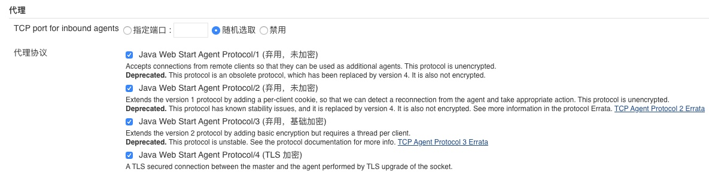

## 原因
公司需要进行 exe 文件的打包，因此需要使用 Windows 服务器进行打包操作，然后使用 rsync 进行增量更新。

## Jenkins

Jenkins 配置中需要将 master 的密钥添加到 slave 机器，使得其可以免密登录 slave 机器，进行相应操作。

## 配置 SSH
然后我就想通过 ssh 把密钥传输过去，然后发现 windows10 服务器连接不到，查了一下 win10 已经自带了 OpenSSH，只需要自己下载一下，然后启动一下服务即可。

前往 `设置 -> 应用 -> 可选功能 -> 添加功能`，将 SSH Server 下载下来，然后前往 `服务` 将 其启动即可。

使用 `netstat -an | findstr :22` 检测是否开始监听默认 22 端口

## 连接 SSH

使用 `ssh user@ip` 连接，本来远程桌面连接是没有密码的，然后使用 ssh 连接居然弹出输入密码！

## 创建 node
在 jenkins 中选择节点管理，新增一个节点


网上说的 Launch agent via Java Web start 和 Launch agent bt connecting it to master 是一样的。


> 注意要在设置中将对应连接打开

然后下载对应的 jar 文件，将文件内部的 url 改为 master 路由即可


如果没有 `Launch agent by connecting it to the master` 的启动方式，则需要在 `全局安全设置` 中的 `代理` 部分，将代理协议都勾选上



下载jar之后双击打开，但是没法连接，提示报错为
```
java.io.IOException:http://localhost:8080/ provided port:37583 is not reachable

at org.jenkinsci.remoting.engine.JnlpAgentEndpointResolver.resolve(JnlpAgentEndpointResolver.java:287)

at hudson.remoting.Engine.innerRun(Engine.java:523)

at hudson.remoting.Engine.run(Engine.java:474)
```
则是因为对应防火墙的端口未开启，开启对应防火墙端口即可连接

添加端口
```
firewall-cmd --permanent --add-port=37583/tcp
```

重启
```
firewall-cmd --reload
```