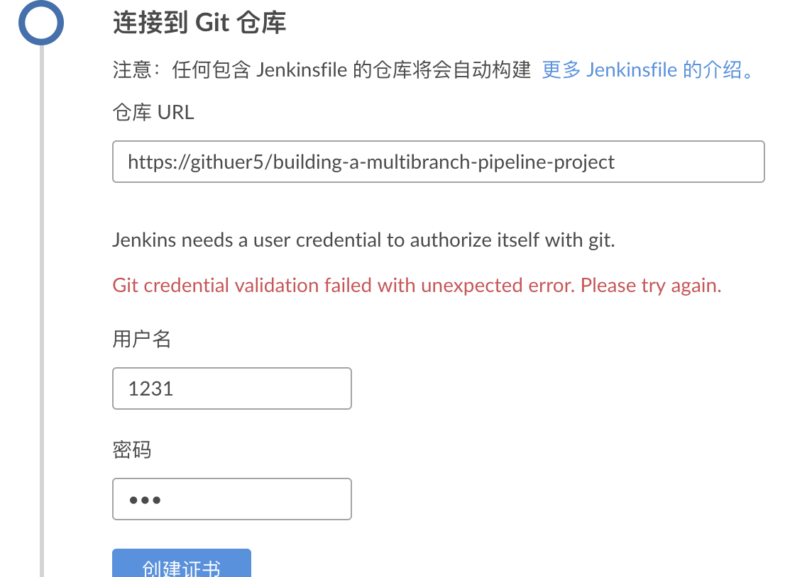
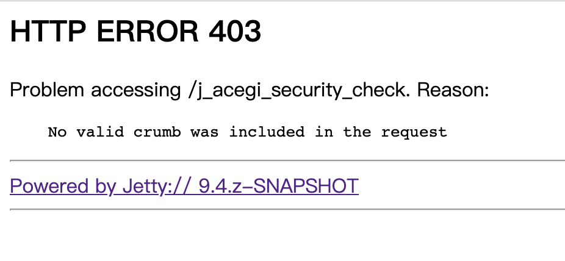

# 目录
+ [流水线](#流水线)
    + [什么是Jenkins的流水线](#什么是Jenkins的流水线)
    + [声明式和脚本话的流水线语法](#声明式和脚本话的流水线语法)
        + [pipeline](#pipeline)
        + [node](#node)
        + [stage](#stage)
        + [step](#step)
+ [明式流水线](#明式流水线)
+ [本化流水线](#本化流水线)
    + [流水线入门](#流水线入门)
    + [使用Jenkinsfile](#使用Jenkinsfile)
        + [字符串插值](#字符串插值)
        + [使用环境变量](#使用环境变量)
+ [何引用](#何引用)
    + [设置环境变量](#设置环境变量)
    + [动态设置环境变量](#动态设置环境变量)
    + [处理凭据](#处理凭据)
        + [Secret文本](#Secret文本)
        + [带密码的用户名](#带密码的用户名)
        + [Secret文件](#Secret文件)
        + [其他凭据类型](#其他凭据类型)
    + [处理参数](#处理参数)
    + [处理故障](#处理故障)
    + [使用多个代理](#使用多个代理)
    + [可选的步骤参数](#可选的步骤参数)
    + [高级脚本式流水线](#高级脚本式流水线)
        + [并行执行](#并行执行)
+ [分支和pull请求](#分支和pull请求)
    + [创建多分支流水线](#创建多分支流水线)
    + [附加的环境变量](#附加的环境变量)
        + [BRANCH_NAME](#BRANCH_NAME)
        + [CHANGE_ID](#CHANGE_ID)
+ [在流水线中使用Docker](#在流水线中使用Docker)
    + [自定义执行环境](#自定义执行环境)
    + [容器的缓存数据](#容器的缓存数据)
    + [使用多个容器](#使用多个容器)
    + [使用Dockerfile](#使用Dockerfile)
+ [ockerfile](#ockerfile)
+ [脚本化流水线高级用法](#脚本化流水线高级用法)
    + [运行sidecar容器](#运行sidecar容器)
    + [构建容器](#构建容器)
+ [下面这一行](#下面这一行)


# 流水线

## 什么是 Jenkins 的流水线

在版本每次进行更新时，都需要一套流程来对新版本的软件进行测试，部署和打包。Jenkins 流水线保证了在每次版本更新时，Jenkins 能够自动的进行以一种可靠并且重复的方式架构软件。以增强软件的健壮性。

对流水线的定义被写在一个文本文件中（Jenkinsfile），该文件可以被提交到项目的源代码的控制仓库。将其提交到源代码有以下好处：

+ 自动为所有分支创建流水线构建过程并拉取请求。
+ 在流水线上进行代码审查/迭代。
+ 在流水线进行审计跟踪。
+ 所有成员都能看到流水线源码，并进行编辑。

## 声明式和脚本话的流水线语法

### pipeline

pipeline 是用户定义的一个 CD 流水线模型。其代表了整个的构建过程，通常包括构建，测试和交付应用程序的阶段。

是声明式流水线的基础。
### node
脚本化流水线基础。

### stage
定义了整个流水线的执行任务的概念性不同的子集，被许多插件用来可视化状态。

### step
单一的一个任务， step 告知了 Jenkins 在特定时间内要做什么。

```python
#声明式流水线

pipeline{
    agent any
    stages{
        stage('Build'){
            steps{

            }
        }
    }
}
```

```python
#脚本化流水线

node {
    stage('Build'){

    }
    stage('Test'){

    }
}

```


## 流水线入门

声明式和脚本式流水线都是 DSL（Domain-specific language）语言

流水线可以用下面任意一种方式来创建：

+ Blue Ocean：在 Blue Ocean 中设置一个流水线项目后，Blue Ocean UI 会帮你编写流水线的 Jenkinsfile 文件并提交到源代码管理系统。
+ 经典 UI：直接在经典 UI 中输入流水线。
+ 在源码管理系统中定义：收到编写一个 Jenkinsfile 文件，然后提交到源码管理仓库。


## 使用 Jenkinsfile

### 字符串插值

尽管 Groovy 语法支持使用单引号或者双引号声明一个字符串

```groovy
def singlyQuoted = 'hello'
def doublyQuoted = "hello"

```
但是只有后者支持使用 $ 进行字符串插值

```groovy
def user = 'jenkins'
echo 'hello, Mr.${user}'
echo "yes, Mr.${user}"
```

得到的结果是

```groovy
hello, Mr.${user}
yes,Mr.jenkins
```

其不在乎字符串定义时是单引号还是双引号，其只在乎在使用时当前文本是单引号还是双引号。

### 使用环境变量

Jenkins 流水线中可访问的完整环境变量列表都记录在 ${YOUR_JENKINS_URL}/pipeline-syntax/globals#env 中。

其中包括：

+ BUILD_ID:当前的构建 ID，和 1.597+ 版本之后的 BUILD_NUMBER 完全一致。
+ BUILD_TAG:字符串 jenkins-\${JOB_NAME}-\${BUILD_NUMBER}，可以放到源码和 jar 文件中便于识别。
+ BUILD_URL:定位此次构建结果的 URL。
+ EXECUTOR_NUMBER:识别执行当前构建的执行者的唯一编号，，编号从 0 开始。
+ JAVA_HOME:如果设置了 JDK，该变量就为此 JDK 的 JAVA_HOME。
+ JENKINS_URL:Jenkins 服务器完整的 URL。
+ JOB_NAME:本次构建的项目名。
+ NODE_NAME:本次构建的节点名称。
+ WORKSPACE:workspace 的绝对路径。


```groovy
#如何引用
pipeline {
    agent any
    stage {
        stage('Example') {
            steps {
                echo "Running ${env.BUILD_ID} ON ${env.JENKINS_URL}"
            }
        }
    }
}
```

## 设置环境变量

声明式流水线支持 environment 指令，而脚本式流水线必须使用 withEnv 步骤。

environment 的作用范围是小于等于当前域的。

## 动态设置环境变量

环境变量可以动态设置，然后给各种脚本使用，各种脚本都可以返回 returnStatus 和 returnStdout

## 处理凭据

### Secret 文本

```groovy
pipeline {
    agent {
        //此处设计 agent 细节
    }
    environment {
        AWS_ACCESS_KEY_ID = credentials('jenkins-aws-secret-key-id')
        AWS_ACCESS_ACCESS_KEY = credentials('jenkins-aws-secret-access-key')
    }
}

```

可以用 $AWS_ACCESS_KEY_ID 和 $AWS_ACCESS_ACCESS_KEY 来引用两个凭据环境变量

### 带密码的用户名

使用一个带密码的用户名凭据的环境变量的流水线。

```groovy
environment {
    BITBUCKET_COMMON_CREDS = credentials('jenkins-bitbucket-common-creds')
}
```

这实际上包含了下面三个环境变量：

+ BITBUCKET_COMMON_CREDS:包含一个以冒号分隔的用户名和密码，格式为 username:password。
+ BITBUCKET_COMMON_CREDS_USR:一个仅包含用户名部分的变量。
+ BITBUCKET_COMMON_CREDS_PSW:一个仅包含密码部分的变量。


### Secret 文件

就流水线而言 Secret 文件和 Secret 文本完全相同。

实际上，他俩的唯一不同在于对于 secret 文本，凭据直接输入到 Jenkins 中，而 secret 文件中的 凭据则原样保存到一个文件中，之后传给 Jenkins。

和 文本不同，文件适合：

+ 太笨重不能直接输入 Jenkins。
+ 二进制格式文件。


### 其他凭据类型

其他凭据类型，如 SSH 密钥或证书，请使用 Jenkins 片段生成器特性


## 处理参数
允许流水线运行时使用 parameters 指令接受用户指定的参数

```groovy
pipeline{
    agent any
    parameters {
        string{name: 'Greeting', defaultValue:'Hello'}
    }
    stages {
        stage('Example') {
            steps {
                echo "${params.Greeting} World!"
            }
        }
    }
}
```

## 处理故障

声明式流水线拥有强大的故障处理能力，其允许声明许多不同的 post 条件。

```groovy
post {
    always {
        junit '**/target/*.max'
    }
    failure {
        mail to : team@example.com, subject:'The Pipeline failed:('
    }
}
```


## 使用多个代理

使用多个代理可以实现跨平台构建/测试。

```groovy
stage('Test in Linux') {
    agent {
        label 'linux'
    }
}
stage('Test in Windows') {
    agent {
        label 'windows'
    }
}

```

## 可选的步骤参数

流水线遵循 groovy 语法省略括号的习惯。

流水线也可以使用 groovy 中的 Map 语法 （[key1 : value1, key2 : value2]）

```groovy
// 下面的语句拥有相同功能
git url: 'git', branch: 'master'
git [url: 'git', branch: 'master']
```

当只有一个参数时，参数名可以省略

```groovy
sh 'echo hello' //short
sh ([script: 'echo hello']) //long
```

## 高级脚本式流水线

### 并行执行

parallel 关键字

```groovy
stage('Test'){
    paraller linux:{
        node('linux'){
            checkout scm
            try{

            }
            finally{

            }
        }
    }
    windows:{
        node('windows'){

        }
    }
}

```
测试并不是在 linux 和 windows 节点串联的执行，而是并行执行。

# 分支和 pull 请求

## 创建多分支流水线

Multibranch Pipeline 项目能够在同一个项目的不同分支上实现不同的 Jenkinsfile。

## 附加的环境变量

### BRANCH_NAME

该流水线正在执行的流水线的名称，比如 master。

### CHANGE_ID
对于某种形式的更改请求的标识符


# 在流水线中使用 Docker

## 自定义执行环境

流水线可以使用单个 Dcoker 镜像作为单个 Stage 或整个流水线的执行环境。

```groovy
pipeline{
    agent{
        docker {image 'node:7-alpine'}
    }
}
```

当流水线执行时，Jenkins 会自动地启动指定的容器并执行相应步骤。


## 容器的缓存数据

许多构建工具都会下载外部依赖并将他们缓存到本地以便将来使用。由于容器都是由最干净的文件结构构成，这导致流水线速度变慢，因为他们不会利用后续流水线运行的磁盘缓存。

向 Docker 中添加参数是的，下载缓存数据，使得流水线的后续运行中不需要重新下载依赖

```groovy
pipeline{
    agentP
    docker{
        image 'maven:3-alpine'
        args '-v $HOME/.m2:/root/.m2'
    }
}
```


## 使用多个容器

使用 agent 将不同技术分开使用

```groovy
stage('Back-end'){
    
}
stage('Front-end'){

}
```

## 使用 Dockerfile

使用 Dockerfile 语法和使用现成容器的用法不同的在于，Dockerfile 是构建一个新的镜像而不是从 Docker Hub 中拉取一个。

```python
#Dockerfile

FROM node:7-alpline

RUN apk add -U subversion

```

# 脚本化流水线高级用法
## 运行 sidecar 容器
Dcoker 流水线可以在后台运行一个容器，而在另一个容器中工作。

使用 withRun 语法实现多个容器协作

```groovy
node {
    checkout scm
    docker.image('mysql:5').withRun('-e "MYSQL_ROOT_PASSWORD=my-sercet-pw"'){
        c-> docker.image('mysql:5').inside("--link ${c.id}:db"){
            //wait mysql service is uo
            sh 'while ! mysqladmin ping -hdb --silent;do sleep 1;done'
        }
        docker.image('centos 7').inside("--link ${c.id}:db"){

        }
    }
}
```

## 构建容器

通过 build（）方法在流水线运行期间从存储库的 Dockerfile 中创建一个新的镜像。

使用 build 语法的好处是后续的流水线操作可以调用其返回值。


尝试了示例代码中，使用多分支创建任务，可以做到不同的分支使用不同的 jenkinsfile 进行控制。


在进行 git 绑定的时候遇到了以下问题



发现仓库 url 只能使用线上地址

然后 user credentials 需要在 credentials 中添加。

上述问题我开始以为是 docker配置问题出现的，所以在我的 mac 上本地运行的。

现在回到 docker 环境，发现现在无法登陆了，点击登录输入账密之后出现如下：



感觉应该是我之前修改过 jenkins 用户配置文件造成的，重启镜像也无法解决该问题。

发现是之前修改配置文件为可以匿名登录后，再在权限设置里修改为匿名用户只有读权限之后就会报错。。。


尝试过删除镜像来重置 jenkins 配置，但是无效，原因是在新建 jenkins 时，是挂载到本地的
```python
docker run 
--rm 
-u root 
-p 8080:8080 
-v jenkins-data:/var/jenkins_home 
# 下面这一行
-v /var/run/docker.sock:/var/run/docker.sock
-v "%HOMEPATH%"/home:/home jenkins
```
docker for mac 本地镜像存储位置：（/Users/{YourUserName} 可以使用 ~ 代替）
```
/Users/{YourUserName}/Library/Containers/com.docker.docker/Data/com.docker.driver.amd64-linux/Docker.qcow2
```

再删除本地镜像之后在重启 docker服务。重新跑jenkins，发现之前的配置还在。

之前删除的 docker.sock 文件又回来了。

这个问题暂时还未解决，但是我个人对要把是否 要把 jenkins 放入 docker 产生了疑惑。按照我目前对于 docker 的了解情况来看， docker 是一个容器，但是按照 leader 说要公司是有不同的服务器的，而且看来不同服务器上的业务逻辑也不同，所以把 jinkens 放到 docker中可能不是必要的，这要等我下午在进行调研。
