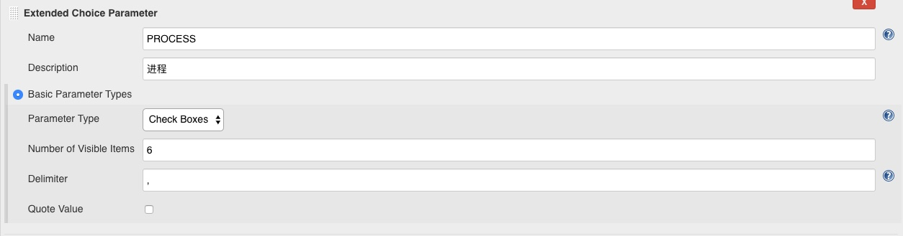
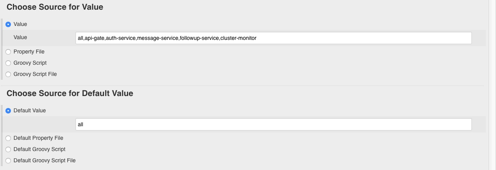
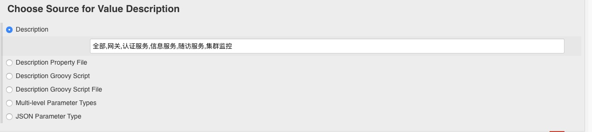
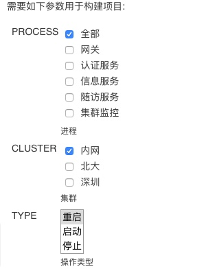

## 原因

公司需要一个可以重启服务器集群进程的 jenkins 服务，一般来说一个项目的后端服务会有 4-6 个进程，所有理应让用户去选择重启哪些进程，所以去研究了一下如何带参数运行 jenkins。

## 过程

### Extended Choice Parameter 插件

使用该插件可以实现让用户选择参数，并且能在构筑时使用对应变量，这点很重要，因为这样才能反馈用户的输出。

+ Name : 对应的变量名
+ Description : 描述
+ Parameter Type : 有很多选择，包括单选框，勾选框等
+ Number of Visible Items : 变量数量
+ Delimiter : 分隔符，下文会用到

+ Value : 对应上文的数量和分隔符的变量列表
+ Default Value : 默认值

Description : 给用户显示的名字

可以在后续构筑中只有引用变量

最终效果还是很高大上的 😂

