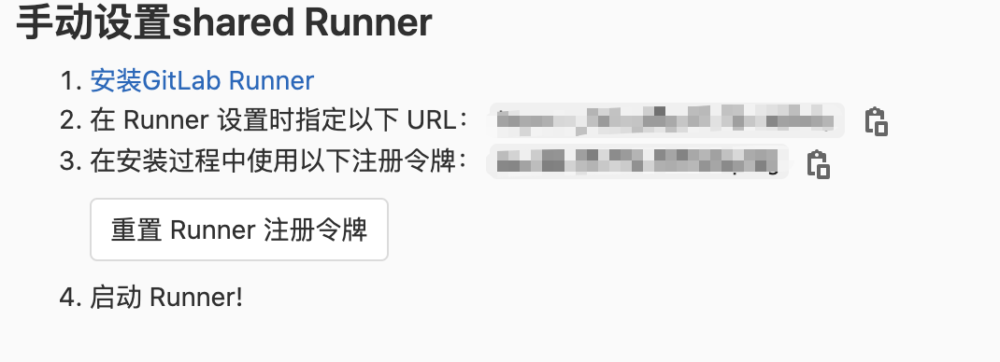

# gitlab 自动部署

gitlab 自身有一套非常完整的自动化流程，gitlab-runner 配合脚本可以实现很多有趣的功能。


## 环境介绍

· Docker
· jdk8
· gitlab-ce
· gitlab-runner

## 安装并启动

在 docker 中部署 gitlab-ce 就不在这里展开了。

在 docker 中安装 `gitlab-runner` 在启动对应服务

``` shell
# 下载对应镜像
sudo docker pull gitlab/gitlab-runner:latest
# 启动 gitlab-runner 服务
sudo docker run -d --name gitlab-runner --restart always \\
   -v /srv/gitlab-runner/config:/etc/gitlab-runner \\
   -v /var/run/docker.sock:/var/run/docker.sock \\
   gitlab/gitlab-runner:latest
```

## 注册runner

通过 docker 进入容器命令 `docker exec -ti d309ecefc792 bash` 进入 `gitlab-runner` 容器中。

运行 `sudo gitlab-runner register` 进行 runner 的注册

需要输入以下内容：

1. 输入 GitLab 实例的 URL


```shell
 Please enter the gitlab-ci coordinator URL (e.g. https://gitlab.com )
 https://gitlab.com
```

2. 输入用来注册 Runner 的 token

```
Please enter the gitlab-ci token for this runner
xxx
```

**上述俩个内容都可以在 GitLab 网页上找到，管理中心->Runner 中看到，如下图**



3. 输入描述，可以后续在 GitLab 网页更改
```
 Please enter the gitlab-ci description for this runner
 [hostame] my-runner
```

4. 输入与 Runner 绑定的标签

```
 Please enter the gitlab-ci tags for this runner (comma separated):
 runner
```

5. 选择 Runner 执行方式，一般选择 `shell`

```
Please enter the executor: ssh, docker+machine, docker-ssh+machine, kubernetes, docker, parallels, virtualbox, docker-ssh, shell:
 shell
```

GitLab 同时提供了一键注册命令：

```
sudo gitlab-runner register \
  --non-interactive \
  --url "https://gitlab.com/" \
  --registration-token "获取的 token " \
  --executor "docker" \
  --docker-image alpine:latest \
  --description "runner" \
  --tag-list "docker,aws" \
  --run-untagged \
  --locked="false" \
```

成功之后会在 `~/etc/gitlab-runner/` 目录下生成 `config.toml` 配置文件，同时在 GitLab 网站上看到对应的 Runner


## 配置 .gitlab-ci.yml 文件

yml的语法，这里就不再展开了，贴出一个简单的示例
```yml
stages:
  - build
  - deploy

build:
  image: node:alpine
  stage: build
  script:
    - npm install
    - npm run build
  artifacts:
    expire_in: 1 week
    paths:
      - dist/
  only:
    - master

deploy_staging:
  image: alpine:latest
  stage: deploy
  before_script:
    - apk update
    - apk add --no-cache rsync openssh
  script:
    - mkdir -p ~/.ssh
    - echo "$SSH_PRIVATE_KEY" >> ~/.ssh/id_dsa
    - chmod 600 ~/.ssh/id_dsa
    - echo -e "Host *\n\tStrictHostKeyChecking no\n\n" > ~/.ssh/config
    - rsync -rav --delete dist/ "$SERVER_USER_HOST:$SERVER_MASTER_PATH"
  only:
    - master
```

这里简单介绍几个KEY值的含义

1. image: 需要使用的 docker 镜像，非必须
2. stages: 定义构筑的场景，一般构筑有多个场景，非必须
3. cache: 定义哪些文件需要缓存
4. script: 需要执行的脚本或者命令，必须
5. stage: 和stages需要对应，为具体场景
6. tags: 指定哪些runner可以被使用，非必须


## 项目部署

在 GitLab 网页对应位置 管理中心->Runner 将项目添加至 Runner，之后在 push 后就可以自动触发了。


## jar包自动发布

### 依赖

如果直接使用 `mvn` 会报错，需要在对应的 git-runner 容器中配置好 maven 和 jdk

公司服务器的情况有点奇怪，需要 jar 包运行在宿主上，但是gitlab-runner是跑在容器上的，所以要将打包结果传输到宿主上

可以通过 scp 命令进行命令的传输，通过 ssh 命令来执行脚本

