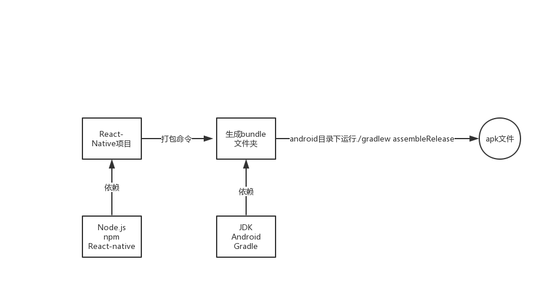

**React-Native打包apk是有官方教程的**

地址：https://reactnative.cn/docs/signed-apk-android/


## 环境配置

+ Android SDK
+ JDK
+ Node
+ React-native

### JDK下载
JDK 下载，直接使用`homebrew`
```
brew cask install java
```
这样默认安装的是最新的 JDK，不太适合用来当做环境。

可以这样来查看可下载 java 相关内容的列表。
```
brew search java
```


可以看到只有一个 java 是和 JDK 相关的，但目前还是没法选择下载版本。
#### Homebrew 获取默认版本库
其实 Homebrew 是支持下载对应软件的历史版本的，只是它的历史版本库默认没有被链接到本地。

终端输入
```
brew tap homebrew/cask-versions
```
可以获取 Homebrew 历史版本库

再输入 `brew search java` 就可以看到如下内容

#### 为什么找不到 java7 的包

如果对 JDK 7.x 有需求的应该会发现上图中没有提供对应的 java7 安装包

Remove java7 by commitay · Pull Request #3914 · Homebrew/homebrew-cask-versions · GitHub 里找到了解决方案

这里面貌似说的是 java7 的安装包被移除了，但是文章最末尾提供了一个替代解决方案

按文中所述，在终端执行`brew cask install caskroom/versions/zulu7`其实下载安装的就是 JDK 7.x

虽然安装之后显示的名字很奇怪，但至少是一个可行的方案

### Node下载

```
brew install node
```

### Android SDK 下载
按照下面的脚本一步一步手动操作，Macos 应该将其安卓包解压至
```
~/Library/Android
```
https://gist.github.com/jpswade/33841e261b28073d9e7551922acea1f2#file-install_adb-sh-L10

### React-native 安装
```
npm install -g react-native-cli
```


## 生成签名密钥
```
keytool -genkeypair -v -keystore my-release-key.keystore -alias my-key-alias -keyalg RSA -keysize 2048 -validity 10000
```
运行上述命令生成一个密钥

+ keystore：文件名
+ alias：别名
+ keyalg：应该是加密方法
+ keysizi：大小？
+ validity：有效期，单位为天

## 设置 gradle变量

1.把 my-release-key.keystore 文件放到你工程中的android/app文件夹下。

2.编辑~/.gradle/gradle.properties（全局配置，对所有项目有效）或是项目目录/android/gradle.properties（项目配置，只对所在项目有效）。如果没有gradle.properties文件你就自己创建一个，添加如下的代码（注意把其中的****替换为相应密码）

```
MYAPP_RELEASE_STORE_FILE=my-release-key.keystore
MYAPP_RELEASE_KEY_ALIAS=my-key-alias
MYAPP_RELEASE_STORE_PASSWORD=*****
MYAPP_RELEASE_KEY_PASSWORD=*****
```

好像没感觉上述俩步有时候必要性


## 把签名配置加入到项目的 gradle 配置中

编辑你项目目录下的android/app/build.gradle，添加如下的签名配置：
```python
...
android {
    ...
    defaultConfig { ... }
    signingConfigs {
        #添加这部分
        release {
            if (project.hasProperty('MYAPP_RELEASE_STORE_FILE')) {
                storeFile file(MYAPP_RELEASE_STORE_FILE)
                storePassword MYAPP_RELEASE_STORE_PASSWORD
                keyAlias MYAPP_RELEASE_KEY_ALIAS
                keyPassword MYAPP_RELEASE_KEY_PASSWORD
            }
        }
        #
    }
    buildTypes {
        # 添加这部分
        release {
            ...
            signingConfig signingConfigs.release
        }
        #
    }
}
...
```

### 生成发行 APK 包

```shell
$ cd android
$ ./gradlew assembleRelease
```

只要注意 java 环境不要太新就像，不然会报错

生成的包在 `android/app/build/outputs/apk/release/app-release.apk`

完整流程图

