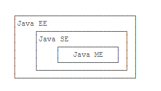
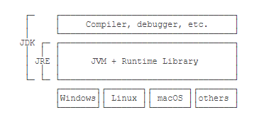
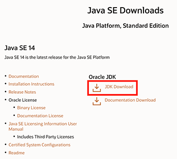
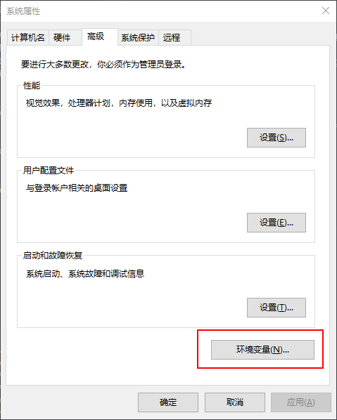
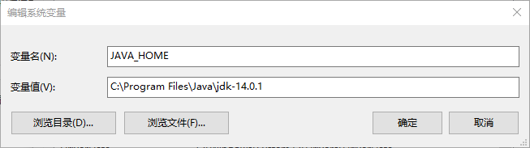

取自 廖雪峰的 java教程，经过个人理解编写，源地址为：https://www.liaoxuefeng.com/wiki/1252599548343744

# Java入门

## Java简介

Java 是由 SUN 公司推出的一种语言，创造本意是为了针对中小型家电设备的嵌入式应用，无人问津。由于互联网热潮崛起，正式改名为 Java。（原名 Oak，据说是Java之父高斯林很喜欢公司外边的橡树，但之后正式发布时发现Oak这个名字已经被人注册）

### Java版本

SUN 给 Java 分出三个版本：
+ Java SE：Standard Edition, 标准的 JVM 和标准库

+ Java EE：Enterprise Edition，企业版，在SE基础上加入了大量API，方便开发

+ Java ME：Micro Edition，针对嵌入式的瘦身版

### JDK&JRE

相信很多同学都见过这俩个名词，但是他们到底是什么，相互之间有何种关系，很多 Java 都不明了。

+ JDK : Java Development Kit
+ JRE：Java Runtime Environment

二者关系如下：

总体来说，JDK 包括 JRE 和编译器、调试器等开发工具。JRE 就是运行 Java 字节码的虚拟机。

为什么需要 Java 字节码和虚拟机？因为 Java 是一种介于解释和编译的语言。

通常的编译语言，比如 C++、C ，直接编译成机器码执行，由于不同平台的指令集不同，因此需要编译出对应不同平台的机器码。而解释性语言则由解释器直接加载源码运行，没有指令集问题，但是代价是运行效率较低。

而 Java 则是将代码编译成一种字节码，类似于 抽象的 CPU 指令集，在针对不同平台编写虚拟机，虚拟机负责字节码的执行。这样就做到了可以跨平台运行，又拥有高超的效率。因此很多人说 Java 是解释 + 编译语言。

### JDK 安装

能翻墙的同学，去 Oracle 官网自行下载就行，不能翻墙的，想办法翻墙！😀

#### Win配置Path
下载下来的 JDK 可以直接双击安装，默认会安装在 `C:\Program Files\Java` 目录下。如果想要在命令行运行，还需要环境变量的配置。

1.进入编辑环境变量界面

2.新建一个系统变量名为 `JAVA_HOME`,其值为之前安装的 Java 路径

**有些安装教程会把变量值设置为bin级别，如果这样设置，配置maven的时候可能会出现JAVA_HOME路径报错！**

3.在 Path 中添加 JAVA_HOME 变量，要注意在 WIN 中占位符为`%`。

4.打开命令行工具，输入 `java` 和 `javac`，如果 `java` 可以但是 `javac` 不行，可以检查一下是不是把 JAVA_HOME 设置为 JRE 的路径了。

+ java：这个可执行程序其实就是JVM，运行Java程序，就是启动JVM，然后让JVM执行指定的编译后的代码
+ javac：这是Java的编译器，它用于把Java源码文件（以.java后缀结尾）编译为Java字节码文件（以.class后缀结尾）