今天下午问导师要了公司 Liunx服务器的地址，想尝试使用 Jenkins 配合 GitHub 实现一个源代码库更新时，Jenkins 自动进行更新并发送邮件提示功能。

公司系统版本：
CentOS 7.6.1810

官网配置链接
https://pkg.jenkins.io/redhat-stable/

## 服务器环境配置
首先在服务器进行环境配置

需要使用以上版本库需要以下命令
```
sudo wget -O /etc/yum.repos.d/jenkins.repo https://pkg.jenkins.io/redhat-stable/jenkins.repo

sudo rpm --import https://pkg.jenkins.io/redhat-stable/jenkins.io.key
```
1.java环境

```shell
# 查看JDK版本：
java -version
```

直接使用 yum 安装

```
yum install jenkins
```

发现 leader 给的不是 root 账号，只是普通账号。

只能 

``` 
sudo yum install jenkins
```


## 切换 yum 下载源

由于 yum 下载某些源并非国内的，比如上面的 jenkins，50MB的东西居然要安装20多分钟，这也太难顶了。

果断切换成国内的镜像源，目前国内的镜像源有俩家比较不错的，网易和阿里云。


1.首先备份系统自带yum源配置文件/etc/yum.repos.d/CentOS-Base.repo

如果不是 root 用户，下面所有命令加上 sudo 即可

```shell
mv /etc/yum.repos.d/CentOS-Base.repo /etc/yum.repos.d/CentOS-Base.repo.backup

```


查看 Centos 版本

```shell
cat /etc/redhat-release
```

2.下载 对应的 aliyun 镜像版本


```shell
wget -O /etc/yum.repos.d/CentOS-Base.repo http://mirrors.aliyun.com/repo/Centos-7.repo

```

3、运行yum makecache生成缓存

```
yum makecache
```

4、这时候再更新系统就会看到以下mirrors.aliyun.com信息

```
yum -y update
```

## 启动 jenkins

启动 jenkins
```
service jenkins start
```
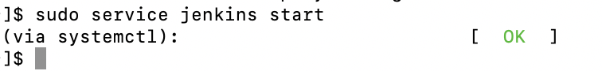

其默认端口为 8080，默认用户为 jenkins

可以在 /etc/sysconfig/jenkins 中修改 jenkins 配置

```
vi /etc/sysconfig/jenkins
```

返回 ok 之后，发现外网仍然无法访问改地址，但是使用 

```
curl localhost:8080
```

进行内部检查时是可以看到启动成功的。

也可以使用
```
netstat -tunlp
```
检查端口启动情况

可能是 8080 端口没有对外开放

添加对外的8080端口
```
firewall-cmd –zone=public –add-port=8080/tcp –permanent
```

修改后输入地址可以看到 jenkins 正常启动

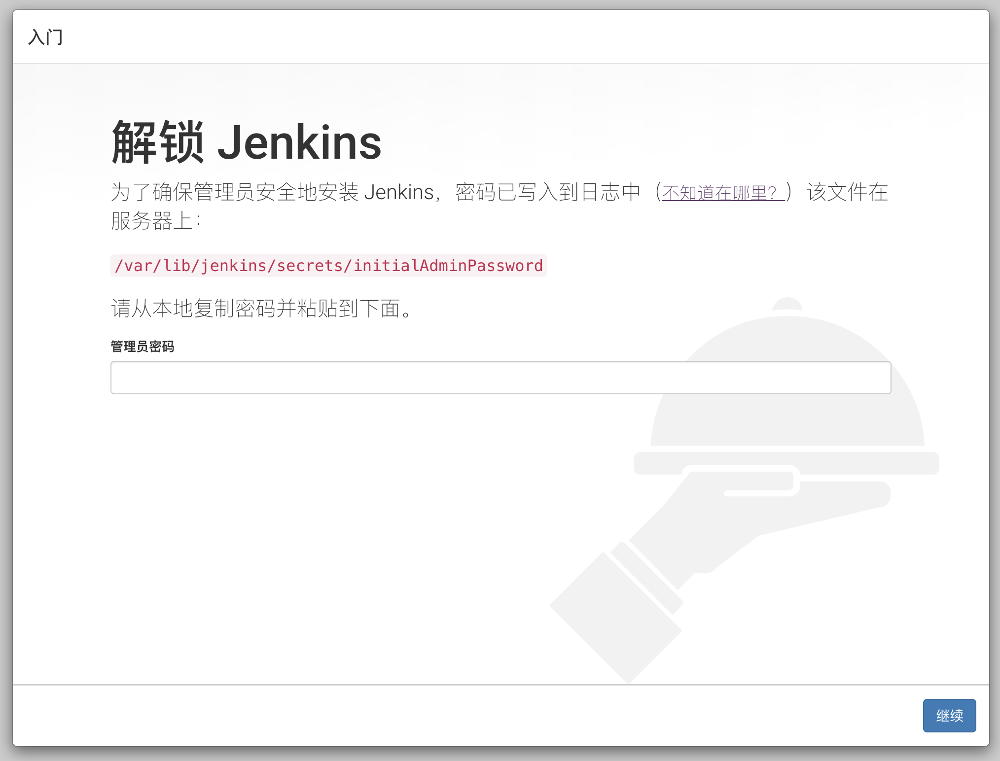

基本部署完成。


后续就是一些简单的部署过程，首先找到超级管理员的密码，路径 jenkins 已经给你了，直接在服务器上

```
cat + 路径
```
查看并复制即可。

之后选择安装模式，直接选择自动安装，等待安装完成。

下面部分参考于：
https://blog.csdn.net/boling_cavalry/article/details/78943061

## 条件梳理

要实现代码在 GitHub 上更新后 Jenkins 能得知并且自动发送邮件需要以下几个先决条件：

1.在对应的项目上配置 Webhooks。

2.在 GitHub 上创建 access token，给予 Jenkins 一些操作权限。

3.Jenkins 安装 GitHub 插件

4.Jenkins 配置 GitHub 访问权限

### 生成Personal access tokens

1.登录GitHub，进入"Settings"页面，点击左下角的"Developer settings"，如下图：

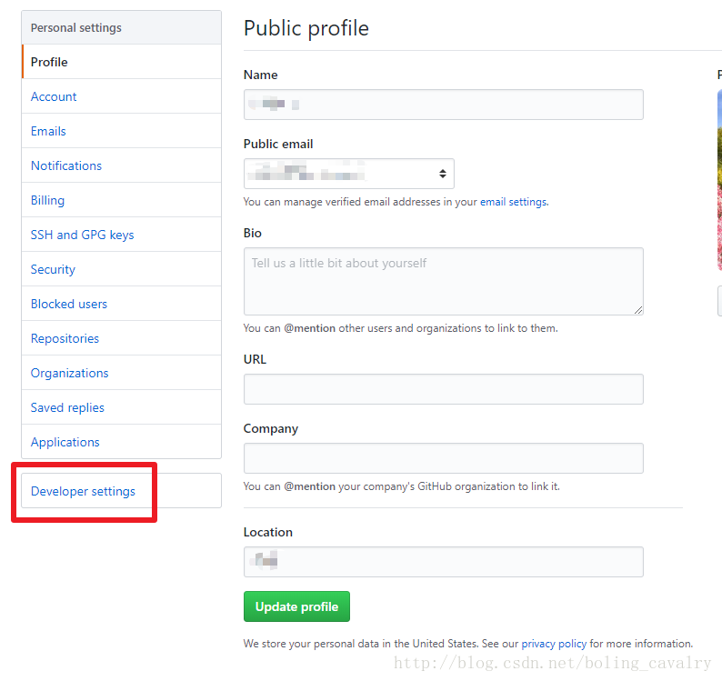

2.跳转到"Developer settings"页面后，点击左下角的“Personal access tokens”，如下图：

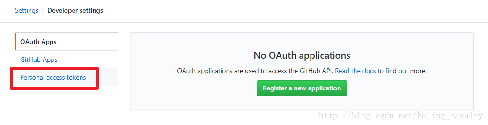

3.跳转到"Personal access tokens"页面后，点击右上角的"Generate new token"按钮，如下图：

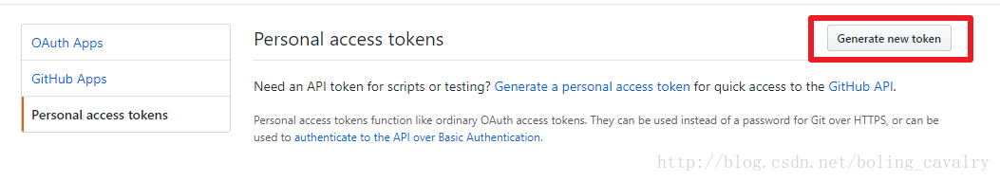

4.可能会提示输入GitHub密码，输入后跳转到创建token的页面，如下图所示，输入title，再勾选"repo"和"admin:repo_hook"，再点击底部的"Generate token"按钮，就能产生一个新的access token，将此字符串复制下来，后面jenkins任务中会用到

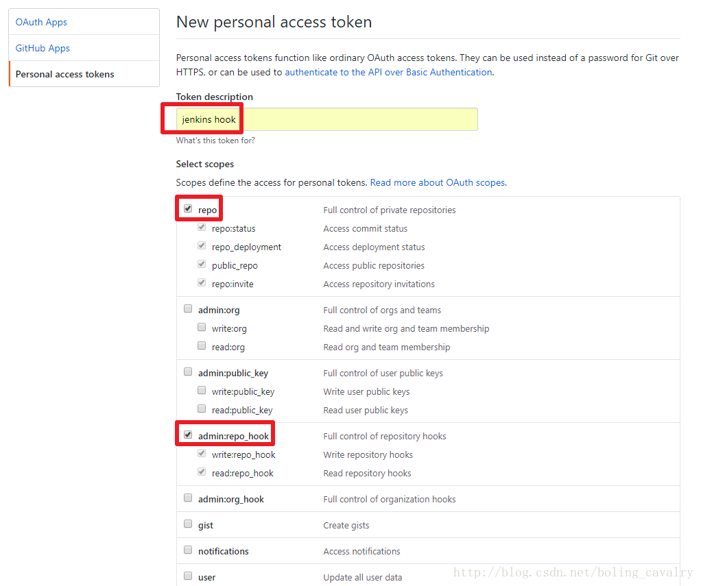


### webhook地址

webhook 是通知 Jenkins 时的请求地址，用来写在 GitHub 上，GitHub 能通过这个地址通知 Jenkins。

**上述地址必须是外网也能访问到的**

1.登录GitHub，进入要本次构建用到的工程；

2.在工程主页面点击右上角的"Settings"，再点击左侧"Webhooks"，然后点击“Add webhook”，如下图：

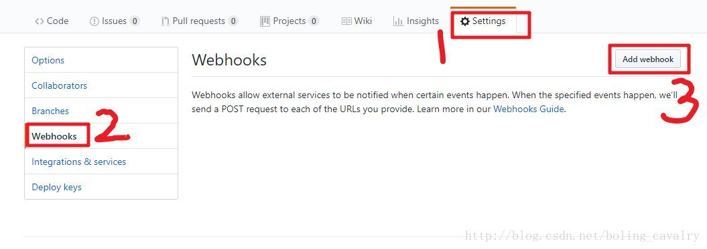

3.如下图，在"Payload URL"位置填入webhook地址，再点击底部的"Add webhook按钮"，这样就完成webhook配置了，今后当前工程有代码提交，GitHub就会向此webhook地址发请求，通知Jenkins构建：

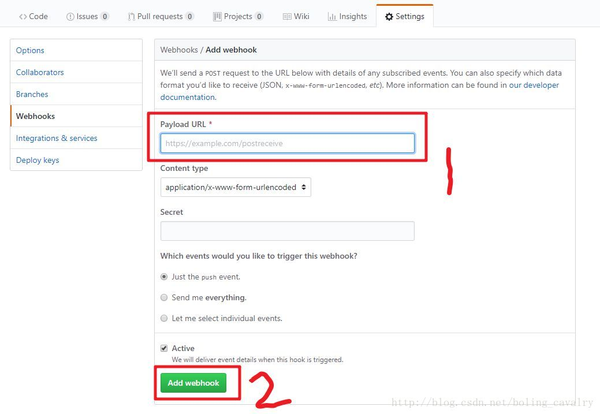

## Jenkins 设置

1.GitHub Plugin插件，在"系统管理->管理插件"位置检查此插件是否已经安装，没有的话请先安装；

2.配置GitHub，点击“系统管理->系统设置”，如下图：

3.在系统设置页面找到"GitHub"，配置一个"GitHub Server"，如下图，“API URL"填写"https://api.github.com”，“Credentials"位置如下图红框所示，选择"Add->Jenkins”

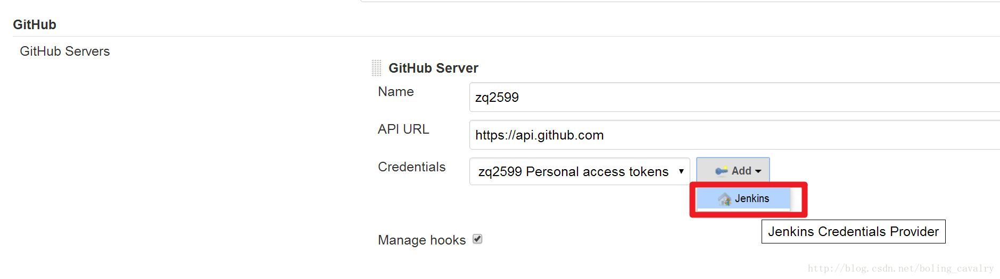

4.弹出的页面中，“Kind"选择"Secret text”，"Secret"填入前面在GitHub上生成的Personal access tokens，Description随便写一些描述信息，如下图：

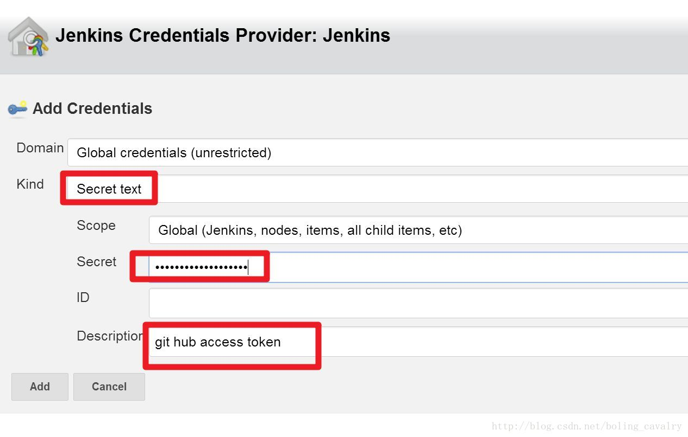

5.填写完毕后，点击右侧的"Test connection"按钮，如果信息没有填错，显示的内容如下图所示：

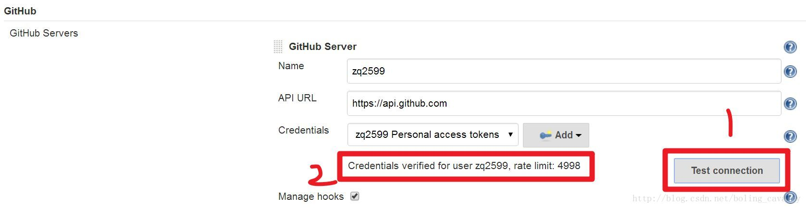

6.点击页面最底部的"保存"按钮


昨天配置 jenkins 的 webhook 失败了。今天继续尝试。发现服务器上的 jenkins 服务中断了。

重启服务器发现返回的是 ok，但是外网仍然无法访问。

使用 curl 语句发现 

```
Failed connect to localhost:8080; 拒绝连接
```

8080 端口拒绝了连接。

重启 jenkins
```
service jenkins restart
```

停止 jenkins
```
service jenkins stop
```

重启服务后，问题解决。

关于 GitHub 的 webhook 还是连接不上，而且全局设置里的设置 hook 也一直不成功，我决定重新安装 jenkins 来还原设置。

```
yum remove jenkins
```

重新下载之后发现配置还在，不知道为什么。。

我决定先删除 jenkins 目录，在运行 yum 命令，重新安装之后，设置都清空了。

由于之前对于 jenkins 了解混乱，对于各种设置还不知道其意义，只是简单地根据网上教程进行操作，可能导致了许多不应该的操作或者无意义的重复步骤。而且在 jenkins 两个完全不同的 ui（经典界面和 Blue Ocean）的情况下，更加混乱。

重新下载 jenkins 之后，插件下载过程中有很多插件都下载失败了，没选择重新安装之后，进到主页面发现很多功能都确实了。具体报错是缺少了一些插件的支持。而且发现了之前的那些各种各样的新项目，都是有插件提供的，怪不得 Jenkins 官方教程没有提供这些东西。

昨天效率太高了，不知道是不是因为推进的太快了，导致今天一直在 boot Jenkins 配置，基本上没什么进度。

早上查了一下公司服务器的 ip 为 10 开头的，原来 10 开头的是内网 ip 地址。

内网 ip 的计算机以 NAT（网络地址转化）协议，通过一个公共的网关访问 Internet。

很重要的一点，内网的计算机可以向 Internet 上其他的计算机发送请求，但 Internet 上的其他计算机无法想内网的计算机发送请求。

原来之前 GitHub 的 Webhook 没法连接是因为这个，自己的网络知识也太短缺了。。。

常见的内网 ip 有以下：
+ 10.0.0.0--10.255.255.255
+ 172.16.0.0--172.31.255.255
+ 192.168.0.0--192.168.255.255

现在问题就是如何让外网能够成功访问到内网

linux 查看本机外网 ip 地址

```
curl ifconfig.me
```
端口映射：将外网的某一个端口映射到内网的某一台主机上的某个端口


拟解决方案：

内网穿透：ngrok服务器，花生壳


进行简单的流水线构建之后，运行结果

```
Started by user tianle xia

Running as SYSTEM

Building in workspace /var/lib/jenkins/workspace/CS-NOTE

No credentials specified

 > git rev-parse --is-inside-work-tree # timeout=10

Fetching changes from the remote Git repository

 > git config remote.origin.url https://github.com/1oser5/CS-Notes.git # timeout=10

Fetching upstream changes from https://github.com/1oser5/CS-Notes.git

 > git --version # timeout=10

 > git fetch --tags --progress https://github.com/1oser5/CS-Notes.git +refs/heads/*:refs/remotes/origin/* # timeout=10
```

一直卡死在最后一波，10分钟之后流水线自动停止。

可能有两个问题：

1.git权限

2.磁盘空间不足

现在尝试在 mac 上运行

超时的原因好像就是因为 CS-NOTE 这个项目太大了，系统默认的 10分钟还 clone 不完，其他小型项目都可以正常构建。

然后关于 webhook，证实了需要内网穿透之后才能实现更新后自动构建。

gitlab 的问题放置到明天，首先解决文件如果过大，不能正常 clone 的问题。


使用公司内网搭建的 gitlab，找不到 settings，可能是因为目前这个账号的权限级别不够。

Mac 上通过添加 私钥方式进行连接成功。

liunx 打包机上也使用类似方式进行连接，成功连接。

目前为止，jenkins 和 gitlab 的联动完成，可以手动更新代码库。

现在拓展一个发送邮箱功能。