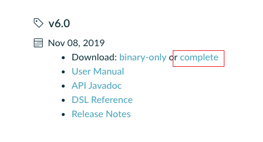
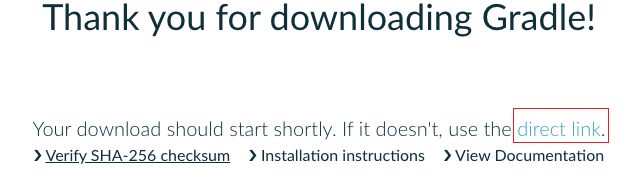

## 环境需求

+ java 环境
+ Gradle 环境
+ Android SDK

Gradle 是一个构建工具，其可以帮助更快的构建软件。简单来说，就是帮你打包的。


## Gradle配置

Gradle 在任何操作平台上都是基于 Java JDK or JRE 8以上。

首先先确认 java 版本
```
java -version
```

到 Gradle 官网，找到下载列表



点击上图的 complete，进入下载页面，复制下载链接。



在 linux 命令行中输入
```
wget https://services.gradle.org/distributions/gradle-6.0-all.zip
```

wget 后为之前复制的下载链接。

下载完之后新建一个文件夹用来解压 gradle.zip
```
mkdir /opt/gradle
```

在制定文件夹解压 gradle-6.0
```
unzip -d /opt/gradle gradle-6.0.bin.zip
```

bin 结尾的文件是二进制的版本的，我下载的是 complete 版本，所以压缩文件名称不一样，需要注意。

查看 gradle 是否正常解压
```
ls /opt/gradle/gradle-6.0
```

最后需要设置系统路径

```
g
```


输入 
```
gradle -v
```

查看是否安装成功。


在 gradle 配置完成后，首先不引入 Jenkins 部分，先使用 gradle 进行打包。

看到公司给我的安卓项目，脑壳有点乱，这不太像是用 as 开发的文件目录啊。

晕了，原来是用 vue 开发的。

原来公司是用 vue 加 HBuilder 打包的，哇！！


之前的 HBuilder 命令行方案应该是不行的，好像没推出这个东西，只能使用 cordova。

首先 `npm install` 所有的包，然后在 `npm run build`，发现 `node.js` 版本不够。

目前公司 linux 服务器上的 node 版本为 6+。

### 更新node

首先清除 npm cache
```
sudo npm cache clean -f
```
安装 n 模块
```
sudo npm install -g n
```
安装最新稳定版本
```
sudo n stable
```
查看 node 版本
```
node -v
```

我虽然更新成功了，但是 `node -v` 显示的还是之前那个版本。

可能是下载了两个 node，直接删除吧
```
yum remove nodejs npm -y
```


1、下载源码，你需要在https://nodejs.org/en/download/下载最新的Nodejs版本，本文以v0.10.24为例:

cd /usr/local/src/
wget http://nodejs.org/dist/v0.10.24/node-v0.10.24.tar.gz
2、解压源码

tar zxvf node-v0.10.24.tar.gz
3、 编译安装

cd node-v0.10.24
./configure --prefix=/usr/local/node/0.10.24
make
make install
4、 配置NODE_HOME，进入profile编辑环境变量

vim /etc/profile
设置 nodejs 环境变量，在 export PATH USER LOGNAME MAIL HOSTNAME HISTSIZE HISTCONTROL 一行的上面添加如下内容:

#set for nodejs
export NODE_HOME=/usr/local/node/0.10.24
export PATH=$NODE_HOME/bin:$PATH
:wq保存并退出，编译/etc/profile 使配置生效

source /etc/profile
验证是否安装配置成功

node -v
输出 v0.10.24 表示配置成功

npm模块安装路径

/usr/local/node/0.10.24/lib/node_modules/

确实是下载好了 npm 和 node，但是发现没法 `sudo npm `
安装。

查了一下 npm 文件 应该放在 `/usr/local/bin/npm` 下，不然就会报错

只能建立软连接解决，不然就要重下了。
```
sudo ln -s /usr/local/node/0.10.24/bin/npm /usr/local/bin/npm
```

我真的服了，这东西是真的不好用。最终我使用 nvm 下的真的快，nvm天下第一。

1.安装并下载 nvm 脚本
```
curl https://raw.githubusercontent.com/creationix/nvm/v0.13.1/install.sh | bash

source ~/.bash_profile
```
列出所有的版本
```
nvm list-remote
```
安装对应版本
```
nvm install v0.10.30
```
查看已安装版本
```
nvm list
```
切换版本
```
nvm use v0.10.30
```
设为默认版本
```
nvm alias default v0.10.30
```

第二天来公司发现之前node版本都不见了。。目前不知道什么原因，使用 nvm 重新下载一个即可。
这好像是因为 nvm 配置有误，我下午在确认一下。

## 安装 cordova

安装之前需要 Android JDK

1.下载Android SDK
http://tools.android-studio.org/index.php/sdk/   

我下载的是：`android-sdk_r24.4.1-linux.tgz`

2.解压Android SDK
将android-sdk_r24.4.1-linux.tgz文件复制到Linux 文件系统中的某个目录，我的是目录是/usr/local/
执行命令解压：
```
tar -zvxf android-sdk_r24.4.1-linux.tgz
```
3.配置环境变量

在文件 `/etc/profile` 末端添加如下两行：
```
export ANDROID_HOME=/usr/local/android-sdk-linux
export PATH=$ANDROID_HOME/tools:$PATH
```
`android-sdk-linux` 是你解压后的文件名，`tools`一定要这样写，是里面文件夹的名称

执行命令文件立马生效
```
source /etc/profile
```

再使用 npm 命令安装
```
npm install -g cordova
```

运行 `javac -version` 报错，但是运行 `java -version`可以正常显示版本号，好像之前安装的是 `jre` 使用 
```
yum install java-devel
```
安装一下 `jdk` 即可。

新建 cordova项目

```
cordova create my_app
```
切换到 my_app，运行
```
cordova platform add android
```
添加安卓环境


运行

```
cordova build android
```

报错

```
A problem occurred evaluating project ':app'.
> No installed build tools found. Install the Android build tools version 19.1.0 or higher.
```

缺少 安卓 build tools，这安卓也太麻烦了。

可以使用安卓自动升级安装

获取所有可用下载
```
android list sdk --all
```
下载对应版本号
```
android update sdk -u -a -t <package no.>
```

但是我这个账户不是 root ，权限不够，在自动下载的时候会报错。只能问 leader 要 root 账户了。

root 账户真香😘，轻松安装。


运行

```
cordova build android
```
又报错了，报错大概就是没有 licences
```
Failed to install the following Android SDK packages as some licences have not been accepted.
     platforms;android-28 Android SDK Platform 28
```
之后你直接用
```
android update sdk -u -a -t <package no.>
```
把他少的装上就像，API对应上


linux 将一个文件下的所有文件复制到另一个文件下
```
cp -r dist/*  ~/zhyl-git/v_cordova/www
```

现在给出的猜想是由于权限原因无法正常使用 jdk 导致 build 失败

现在使用 root 账户尝试一下

如果俩个不同用户访问同一个文件夹，是有互斥锁机制的。具体表现为第二个用户无法进入或者打开第二个文件夹。


国内找了半天怎么下载 sdk，最后还是用了人家的傻瓜方法。 https://gist.github.com/jpswade/33841e261b28073d9e7551922acea1f2#file-install_adb-sh-L10