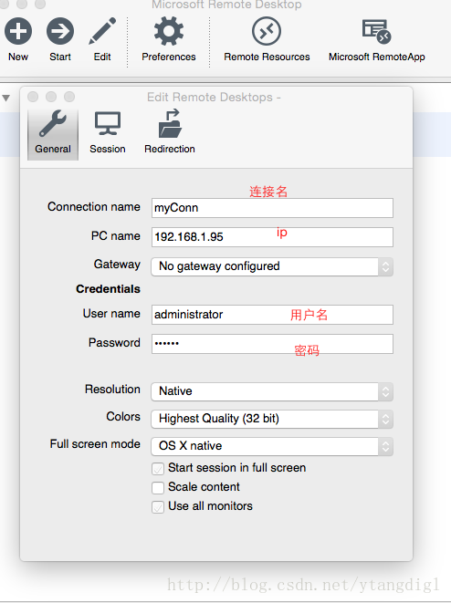
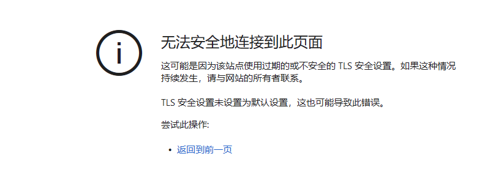
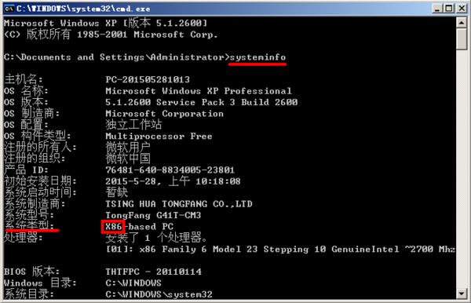

mac 可以直接使用 Microsoft Remote Desktop for Mac 来远程控制 Windows 界面。



打开命令行输入
```
java -version
```
查看是否拥有 java 环境

windows 服务器方便就方便在有 GUI，直接打开浏览器去下载 java。

需要注意的是 Jenkins 对于 Java 的版本有一定要求。

百度是可以正常使用，但是发现 oracle 官网打不开，问题如下：




1.搜索输入 运行，然后输入 inetcpl.cpl

2.打开 internet 设置

3.点击 高级

4.勾选“使用 TLS 1.1”和“使用 TLS 1.2”

5.刷新网页即可


确定 windows 服务器是几位的

在 cmd 中输入 
```
systeminfo
```


