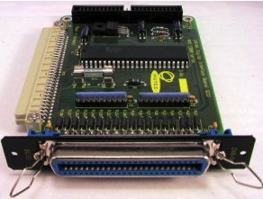
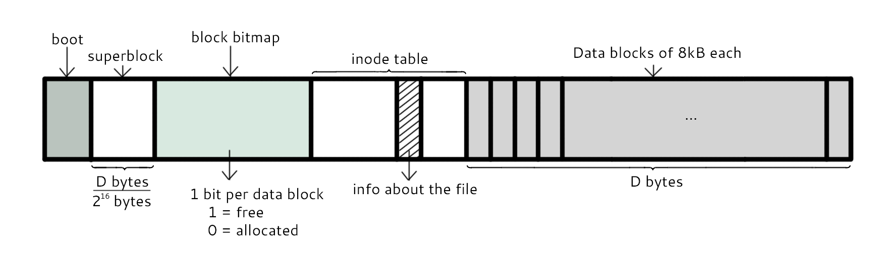
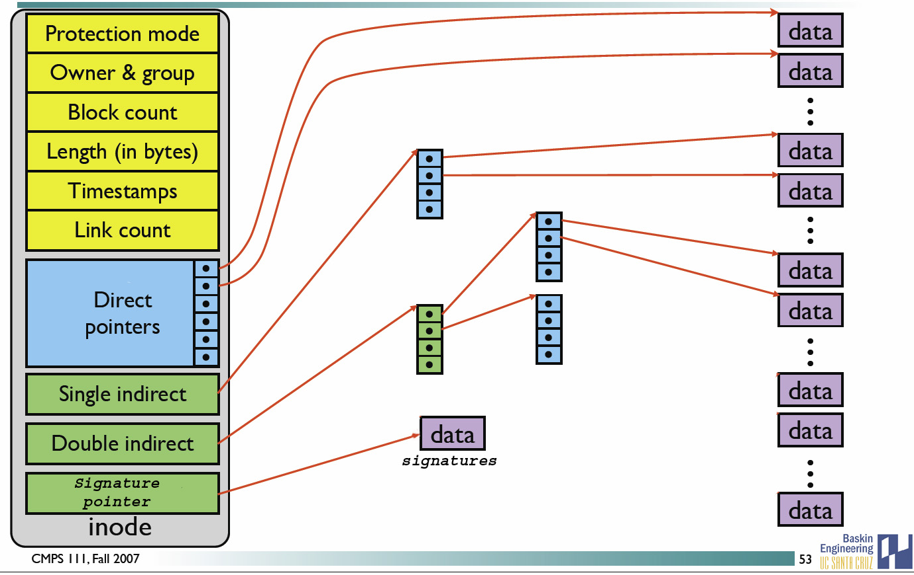
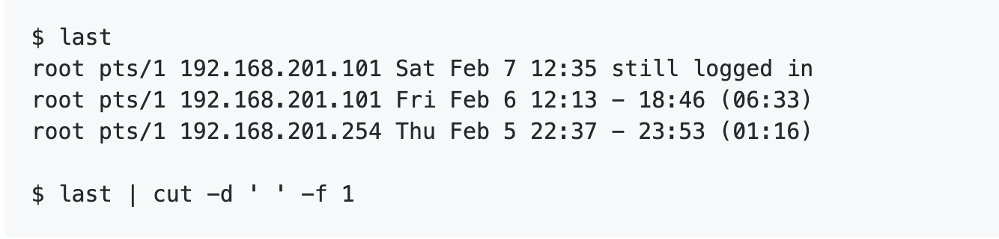
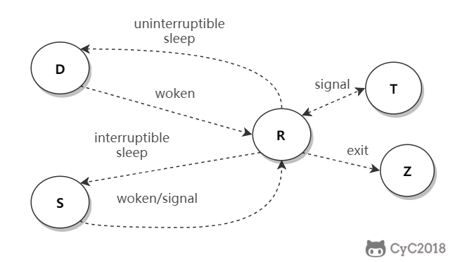

+ [常用操作以及概念](#常用操作以及概念)
  + [1.快捷键](#1.1)
  + [2.求助](#1.2)
  + [3.关机](#1.3)
  + [4.PATH](#1.4)
  + [5.sudo](#1.5)
  + [6.包管理工具](#1.6)
  + [7.发行版](#1.7)
  + [8.VIM 三个模式](#1.8)
  + [9.GNU](#1.9)
  + [10.开源协议](#1.10)
+ [磁盘](#2) 
  + [1.磁盘接口](#2.1) 
  + [2.磁盘的文件名](#2.2)
+ [分区](#3) 
  + [1.分区表](#3.1)
  + [2.开机测验程序](#3.2)
+ [文件系统](#4)
  + [1.分区与文件系统](#4.1)
  + [2.组成](#4.2)
  + [3.文件读取](#4.3)
  + [4.磁盘碎片](#4.4)
  + [5.block](#4.5)
  + [6.inode](#4.6)
  + [7.目录](#4.7)
  + [8.日志](#4.8)
  + [9.挂载](#4.9)
  + [10.目录配置](#4.10)
+ [文件](#5)
  + [1.文件属性](#5.1)
  + [2.文件与目录的基本操作](#5.2)
  + [3.修改权限](#5.3)
  + [4.默认权限](#5.4)
  + [5.目录的权限](#5.5)
  + [6.链接](#5.6)
  + [7.获取文件内容](#5.7)
  + [7.指令与文件搜索](#5.8)
+ [压缩与打包](#6)
  + [1.压缩文件名](#6.1)
  + [2.压缩指令](#6.2)
  + [3.打包](#6.3)
+ [Bash](#7)
  + [1.特性](#7.1)
  + [2.变量操作](#7.2)
  + [3.指令搜索顺序](#7.3)
  + [4.数据流重定向](#7.4)
+ [管道指令](#8)
  + [提取指令](#8.1)
  + [排序指令](#8.2)
  + [双向输出重定向](#8.3)
  + [字符转换指令](#8.4)
  + [分区指令](#8.5)
+ [正则表达式](#9)
  + [grep](#9.1)
  + [printf](#9.2)
  + [awk](#9.3)
+ [进程管理](#10)
  + [查看进程](#10.1)
  + [进程状态](#10.2)
  + [SIFCGLD](#10.3)
  + [wait()](#10.4)
  + [waitpid()](#10.5)
  + [孤儿进程](#10.6)
  + [僵尸进程](#10.7)
  
# 常用操作及概念<span id ="1"></span>
## 1.快捷键<span id ="1.1"></span>

+ Tab ：命令和文件补全；
+ Ctrl + C：中断正在运行的程序；
+ Ctrl + D：结束键盘输入（End Of File，EOF）
  
## 2.求助<span id ="1.2"></span>

### 1.--help  
指令的基本用法与选项介绍。

### 2.man

man 是 manual 的缩写，将指令的具体信息显示出来。

当执行 **man date** 时，有 DATE(1)出现，其中的数字代表指令的类型，常用的数字及其类型如下：

| 代号 | 类型|
| :--: | :--:|
| 1 | 用户在 shell环境中可以操作的指令或者可执行文件 |
| 5 | 配置文件 |
| 8 | 系统管理员可以使用的管理指令 |

### 3.info

info 与 man 类似，但是 info 将文档分成一个个页面，每个页面可以进行跳转。

4.doc

/usr/share/doc 存放着系统的一整套完整说明文件。

## 3.关机<span id ="1.3"></span>

### 1.who 

在关机前需要先使用 who 命令查看有没有其他用户在线。

### 2.sync

为了加快磁盘文件的读写速度，位于内存中的文件数据不会立刻同步到磁盘上，因此关机之前需要先进行 sync 同步操作。

### 3.shoutdown

#showdown [-krhc] 时间 [信息]

-k：不会关机，只是发生警告信息，通知所有在线用户
-r：将系统的服务停掉后就重新启动
-h：将系统的服务停掉后就立即关机
-c：取消已经进行的 shutdown 指令内容

## 4.PATH<span id ="1.4"></span>

可以在环境变量 PATH 中声明可执行文件的路径，路径之间用 ： 分隔

/usr/local/bin:/user/bin:/user/local/sbin:/usr/sbin:/home/dmtsai/.local/bin:/home/dmtsai/bin

## 5.sudo<span id ="1.5"></span>

sudo 允许一般用户使用 root 可执行的命令，不过只有在 /etc/sudoers 配置文件中添加的用户才能使用该指令。

## 6.包管理工具<span id ="1.6"></span>

PRM 和 DPKG 为最常见的两类软件包管理工具：
+ RPM 全称为Redhat Package Manager，最早由 Red Hat 公司制定实施，最后被 GNU 开源操作系统接受并成为许多 Linux系统的既定软件标准。YUM 基于 RPM，具有依赖管理和软件升级功能。
+ 与 RPM 竞争的是基于 Debian 操作系统的 DEB 软件包管理工具 DPKG，全称为 Debian Package，功能与 PRM 类似。
  
## 7.发行版<span id ="1.7"></span>

Linux 发行版是 Linux 内核及各种应用软件的集成版本。

| 基于的包管理工具 | 商业发行版 | 社区发行版 |
| :--: | :--: | :--: |
| PRM | Red Hat | Fedora/CentOS |
| DPKG | Ubuntu | Debian |

## 8.VIM 三个模式<span id ="1.8"></span>

+ 一般指令模式（Command mode）：VIM 的默认模式，可以用于移动游标查看内容；
+ 编辑模式（Insert mode）：按下 "i" 等按键之后进入，可以对文本进行编辑；
+ 指令列模式（Bottom-line mode）：按下 ":"按键之后进入，保存退出等操作。


在指令列模式下，有以下命令用于离开或者保存文件。

| 命令 | 作用 |
| :--: | :--: |
| :w | 写入磁盘 |
| :w! | 当文件为只读时，强制写入磁盘，到底能不能写入，与用户对该文件的权限有关 |
| :q | 离开 |
| :q! | 强制离开不保存 |
| :wq | 写入磁盘后离开 |
| :wq! | 强制写入磁盘后离开 |


## 9.GNU<span id ="1.9"></span>

GNU 计划，译为革奴计划，它的目的是创造一套完全自由的操作系统，称为 GNU，其内容软件完全以 GPL 方式发布。其中 GPL 全称为 GNU 通用公共许可协议（GNU General Public License），包含了以下内容：
+ 以任何目的运行此程序的自由；
+ 再复制的自由；
+ 改进此程序，并公开发布改进的自由。
  
## 10.开源协议<span id ="1.10"></span>

世界上的开源许可证，大概有上百种，很少有人能搞得清楚它们的区别。即使现在最流行的六种 -- GPL，BSD，MIT，Mozilla，Apache 和 LGPL --之一做选择。


# 磁盘<span id ="2"></span>

## 1.磁盘接口<span id ="2.1"></span>

### 1.IDE

IDE（ATA）全称 Advanced Technology Attachment，接口速度最大为 133MB/s，因为并口线的抗干扰性太差，且排线占用空间较大，不利于电脑内部散热，亦逐渐被 SATA 取代。


### 2.SATA

SATA 全称 Serial ATA，也就是使用串口的 ATA 接口，抗干扰性强，且对数据线的长度要求比 ATA 低很多，支持热插拔等功能。SATA-II 的接口速度为 300MiB/s，而 SATA-III 标准可以达到600 MiB/s 的传输速度。 SATA 的数据线也比 ATA 的细的多，
有利于机箱内的空气流通，整理咸菜也更为方便


### 3.SCSI

SCSI 全称是 Small Computer System Interface（小型机系统接口），SCSI 硬盘广为工作站以及个人电脑以及服务器锁使用，因此会使用较为先进的技术，如碟片转速 15000 rpm的高转速，且传输时 CPU 占用率比较低，但是单价也比相同容量的 ATA 及 SATA 硬盘更加昂贵。



### 4.SAS

SAS（Serial Attached SCSI）是新一代的 SCSI 技术，和 SATA 硬盘相同。都是采用序列式技术以获取更高的传输速度，可以达到 6Gb/s。此外也通过缩小连接线改善系统内部空间等。


## 2.磁盘的文件名<span id ="2.2"></span>

Linux 中每个硬件都被当做一个文件，包括磁盘。磁盘以磁盘接口类型进行命名，常见磁盘的文件名如下：
+ IDE 磁盘： /deb/jd[a-d]
+ SATA/SCSI/SCS 磁盘：/dev/sd[a-p]

其中文件名后面的序号的确定与系统检测到磁盘的顺序有关，而与磁盘所插入的槽位置无关。

# 分区<span id ="3"></span>
## 1.分区表<span id ="3.1"></span>

磁盘分区表主要有两种格式，一种是限制较多的 MBR 分区表，一种是较新且限制较少的 GPT 分区表。

### 1.MBR

MBR 中，第一个扇区最重要，里面有主要开机记录（Master boot record，MBR）及分区表（Partition table），其中主要开机记录占 446 bytes，分区表占 64 bytes。

分区表只有 64 bytes，最多只能存储 4 个分区，这 4 个分区为主分区（Primary）和扩展分区（Extended）。其中扩展分区只有一个，它使用其他扇区来记录额外的分区表，因此通过扩展分区可以分出更多的分区，这些分区称为逻辑分区。

Linux 也把分区当做文件，分区文件的命名方式为：磁盘文件名 + 编号，例如 /dev/sda1 。注意，逻辑分区的编号从 5 开始。

### 2.GPT
扇区是磁盘的最小存储单位，旧磁盘的扇区大小通常为 512 bytes，而最新的磁盘支持 4 k。GPT 为了兼容所有磁盘，在定义扇区使用上逻辑区块地址（Logical Block Address，LBA），LBA 默认大小为 512 bytes。

GPT 第一个区块记录了主要开机记录（MBR），紧接着是 33 个区块记录分区信息，并把最后的 33 个区块用于对分区信息进行备份。这 33 个区块第一个为 GPT 表头记录，这个部分记录了分区表本身的位置与大小和备份分区的位置，同时放置了分区表的校验码（CPC32），操作系统可以根据这个校验码来判断 GPT 是否正确。如果错误，可以使用备份分区进行恢复。

GPT 没有扩展分区概念，都是主分区，每个 LBA 可以分到 4 个分区，因此总共可以分 4 * 32 = 128 个分区。

MBR 不支持 2.2 TB 以上的硬盘，GPT则支持最多 8 ZB。


## 2.开机检测程序<span id ="3.2"></span>

### 1.BIOS

BIOS （Basic Input/Output System，基本输入输出系统），他是一个固件（嵌入在硬件中的软件），BIOS 程序存放在断电后内容不会丢失的只读内存中。


BIOS 是开机的时候计算机执行的第一个程序，这个程序知道可以开机的磁盘，并读取磁盘第一个扇区的主要开机记录（MBR），由主要开机记录（MBR）执行其中的开机管理程序，这个开机管理程序会加载操作系统的核心文件。

主要开机记录（MBR）中的开机管理程序提供以下功能：选单，载入核心文件以及转角其他开机管理程序。转交这个功能可以用来实现多重引导，只需要将一个操作系统的开机管理程序安装在其他分区的启动扇区上，在启动开机管理程序时，就可以通过选单选取启动当前的操作系统或转交给其他开机管理程序从而启动另一个操作系统。

下图中，第一扇区的主要开机记录（MBR）中的开机管理程序提供了两个选单：M1，M2，M1 指向了 Windos 操作系统，而 M2 指向其他分区的启动扇区，里面包含了另外一个开机管理程序，提供了一个指向 Linux 的选单。


安装多重引导，最好在安装 Windows 再安装 Linux。因为安装 Windows 时会覆盖掉主要开机记录（MBR），而 Linux 可以选择将开机管理程序 安转载 主要开机记录（MBR）或者其他分区的启动扇区，并且可以设置开机管理程序的选单。

### 2.UEFI

BIOS 不可以读取 GPT 分区表，而 UEFI 可以。

# 文件系统<span id ="4"></span>
## 1.分区与文件系统<span id ="4.1"></span>

对分区的格式化是为了在分区上建立文件系统。一个分区通常只能格式化为一个文件系统，但是磁盘阵列等技术可以讲一个分区化为多个文件系统。

## 2.组成<span id ="4.2"></span>

最主要的几个组成部分如下：
+ inode：一个文件占用一个 inode，记录文件属性，同时记录此文件的内容所在的 block 编号；
+ block：记录文件的内容，文件太大时，会占用多个 block。
  
除此之外还包括：
+ superblock：记录文件系统的整体信息，包括 inode 和 block 的总量，使用量，剩余量，以及文件系统的格式与相关信息等。
+ block bitmap：记录 block 是否被使用的位图。



## 3.文件读取<span id ="4.3"></span>

相对于 Ext2 文件系统，当要读取一个文件的内容时，先在 inode 中查找文件内容所在的所有 block，然后把所有 block 的内容读取出来。


而对于 FAT 文件系统，他没有 inode，每个 block 中存储着下一个 block 的编号。


## 4.磁盘碎片<span id ="4.4"></span>

指一个文件内容所在的 block 过于分散，导致磁盘磁头移动距离过大，从而降低磁盘读写性能。

## 5.block<span id ="4.5"></span>

在 Ext2 文件系统中所支持的 block 大小有 1K，2K，以及 4K 三种，不同的大小限制了单个文件和文件系统的最大大小。

| 大小 | 1KB | 2KB | 4KB|
| :--: | :--: | :--: | :--:|
| 最大单一文件 | 16GB | 256GB | 2TB|
| 最大文件系统 | 2TB | 8TB | 16TB |

一个 block 只能被一个文件所使用，未使用的部分直接浪费了。因此如果需要存储大量的小文件，最好使用比较小的 block。


## 6.inode<span id ="4.6"></span>

inode 具体包含以下信息：

+ 权限（read/write/excute）；
+ 拥有者与群组（owner/group）；
+ 容量；
+ 建立或状态改变的时间（ctime）；
+ 最近读取时间（atime）；
+ 最近修改时间（mtime）；
+ 定义文件特性的旗标（flag），如 SetUID；
+ 该文件真正内容的指向（pointer）。

inode 具有以下特点：
+ 每个 inode 大小均固定为 128 bytes（新的 ext4 与 xfs 可以设定到 256 bytes）；
+ 每个文件都仅占用一个 inode。

inode 中记录了文件内容所在的 block 编号，但是每个 block 非常小，一个大文件随便都需要几十万的 block。而一个 inode 大小记录有限，无法直接引用这么多 block 编号。因此引入了间接、双简介、三间接引用。间接引用让 inode 记录的引用 block 块记录引用信息。



## 7.目录<span id ="4.7"></span>

建立一个目录时，会分配一个 inode 与至少一个 block。block 记录的内容是目录下所有文件的 inode 编号 以及 文件名。

## 8.日志<span id ="4.8"></span>

如果突然断电，那么文件系统就会发生错误，例如断电前只修改了 block bitmap，还没有将数据真正写入 block 中。

ext3/ext4 文件系统引入了日志功能，可以利用日志来修复文件系统。

## 9.挂载<span id ="4.9"></span>

挂载利用目录作为文件系统的进入点，也就是说，进入目录之后可以读取文件系统的数据。


## 10.目录配置<span id ="4.10"></span>

为了使不同 Linux 发行版本的目录结构保持一致性，Filesystem Hierarchy Standard（FHS）规定了 Linux 的目录结构。最基础的三个目录如下：
+ / (root，根目录)
+ /usr（unix software resource）：所有系统默认软件都会安装到这个目录；
+ /var（variable）：存放系统或程序运行过程中的数据文件。


# 5.文件<span id ="5"></span>
## 1.文件属性<span id ="5.1"></span>

用户分为三种：文件拥有者、群组以及其他人，对不同的用户有不同的文件权限。

使用 ls 查看一个文件时，会显示一个文件的信息，例如 drwxr-xr-x 3 root root 17 May 6 00:14 .config，对这个信息的解释如下：
+ drwx-xr-x：文件类型以及权限，第 1 位 为文件类型字段，后 9 位 为文件权限字段
+ 3：链接数
+ root ：文件拥有者
+ 17：文件大小
+ May 6 00:14：文件最后被修改时间
+ .config：文件名

常见的文件类型以及其含义有：
+ d：目录
+ -：文件
+ l：链接文件

9 位的文件权限字段中，每 3 个为一组，每一组分别代表对文件拥有者、所属群组以及其他人的文件权限。一组权限中的 3 位分别为 r、w、x 权限，表示可读、可写、可执行。

文件时间有三种：
+ modification time（mtime）：文件的内容更新就会更新；
+ status time（ctime）：文件的状态（权限、属性）更新就会更新；
+ access time（atime）：读取文件时就会更新。
  
## 2.文件与目录的基本操作<span id ="5.2"></span>

### 1.ls

列出文件或目录的信息，目录的信息就是其中包含的文件。

``` html
# ls [-aAdfFhilnrRst] file|dir
-a ：列出全部文件
-d ：仅列出目录本身
-l ：以长数据串行列出，包含文件的属性与权限等等数据
```

### 2.cd

更换当前目录。

``` html
cd [相对路径或绝对路径]
```

### 3.mkdir

创建目录。

```html
# mkdir [-mp] 目录名称
-m：配置目录权限
-p：递归创建目录
```

### 4.rmdir

删除目录，目录必须为空。

```html
rmdir [-p] 目录名称
-p：递归删除目录
```
### 5.touch

更新文件时间或建立新文件。

```html
# touch [-acdmt] filename
-a：更新 atime
-c：更新 ctime，若该文件不存在则不建立新文件
-m：更新 mtime
-d：购买可以接更新日期而不使用当前日期，也可以使用 --date="日期或者时间''
-t：后面可以接更新时间而不使用当前时间，格式为[YYYYMMDDhhmm]
```

### 6.cp

复制文件。如果源文件有两个以上，则目的文件一定要是目录才行。

```html
cp [-adfilprsu] source destination
-a：相当于 -dr --preserve=all
-d：若来源文件为链接文件，则复制链接文件属性而非文件本身
-i：若目标文件已经存在，覆盖前会先询问
-p：连同文件的属性一起复制过去
-r：递归复制
-u：destination 比 source 旧才更新 desitnation 或 destination 不存在的情况下才复制 --preserve=all：除了 -p 的权限相关参数外，还加入了 SELinux 属性，links，xattr 等也复制了
```

### 7.rm

删除文件。

```html
rm [-fir] 文件或目录
-r：递归删除
```

### 8.mv

移动文件。

```html
# mv [-fiu] source destination
# mv [options] source1 source2 source3 ...directory
-f： force 强制的意思，如果目标文件已存在，不会询问而直接覆盖
```

## 3.修改权限<span id ="5.3"></span>

可以将一组权限用数字来表示，此时一组权限的 3 个位当做二进制数字的位，从左到右每个位的权值为 4、2、1，即每个权限的数字权值为 r：4、w：2、x：1。

```html
chmod [-R] xyz dirname/filename
```
示例：将 .bashrc 文件权限修改为 -wxr-xr-r-。

```html
chmod 754 .bashrc
```

也可以使用符号来设定权限、

```html
# chmod [ugoa] [+-=] [rwx] dirname/filename
- u：拥有者
- g：所属群组
- o：其他人
- a：所有人
- +：添加权限
- -：移除权限
- =：设定权限
```

示例：为 .bashrc 文件的所有用户添加写权限。

```html
# chmod a+w .bashrc
```


## 4.默认权限<span id ="5.4"></span>

+ 文件默认权限：文件默认没有可执行权限，因此为 666，也就是 -rw-rw-rw-。
+ 目录默认权限：目录必须要能够进入，也就是必须拥有可执行权限，因此 777，也就是 drwxrwxrwx
  
可以通过 umask 设置或者查看默认权限，通常以掩码的形式来表示，例如 002 表示其他用户的权限除去了一个 2 的权限，也就是写权限，因此建立新文件的默认权限为 -rw-rw-r--。

## 5.目录的权限<span id ="5.5"></span>

文件名不是存储在一个文件中的内容，而是存储在一个文件的目录中。因此，拥有文件的 w 权限并不能对文件名进行修改。

目录存储文件列表，一个目录的权限也就是对其文件列表的权限。因此，目录的 r 权限可以读取文件列表；w 权限表示可以修改文件列表，具体来说，就是添加删除文件，对文件名进行修改；x 权限可以让该目录成为工作目录，x 权限 是 r 和 w 权限的基础。如果不能使一个目录成为工作目录，也就没有办法读取文件列表以及对文件列表进行修改了。

## 6.链接<span id ="5.6"></span>


### 1.实体链接

在目录下创建一个条目，记录着文件名与 inode 编号，这个 inode 就是源文件的 inode。

删除任意一个条目，文件还是存在的，只要引用数量不为 0。

有以下限制：不能跨越文件系统、不能对目录进行链接。

```html
# ln /etc/crontab .
# ll -i /etc/crontab crontab
34474855 -rw-r--r--. 2 root root 451 Jun 10 2014 crontab
34474855 -rw-r--r--. 2 root root 451 Jun 10 2014 /etc/crontab
```

### 2.符号链接

符号链接文件保存着源文件所在的绝对路径，在读取时会定位到源文件上，可以理解为 Windows 的快捷方式。

当源文件被删除了，链接文件就打不开了。

因为记录的是路径，所以可以为目录建立符号链接。

```html
# ll -i /etc/crontab/root/crontab2
34474855 -rw-r--r--. 2 root root 451 Jun 10 2014 /etc/crontab
53745909 lrwxrwxrwx. 1 root root 12 Jun 23 22:31 /root.crontab2 -> /etc/crontab
```

## 7.获取文件内容<span id ="5.7"></span>

### 1.cat 
获取文件内容。

``` html
# cat [-AbEnTv] filename
-n：打印出行号，连同空白行业会有行号，-b 不会
```

### 2.tac
是cat 的反向操作，从最后一刚开始打印。

### 3.more
和 cat 不同的是它可以一页一页查看文件内容，比较合适大文件的查看。

### 4.less
和 more 类似，但是多了一个向前翻页功能。

### 5.head
取的文件前几行。

```html
# head [-n number] filename
-n：后面的数字，代表显示几行的意思
```

### 6.tail
是head的反向操作，只是取得后几行。

### 7.od
以字符或者十六进制的形式显示二进制文件。

## 8.指令与文件搜索<span id ="5.8"></span>

### 1.which
指令搜索。

```html
# which [-a] command
-a：将所有指令列出，而不是指列出第一个
```

### 2.whereis
文件搜索。速度比较快，因为他只搜索特定几个目录。
```html
# whereis [-bmsu] dirname/filename
```

### 3.locate
文件搜素。可以用关键字或者正则表达式进行搜索。

locate 使用 /var/lib/mlocate/ 这个数据库来进行搜索，它存储在内存中，并且每天更新一次，所以无法用 locate 搜索新建的文件。可以使用 updatedb 来立即更新数据库。

```html
locate [-ir] keyword
-r：正则表达式
```

### 4.find
文件搜素。可以使用文件的属性和权限进行搜索。

```html
find [basedir] [option]
example: find . -name "shadow*"
```

**与时间有关的选项**

```html
-mtime n：列出在 n 天前的那一天修改过内容的文件
-mtime +n：列出在 n 天之前（不含 n 天本身）修改过内容的文件
-mtime -n：列出在 n 天之内（含 n 天本身）修改过内容的文件
-newer file：列出比 file 更新的文件
```

+4、4 和 -4 的指示的时间范围如下：


**与文件拥有者和所属群组有关的选项**

```html
-uid n
-gid n
-user name
-group name
-nouser：搜索拥有者不存在 /etc/passwd 的文件
-nogroup：搜索所属群组不存在与 /etc/group 的文件
```

**与文件权限和名称有关的选项**

```html
-name filename
-size [+-]SIZE：搜索比 SIZE 还要大（+）或小（-）的文件。这个 SIZE 的规格有：c：代表 byte，k：代表 1024 bytes。所以，要找出比 50KB 还要大的文件，就是 -size +50k
-perm mode：搜索权限等于 mode 的文件
-perm -mode：搜索权限包含 mode 的文件
-perm /mode：搜索权限包含任一 mode 的文件
```

# 压缩与打包<span id ="6"></span>

## 1.压缩文件名<span id = "6.1"></span>

Linux 下有许多压缩文件名，常见的如下：

|扩展名|压缩程序|
|:--:|:--:|
|*.Z|compress|
|*.zip|zip|
|*.gz|gzip|
|*.bz2|bzip2|
|*.xz|xz|
|*.tar|tar 程序打包的数据，没有经过压缩|
|*.tar.gz|tar 程序打包的文件，经过 gzip 的压缩|
|*.tar.bz2|tar 程序打包的文件，经过 bzip2 的压缩|
|*.tar.xz| tar 程序打包的文件，经过 xz 的压缩|

## 2.压缩指令 <span id = "6.2"></span>

### 1.gzip
gzip 是 Linux 使用最广的压缩指令，可以解开 compress、zip 与 gzip 所压缩的文件。

经过 gzip 压缩过，源文件就不存在了。

有 9 个不停的压缩等级可以使用。

可以使用 zcat、zmore、zless 来读取压缩文件的内容。

```html
$ gzip [-cdtv#] filename
-c：将压缩的数据传输到屏幕上
-d：解压缩
-t：检验压缩文件是否出错
-v：显示压缩比等信息
-#：#为数字的意思，代表压缩等级，数字越大压缩比越高，默认为 6
```

### 2.bzip2
通过比 gzip 更高的压缩比。

查看命令： bzcat、bzmore、bzless、bzgrep。

```html
bzip2 [-cdkzv#] filename
-k ：保留源文件
```
### 3.xz
提供比 bzip2 更佳的压缩比。

可以看到，gzip、bzip2、xz 的压缩比不断优化，不过要注意的是，压缩比越高，压缩的时间也就越长。

查看命令：xzcat、xzmore、xzles、xzgrep。

```html
xz [-dtlkc#] filename
```

## 3.打包
压缩指令只对一个文件进行压缩，而打包能够将多个文件打包成一个大文件。tar 不仅可以用于打包，也可以使用 gzip、bzip2、xz 将打包文件进行压缩。

```html
$ tar [-z|-j|-J] [cv] [-f 新建的 tar 文件] filename... == 打包压缩
$ tar [-z|-j|-J] [tv] [-f 已有的 tar 文件] ==查看
$ tar [-z|-j-J] [xv] [-f 已有的 tar 文件] [-C 目录] ==解压缩
-z：使用 zip；
-j：使用 bzip2；
-J：使用 xz；
-c：新建打包文件；
-t：查看打包文件里面有哪些文件；
-x：解打包或解压缩的功能；
-v：在压缩/解压缩的过程中，显示正在处理的文件名；
-f：filename：要处理的文件
-C: 在特定目录解压缩。
```
# Bash <span id = "7"></span>
可以通过 Shell 请求内核提供服务，Bash 正是 Shell 的一种。

## 1.特性 <span id = "7.1"></span>
+ 命令历史：记录使用过的命令
+ 命令与文件补全：快捷键：tab
+ 命令别名：例如 ll 是 ls - al的别名
+ shell scripts
+ 通配符：例如 ls -l /usr/bin/X* 列出 /usr/bin 下面所有以 X 开头的文件

## 2.变量操作 <span id = "7.2"></span>

对一个变量赋值直接使用 =。

对变量取用需要在变量前加上 $，也可以使用 ${} 的形式；

输出变量使用 echo 命令

``` html
$ x = abc
$ echo $x
$ echo ${x}
```
变量内容如果有空格，必须使用双引号或者单引号。
+ 双引号内的特殊字符可以保留原本特性，例如 x ="lang is $LANG"，则 x 的值为 lang is zh_TW.UTF-8；
+ 单引号内的特殊字符就是特殊字符本身，例如 x ="lang is $LANG"，则 x 的值为 lang is $LANG。

可以使用\`指令\`或者$(指令) 的方式将指令的执行结果赋值给变量。例如 version = $(uname -r)，则 version 的值为 4.15.0-22-generic。

可以使用 eport 命令将自定义变量转化为环境变量，环境变量可以在子程序中使用，所谓子程序就是由当前 Bash 而产生的子 Bash。

Bash 的变量可以声明为数组和整数数字。注意数字类型没有浮点数。如果不进行声明，默认是字符串类型。变量的声明使用 declare 命令：

``` html
$ declare [-aixr] variable
-a：定义为数组类型
-i：定义为整数类型
-x：定义为环境类型
-r：定义为 readonly 类型
```
使用[]来对数组进行索引操作：
```html
$ array[1]=a
$ array[2]=b
$ echo ${array[1]}
```

## 3.指令搜索顺序 <span id = "7.3"></span>
+ 以绝对或者相对路径来执行指令，例如 /bin/ls 或 ./ls;
+ 由别名找到该指令来执行；
+ 由 Bash 内置的指令来执行；
+ 按 $PATH 变量指定的搜索路径的顺序找到第一个指令来执行。
  
## 4.数据流重定向 <span id = "7.4"></span>
重定向值的是使用文件代替标准输入，标准输出和标准错误输出。
|1|代码|运算符|
|:--:|:--:|:--:|
|标准输入（stdin）|0|< 或 <<|
|标准输出（stdout）|1|>或>>|
|标准错误输出（stderr）|2|2> 或 2>>|

其中，有一个箭头的表示以覆盖的方式重定向，两个箭头表示以追加的方式重定向。

可以将不需要的标准输出以及标准错误输出重定向到 /dev/null，相当于扔进垃圾桶。

如果需要将标准输出以及标准错误输出同时重定向到一个文件，需要将某个输出转换到另一个输出，例如 2>&1 表示将错误输出转化为标准输出。
```html
$ find /home -name .bashrc > list 2>&1
```
# 管道指令 <span id = "8"></span>
管道指令是将一个命令的标准输出作为另一个命令的标准输入，数据需要经过多个步骤的处理之后才能得到我们想要的内容时就能使用管道。

在命令之间使用 | 分隔各个管道命令。

```html
$ ls -al /etc | less
```

## 1.提取指令 <span id = "8.1"></span>
cut 对数据进行切分，取出想要的部分。

切分过程一行一行地进行。

```html
$cut
-d：分隔符
-f：经过 -d 分隔后，使用 -f n 取出第 n 个区间
-c：以字符为单位取出区间
```
示例 1：last 显示登入者的信息，取出用户名。




示例 2：将 export 输出的信息，取出第 12 字符后的所有字符串。


## 2.排序指令 <span id = "8.2"></span>

sort 用于排序。
```html
$sort [-fbMnrtuk] [file or stdin]
-f：忽略大小写
-b：忽略最前面的空格
-M：以月份的名字来排序，例如 JAN，DEC
-n：使用数字
-r：反向排序
-u：相当于 unique，重复的内容只出现一次
-t：分隔符，默认为 tab
-k：指定排序的区间
```
示例：/etc/passwd 文件内容以：来分隔，要求以第三列进行排序。


uniq 可以将重复的数据只取一个。
```html
$ uniq [-ic]
-i：忽略大小写
-c：进行计数
```

示例：取得每个人的登录总次数


## 3.双向输出重定向 <span id = "8.3"></span>

输出重定向会将输出内容重定向到文件中，而 **tee** 不仅能够完成这个功能，还能保留屏幕上的输出。也就是说，使用 ree 指令，一个输出会同时传送到文件和屏幕上。
```html
$ tee [-a] file
```
## 4.字符转换指令<span id = "8.4"></span>

tr 用来删除一行中的字符，或者对字符进行替换。

```html
$ tr [-ds] SET1 ...
-d：删除行中 SET1 这个字符串
```
示例，将 last 输出的信息所有小写转化为大写。
```html
$ last | tr '[a-z]' '[A-Z]'
```
col 将 tab 字符转化为空格字符。

```html
$ col [-xb]
-x：将 tab 键转化成对等的空格键
```
expand 将 tab 转换成一定数量的空格，默认为 8 个。
``` html
$ expand [-t] file
-t：tab转化为空格的数量
```
join 将相同数据的那一行合并在一起。
```html
join [-ti12] file1 file2
-t：分隔符，默认为空格
-i：忽略大小写的差异
-1：第一个文件所用的比较字段
-2：第二个文件所用的比较字段
```
paste 直接将两个粘贴在一起。

```html
$ paste [-d] file1 file2
-d：分隔符，默认为 tab
```
## 5.分区指令<span id = "8.5"></span>

split 将一个文件划分成多个文件。

```html
$split [-bl] file PREFIX
-b：以大小来进行分区，可追加单位，例如 b，k，m等
-l：以行数来进行分区。
- PREFIX：分许文件的前导名称
```

# 正则表达式<span id = "9"></span>
## 1.grep<span id = "9.1"></span>

g/re/p（globally search a regular expression and print），使用正则表示式进行全局查找并打印。

```html
$ grep [-acinv] [--color=auto] 搜索字符串 filename
-c：统计个数
-i：忽略大小写
-n：输出行号
-v：反向选择，也就是显示出没有 搜索字符串 内容的那一行
--color=auto：找到关键字加以颜色显示
```
实例：把含有 the 字符串的行提取出来（注意默认会有 --color=auto 选项，因此以下内容在 Linux 中有颜色显示 the 字符串）


因为 { 和 } 在 hsell 是由特殊含义的，因此必须进行转义。
```html
$ grep -n 'go/{2,5}g' regular_express.txt
```

## 2.printf<span id = "9.2"></span>
用于格式化输出。他不属于管道命令，在给 printf 传数据时需要使用 $()形式。


## 3.awk<span id = "9.3"></span>

是由 Alfred Aho，Peter Weinberger, 和 Brian Kernighan 创造，awk 这个名字就是这三个创始人名字的首字母。

awk每次处理一行，处理的最小单位是字段，每个字段的的命名方式为：$n，n为字段号，从 1 开始，$0 表示一整行。

示例：取出最近 5 个登录用户的用户名 和 IP


可以根据某些字段的某些条件进行匹配，例如匹配字段小于某个值的那一行数据

```html
$ last -n 5 | awk '{print $1 "\t" $3}'
```
可以根据字段的某些条件进行匹配，例如匹配字段小于某个值的那一行数据。

示例：/etc/passwd 文件第三个字段为 UID ，对 UID 小于 10 的数据进行处理。


awk 变量：

|变量名称|代表意义|
|:--:|:--:|
|NF|每一行拥有的字段总数|
|NR|目前所处理的是第几行数据|
|FS|目前的分隔字符，默认是空格键|

示例：显示正在处理的行号以及每一行有多少字段


# 进程管理 <span id ="10"></span>
## 1.查看进程 <span id ="10.1"></span>

### 1.ps

查看某个时间点的进程信息。
示例一：查看自己的进程
```html
# ps -l
```
示例二：查看系统所有进程
```html
# ps aux
```
示例三：查看特定的进程
```html
# ps aux | grep thredax
```

### 2.pstree
查看进程树。

示例：查看所有进程树
```html
# pstree -A
```
### 3.top
实时显示进程信息。

示例：每两秒刷新一次

```html
# top -d 2
```
### 4.netstat
查看占用端口的进程

示例：查看特定端口的进程

```html
# netstat -anp | grep port 
```

## 2.进程状态 <span id ="10.2"></span>

|状态|说明|
|:--:|:--:|
|R|正在执行或者可执行，此时进程位于执行队列中。|
|D|不可中断阻塞，通常为IO阻塞|
|S|可中断阻塞，此时进程正在等待某个事件完成。|
|Z|僵死，进程已经终止但是尚未被其父进程获取信息。|
|T|结束，进程既可以被作业控制信号结束，也可能是正在被追踪。|



## 3.SIGCHLD <span id ="10.3"></span>

当一个子进程改变了它的状态是（停止运行，继续运行或者退出），会有两件事发生在父进程中：
+ 得到 SIGCHLD 信号；
+ waitpid（）或者 wait（）调用会返回。


其中子进程发送的 SIGCHLD 信号包含了子进程的信息，比如进程 ID、进程状态、进程使用 CPU 的时间等。

在一个子进程退出时。它的进程描述不会立即释放，这是为了让父进程得到子进程信息，父进程通过 wait（）和 waitpid（）来获取一个已经退出的子进程的信息。

## 4.wait（） <span id ="10.4"></span>

```html
pid_t wait(int *status)
```

父进程调用 wait（）会一直阻塞，直到收到一个子进程退出的 SIGCHLD 信号，之后 wait（）函数会销毁子进程并返回。

如果成功，返回被收集的子进程的进程 ID；如果调用进程没有子进程，调用就会失败，此时返回 -1，同时 errno 被置为 ECHILD。

参数 status 用来保存被收集的子进程退出时的一些状态，如果对这个子进程是如何死掉毫不在意，只要把这个子进程消灭，可以将该参数设置为 NULL。

## 5.waitpid（） <span id ="10.5"></span>

```html
pid+t waitpid(pid_t ,int *status,int options)
```

作用和 wait（）完全相同，但是多个两个可由用户控制的参数 pid 和 options。

pid 参数指示一个子进程的 ID， 表示只关心这个子进程退出的 SIGCHLD 信号。如果 pid = -1，那么和 wait（）作用相同，都是关系所有子进程退出的 SIGCHLD 信号。

options 参数主要有 WNOHANG 和 WUNTRACED 两个选项， WNOHANG 可以使 waitepid（）编程非阻塞的，也就是说它会立即返回，父进程可以继续执行其他任务。

## 6.孤儿进程 <span id ="10.6"></span>

一个父进程退出，而它的一个或者多个子进程还在运行，那么这些子进程将成为孤儿进程。

孤儿进程将被 init进程（进程号为1）所收养，并由 init 进程完成对他们的状态收集工作。

由于孤儿进程会被 init 所收养，所以其对系统不会造成危害。

## 7.僵尸进程 <span id ="10.7"></span>

一个子进程的进程描述符在子进程退出时不会释放，只有当父进程通过 wait（）或者 waitpid（）获取了子进程信息后才会释放。如果子进程退出，而父进程并没有调用 wait（）或 waitpid（），那么子进程的进程描述仍然保存在系统中，这种进程称为僵尸进程。

僵尸进程通过 ps 命令显示出来的状态为 Z（zombie）。

系统所能使用的进程号是有限的，如果有大量的僵尸进程，将会因为没有可用的进程号而导致系统不能产生新的进程。

要消灭大量僵尸进程，只需要杀死其父进程，将其变成孤儿进程即可。
