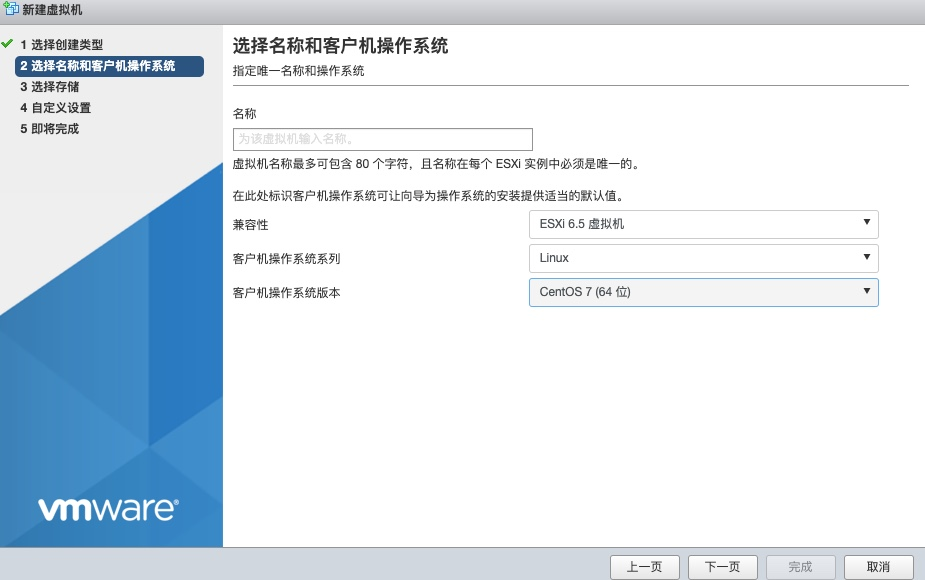
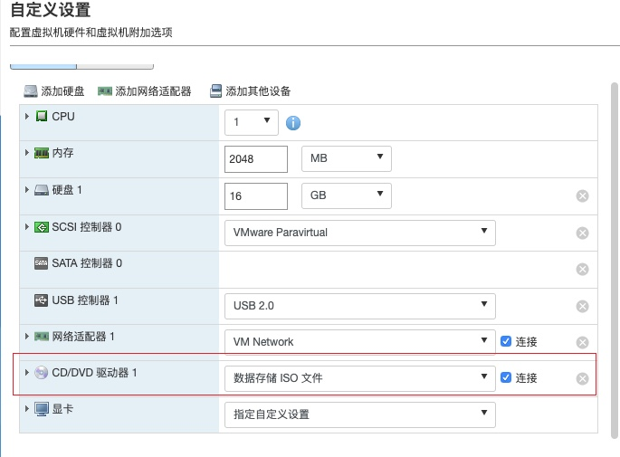

## 原因

由于之前偷懒，把公司的jenkins master 服务搭建在 Mac 上，并且超过七成的脚本服务都是基于 mac 的，但是最近由于 mac 电脑有人使用，运维起来就不太方便，因此想把主服务迁移到 linux 服务器上，把弱依赖的项目都迁移到专门的 linux 服务器上。所以需要新建一个新的虚拟机


## 过程

首先登入 VMware ，然后选择创建新的虚拟机

然后选择好对应的操作系统



选择下一步，然后选择在自定义设置中选择 ISO



因为公司之前有人配置过 Centos7，所以我只需要选择对应的镜像即可，如果数据中没有对应操作系统镜像，去官网下载并上传即可。

然后启动对应的机器，其会让你进行一些简单的配置，包括磁盘分配以及用户创建，在所有配置好之后，可以正常开机。开机则会自动安装 Centos7

最后一步配置网络，在 vmware 服务器对应监控界面，输入

```
ip addr
```

发现没有配置网络。因为CentOS 默认不开启网卡，需要修改一下配置
```
vim /etc/sysconfig/network-scripts/ifcfg-ens33
```

注意文件名不一定为 `ifcfg-ens33` 可以自己到 `/etc/sysconfig/network-scripts` 确认。然后将 `ONBOOT=no`  改为 yes，然后重启网络设置

```
systemctl restart network
```

再使用 `ip addr` 就可以看到对应内网地址了，我使用我的电脑尝试 `ping` 了以下确实可以连接。

至此，配置 Centos 已经完成，之后还需要配置一些工具，就不再赘述了。