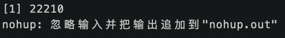

之前在服务器上运行爬虫脚本的时候，出去开会，回来发现 `ssh` 连接断开了，脚本也停止运行，需要解决一下。


## 原因

断开ssh连接时产生的挂断信号(SIGHUP) 信号会终止程序的运行。

## 解决方案

1. 让进程忽略 `SIGHUP`信号
2. 让程序运行在不属于 `ssh` 的进程中

## 方案一 nohup

使用 `nohup` 命令不挂端的运行命令
```
nohup /root/test.php &
```
使用 `nohup` 的同时，你可以指定输出内容的位置，在不规定的情况下，会输出到 `nohup.out`
```shell
nohup python my.py >> /usr/local/python/xxf/my.log 2>&1 &
```

`0`：表示 `stdin` 标准输入，用户键盘输入内容
`1`：表示 `stdout` 输出到显示屏内容
`2`：表示 `stderr` 报错内容

`2>&1` 表示将错误输入到标准输出中

在你运行起来之后会给你一个进程号



### 查看运行进程

你可以使用 `jobs -l` 查看后台运行的进程

**上述方法只在同一个终端情况下有效，在另一个终端你看不到该程序**

在不同终端可以使用 `ps -ef` 命令

参数：

+ a:显示所有程序
+ u:以用户为主的格式来显示
+ x:显示所有程序，不以终端机来区分 

```
ps -aux|grep xxx.py
```

使用 `grep` 参数很方便，因为你可以输入你想查看的脚本名。

`grep` 就是一个文本搜索工具，使用正则表达式搜索文本。

使用 `grep -v` 可以把 `grep` 命令排除，即不使用正则搜索。
```
ps -aux|grep xxx.py | grep -v grep
```

使用 `kill -9 进程号` 终止后台运行的进程
## 方案二 screen

下载 `screen`

```
yum install
```

新建一个 `screen` 窗口

在 `screen` 窗口中运行命令，你只要不进行杀掉当前窗口的目录，直接退出 `ssh` 也没事，重新连接就行