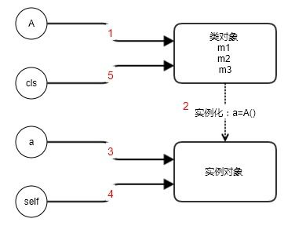

## 1. if \__name__ == "\__main__" 做了什么 

问题来源：stackoverflow 高分 Python 问题

链接：https://stackoverflow.com/questions/419163/what-does-if-name-main-do


## 2. os.system('cd')问题

今天在公司写自动化打包脚本的时候发现使用`os.system('cd xxx')`命令进行目录切换，十分好奇，去 Google 了以下原由。

原来和 Python 中 os.system 的实现机制有关。
> Execute the command (a string) in a subshell. This is implemented by calling the Standard C function system(), and has the same limitations.

os.system 实际上运行了一个子进程，是通过调用 C 标准库中的 system 来实现的，并且具有相同的限制。

由于是子进程，那么自然而然无法影响父进程的环境变量。

解决的办法有两种：

1.是使用os提供的`os.chdir(‘hello’)`

2, 是使用复合语句或者多个语句

`os.system(‘cd hello && ls’)`
或者 `os.system(‘cd hello’;’ls’)`

同时也可以使用 `subprocess` 模块

存疑。

## 3. 正确理解Python的@staticmethod和@classmethod

```python
class A(object):
    #实例方法
    def m1(self, m):
        pass
    #类方法
    @classmethod
    def m2(cls, n):
        pass
    #静态方法
    @staticmethod
    def m3(n):
        pass

a = A()
a.m1()
A.m2()
a.m2()
A.m3()
a.m3()
```
### 实例方法

`m1` 是我们最常见的实例方法，其第一个参数的 `self`，这是约定俗称的，实例对象就是通过 `self` 参数进行绑定的。

> **`self` 指向实例对象**

### 类方法

而 `m2` 函数就是所谓的类方法，其不需要实例化就可以调用，第一个参数 `cls` 传递的是类对象。当调用 `a.m2()` 时，类方法也会通过实例对象找到他所属的类。

> **`cls`指向类对象**

如果方法里面使用调用了静态类，那么使用类方法是合适的，因为这样可以隐形调用该方法。
```python
class A:

    @staticmethod
    def m1()
        pass

    @staticmethod
    def m2():
        A.m1() # bad

    @classmethod
    def m3(cls):
        cls.m1() # good
```
同时可以作为初始化之前获得类信息以及对类进行动态配置。

因为 classmethod 增加了对一个实际类的引用，带来了很多方便：

+ 方法可以知道自己被哪个类调用
+ 子类调用可以返回子类实例而非基类实例
+ 子类调用可以返回其他的 classmethod 方法

classmethod 方法和 metaclass 方法是等效的，classmethod 的优先级较高些

使用 metaclass 优点：

+ 不破坏类继承关系，某些情况可以让类继承有其他语义
+ 可以通过 isinstance 判断是否有某个 metaclass 产生
+ 功能强大
+ 与业务代码分离

使用 classmethod 优点：
+ 简单，不引入额外复杂度
+ 不占用 metaclass的位置（metaclass 只能有一个）
+ 与业务代码在一起


### 静态方法

静态方法不需要特指指向，使用 `A.m3()` 或者 `a.m3()` 都可以调用。

如果方法中不需要访问任何实例和属性，存储只是传入参数返回数据，可以使用静态方法。

其实将静态方法放在类外作为普通函数也行，放在类内能够好的保护数据和封装罢了。


类方法和实例方法首参数指向：



> 类方法和静态方法的不同在于存在类的继承的情况下对多态的支持不同。

参考：https://www.zhihu.com/question/20021164 灵剑的回答

以及
https://zhuanlan.zhihu.com/p/28010894


## 4. 如何判断Python的当前版本

### 使用sys模块

```python
#获得当前 python 版本
In [5]: sys.version_info                                                        
Out[5]: sys.version_info(major=3, minor=7, micro=0, releaselevel='final', serial=0)
```

我当前的版本号是 `3.7.0` 显示的就是 `major=3, minor=7, micro=0`

判断 `python2.x` 或者 `python3.x`

```python
import sys
#sys syntax sugar
_ver = sys.version_info
# is python2.x?
is_py2 = (_ver[0] == 2)
#is python3.x
is_py3 = (_ver[0] == 3)
```

如果是详细的版本比较，来确认当前版本是否可以下载某些第三方库时

```python
import sys
#sys syntax sugar
_ver = sys.version_info
major, minor, patch = _ver[:3]
# python >= 3.2.1
assert major == 3
assert minor >= 2
assert patch >= 1
```

## 5. Python字符串类型

Python中的字符串有两种数据类型：str 类型和 unicode 类型。

str 类型采用的 `ASCII` 编码，也就是说它无法表示中文
。unicode类型采用 `unicode` 编码，能够表示任意字符，包括中文及其它语言。

并且 python 中不存在像 c 语言中的`char`类型，就算是单个字符也是字符串类型。

字符串默认采用的ASCII编码，如果要显示声明为 `unicode` 类型的话，需要在字符串前面加上 `'u'` 或者 `'U'`。例如：

```python
u = u'汉'  
print repr(u) # u'\u6c49'  
s = u.encode('UTF-8')  
print repr(s) # '\xe6\xb1\x89'  
u2 = s.decode('UTF-8')  
print repr(u2) # u'\u6c49' 
```

对于编码的经验总结：

1.在python文件头声明编码格式 ；
```
#-*- coding: utf-8 -*-  
```
2.将字符串统一声明为 `unicode` 类型，即在字符串前加`u`或者 `U`;

3.对于文件读写的操作，建议适用 codecs.open() 代替内置的 open()，遵循一个原则，用哪种格式写，就用哪种格式读。


## 6. Python类中的super().__init__()


```python
class Father:
    def __init__(self, name):
        self.name = name


class Child(Father):
    pass

class Child_i(Father):
    def __init__(self):
        pass

class Child_s(Father):
    def __init__(self, arg, name):
        super().__init__(name)

```

+ 如果子类未重写父类的 `__init__ ` 方法，则自动继承父类的 `__init__` 方法。
+ 如果重写了父类方法，则不调用父类 `__init__` 方法。

**而 `super().__init__()` 出现的意义就是在重写父类方法的同时，调用了父类的 `__init__` 方法，如果父类还有父类，则会递归调用。**

```python
class A(object):
    def __init__(self):
        print("I am A")

class B(A):
    def __init__(self):
        super().__init__()
        print("I am B")

class C(B):
    def __init__(self):
        super().__init__()
        print("I am C")

if __name__ == '__main__':
    c = C()
# print
# I am A
# I am B
# I am C
```

如果是多继承，则继承中super的调用顺序是与 `MRO-C3` 的类方法查找顺序一样的。


## 7. Centos安装Python3之后yum无法正常使用


```
$ cd /usr/bin
$ mv python python.backup
$ ln -s /usr/local/bin/python3 /usr/bin/python
```

将新版本 Python3 创建软连接使得默认 Python 为 Python3 之后

运行 `yum install xx` 命令报错

```
  File "/usr/libexec/urlgrabber-ext-down", line 28
    except OSError, e:
                  ^
SyntaxError: invalid syntax
```
因为 yum 依赖于 Python2，所以要修改 yum 的 Python 文件依赖

修改 `/usr/bin/yum` 文件头部的 `#!usr/bin/python` 修改为 `#!/usr/bin/python2.7`即可。

运行 `yum install xxx` 还是报错，那就直接找到报错的文件，查看其 Python 指向，运行 `vim /usr/libexec/urlgrabber-ext-down`

果不其然它首部为 `#!usr/bin/python`，修改为 `#!/usr/bin/python2.7` 可以正常运行了。


## 8. Python实现单例模式

### 装饰器实现
```python
def singleton(cls):
    instance = {}
    def wrapper(*args, **kwargs):
        if cls not in instance:
            instance[cls] = cls(*args, **kwargs)
        return instance[cls]
    return wrapper
@singleton
class Foo(object):
    pass
foo1 = Foo()
foo2 = Foo()
print (foo1 is foo2) #True
```

## 9. Python中的获得异常信息

异常信息的捕获对于程序的调试非常重要，有助于快速定位错误，Python 常用的捕获异常语法为 `try...except...`

结构如下

```python
try:
    pass
except Exception as e:
    pass

```
你可以在 `except` 部分输出错误信息

可以选择打印出不同的错误信息

+ str(e): 返回字符串类型，只给出异常信息，但不包括异常信息的类型
```py
'integer division or modulo by zero'
```
+ repr(e): 给的信息比较全，包含异常信息类型
```py
ZeroDivisionError('integer division or modulo by zero',)
```
+ e.message: 获得的信息和 str(e) 一样
+ 采用 `traceback` 模块: 需要导入traceback模块，此时获取的信息最全，与python命令行运行程序出现错误信息一致。使用traceback.print_exc()打印异常信息到标准错误，就像没有获取一样，或者使用traceback.format_exc()将同样的输出获取为字符串。你可以向这些函数传递各种各样的参数来限制输出，或者重新打印到像文件类型的对象。
```py
import traceback

try:
    pass
except:
    print(traceback.format_exc())
```

## 10.自定义对象的布尔值
Python 中布尔值为 False 的值为：

+ ""
+ {}
+ []
+ None
+ False
+ 0
+ set()

用户自定义类一般布尔值为 True，但是你也可以通过设置魔术方法进行修改（`__len__` 和 `__bool__`）

### \_\_bool__

```python
class Student(object):
    def __init__(self,s):
        pass
    def __bool__(self):
        return Fasle

s = Student()
bool(s) #return False
```
当你设置了 `__bool__` 方法，在进行布尔判断的时候，会用该方法的返回值作为实例的布尔值。

### \_\_len__

如果你没有定义 `__bool__` 方法，Python 还会尝试调用 `__len__`（确实是序列对象的 `len` 方法） 方法，通过其返回值是否为 0 判断布尔值。

```python
# without __len__
class User(object):
    def __init__(self, users):
        self.users = users

u = User()
if u.users > 0:
    return True

# use __len__
class User(object):
    def __init__(self, users):
        self.users = users
    def __len__(self):
        return len(self.users)

u = User()
if u:
    return True
```

# 11.yield和yield from

yield form 本质上是将生成器或者可迭代对象进行解析后返回，可以这样来理解

`yield from iterable` 本质上等于 `for item in iterable: yield item`。

下面是一个简单的离职
```python
def y():
    yield range(5)
def yf():
    yield from range(5)
for x in y():
    print(x) # range(0, 5)
for y in yf():
    print(y) # 0, 1, 2, 3, 4, 5
```

# 12.魔术方法__dict__

使用 `__dict__` 来为类添加属性

一个简单的例子
```python
class A(object):
    def __init__(self,d):
        self.name = d['name']
        self.sex = d['sex']
        self.address = d['address']
```
上面是一个添加实例属性的例子。如果实例属性不多，这样做可行，但如果有很多实例属性，需要定义一个更高效的做法，这时候就可以引出 `__dict__` 
```python
class A(object):
    def __init__(self, d):
        self.__dict__.update(d)
d = {"name": "Bob","sex":"M","address":"somewhere"}
a = A(d)
d.__dict__ # {"name": "Bob","sex":"M","address":"somewhere"}
```

# 13.Python类的__slots__属性

当你需要大量实例化一个类时，`__slots__ ` 属性能极大地减少实例所占内存。其会阻止在实例化类时为实例分配 dict。换而言之，使用 `__slots__` 属性后的类，无法使用 `__dict__` 属性。其原理是当你定义 `__slots__` 之后，Python 会用一种更紧凑的内部表示实例，通过一个固定大小的数组来构建，而不是为每一个实例定义一个字典，这样解释了为什么 `__dict__` 无法使用。


与此同时，你的实例无法创建新的变量
```python
class Date(object):
    __slots__ = ['year', 'month', 'day]

d = Date()
d.year = 2020 # Success
d.hour = 12 # Fail
```
当然其作为有一个内存优化工具，只适用于大量实例，我指上百万个，不建议冲动的使用它，因为Python很多特性依赖于普通的基于字典实现的类，定义了 `__slots__` 之后将不再支持一些普通类特性。
