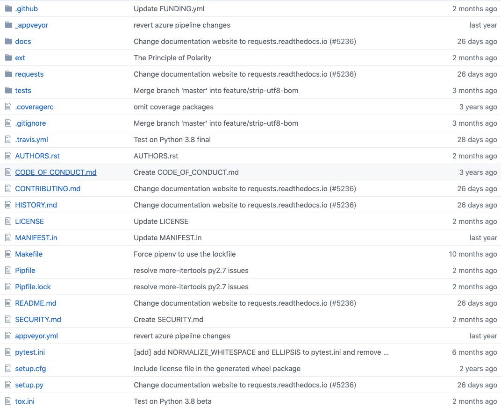

## 原由
由于公司需要我自己封装一个库，用来实现打包的功能，所以我想先借鉴一下 GitHub 里封装的比较好，目录结构比较清晰的第三方库，借鉴一下目录结构和封装方式。

## Why requests

首先这个 lib 在 GitHub 上有 40k 的 stars。同时我也有这个库的使用经验，阅读源码成本较低，我是用这个库的时候也完完全全感受到了其作者所说的 reqeusts 的优点
> Requests is an elegant and simple HTTP library for Python, built with ♥.

## 目录结构分析

目录结构

### .github

存放了各种模版和基金的超链接，主要是报错模版，自定义模版和 新需求模版。

### _appveyor

存放了一个在 windows 下安装 Python 和 pip 的 PowerShell 脚本。

不知道为什么要单独列一个脚本在这，可能原因是 windows 是无法运行 ps1 文件的，所以需要一些特殊配置。

### doc

存放了大量的 rst（reStructuredText）文件，有一些文档的 js 和 css 代码。大多都是文档的文字内容。

### ext

存放一些图片资源

### reqeusts

源码存放位置，稍后会仔细分析

### test