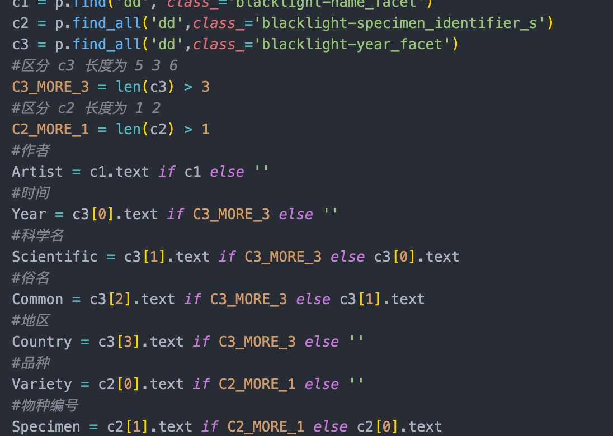
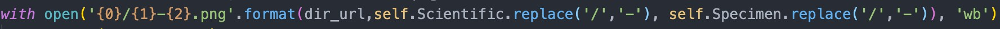

目录地址
```
https://usdawatercolors.nal.usda.gov/pom/search.xhtml?start=0
```
从 url 可以分析出是通过 `start` 进行分页跳转的，一共是 `380`，一页有 `20` 张图片。因此每次跳转间隔为 `20`。

上述的地址是一个目录地址，里面的图片只是缩略图，点击图片地址是可以提供高清图片下载的，我需要的是高清图片。


首先确定一下总数据量，`380x20` 是 `7600` 条。

要存储的数据为：
+ 作者
+ 绘制年份
+ 科学名
+ 俗名
+ 所属国家？
+ 物种编号
+ 高清图片

首先高清图片需要分开放，一张缩略图大概 `7MB`，下载所有图片需要 `1GB` 左右。

然后高清图片需要点击才能进行跳转，所有要分析一下缩略图 `url` 和高清图片 `url` 的关系。

缩略图 `url` :
```
https://usdawatercolors.nal.usda.gov/pom/catalog.xhtml?id=POM00007435&start=0&searchText=&searchField=&sortField=
```
高清图下载链接 :
```
https://usdawatercolors.nal.usda.gov/pom/download.xhtml?id=POM00007435
```

可以看到你只需要对缩略图的 `url` 地址进行简单的处理就可以得到高清图的下载链接。


之前爬取图片的时候经常卡住不动，最后发现公司的网络问题，放到服务器上很丝滑。。

添加了显示了执行时间的装饰器，完善了爬虫结束后发送邮件功能，具体代码在 
```
https://github.com/1oser5/Spider/blob/master/pa_usad.py
```

## 遇到的问题

### 1. 目录中水果信息格式

目录中有三种格式，不同的格式导致赋值的时候会遇到超出下标的问题，需要进行数据保护



### 2. 保存的图片名

保存的图片名我是使用 Scientific 和 Specimen 组合成的，想的这样会独一无二，没想到这个坑爹的 Specimen 字段到后面居然会有 `/` !。导致我下载图片的时候路径报错了，对上述俩个字段中的 `/` 进行替换



