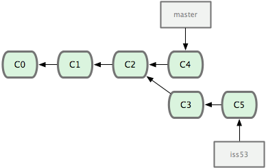

# 起步

## 关于版本控制

版本控制是一种记录文件相关变化，以便将来查阅的特定版本的系统。

采用版本控制可以让你有效的保存各个版本的文件。在你操作失误或者心情不好乱弄一通时，版本控制可以有效帮你“回到过去”。


### 本地版本控制

许多人习惯用复制整个项目的方式来进行本地的版本控制，这样有效，但是未免会造成版本控制混乱，取名麻烦，复制时间消耗等问题。

之后人们也开发出了用简单数据库来记录文件差异的方式。

其中最流行的就是 rcs，许多计算机系统还看得到它的声影。它通过某种特定的补丁文件，记录对应文件修改前后的内容变化。每次修订完之后，rcs 将不断打补丁来计算各版本的文件内容。

### 集中化版本控制系统

那要在不同的系统中，或者不同的设备中进行版本控制呢？于是集中化版本控制系统（Centralized Version Control Systems, CVCS）出现了。类似 CVS, Subversion 等，都有一个集中管理的服务器，用户通过客户端统一向该服务器下载文件或者更新文件。


这种版本控制有一定好处，每个人可以在一定程度上看到项目上其他人在干什么，而管理员也可以轻松的分配权限，管理起来比本地版本控制容易得多。

但也存在隐患，比如中心服务器宕机一个小时，那么一个小时中所有人都不能提交或者下载，是否影响效率。亦或者更严重，中心服务器数据丢失，导致整个项目无法复原，只能依靠本地存储的快照进行修复。

### 分布式版本控制系统

于是分布式版本控制系统（Distributed Version Control System, DVCS）出现了。客户端不止提取最新版本的快照，而是将整个代码仓库进行镜像。这样一来，任何协调工作的服务器故障了，都可以使用任意一台电脑的本地仓库进行恢复。


## Git基础

Git 与其他 DVCS 系统的差异

### 直接记录快照，而非差异比较

Git 只关心文件数据的整体是否发生变化，其他系统则只关心文件具体内容的差异。


Git 并不保存这些文件的差异数据，相对来说，Git 更像是把变化的文件快照后，记录在一个微型的文件系统中，每次提交更像后，他会总览一遍所有文件的指纹信息并对修改了的文件做一快照，然后保存执行这个快照的索引。为了提高性能，如果文件没有变化，则只保存对上一次快照的链接。


### 几乎所有的操作都是本地执行

Git 大多才做都可以在本地执行，不需要联网。因为本地仓库存储着最新版本的代码和修改记录，你完全可以在断网的情况下查阅版本修订和修改代码，再在连上网络之后上传到远程仓库。


### 时刻保持数据的完整性

保存到 Git 之前，所有数据都要进行内容的校验和（checksum），并将此结果作为数据的唯一标识和索引。

Git 使用 SHA-1 算法计算数据的校验和，通过对文件的内容或目录的结构计算出一个 SHA-1 哈希值，作为指纹字符串，该字符由 40 个 16 进制字符串组成，看上去像：
```
24b9da6552252987aa493b52f8696cd6d3b00373
```

事实上在 Git 数据库中都是用此哈希值来进行索引的，而不是文件名。

### 多数操作仅添加数据

Git 的大多数操作都只是在 Git 数据库中添加数据，因为多数的不可逆操作都会时重现历史版本变得困难重重。

### 文件的三种状态

对任何一个文件，在 Git 中只有三种状态，已提交（committed），已修改（modified），以暂存（staged）。

+ 已提交（committed）: 文件已经保存到本地仓库中。
+ 已修改（modified）: 文件被修改但还未提交保存。
+ 已暂存（staged）: 文件被放在下次提交要保存的清单中。

Git 保存文件的三个工作区域： Git 的工作目录，暂存目录，本地仓库。


每个项目都有一个 Git 目录（如果是 git clone 则 .git 是 Git 目录，如果是 git clone --bare，新建目录本身急速 Git 目录）。Git 目录用来保存元数据和对象数据库。该目录非常重要，每次克隆镜像仓库其实都是克隆该目录中的数据。

从项目中取出某个版本的所有文件和目录，用来后续工作的就是工作目录。这些文件实际上都是从 Git 目录中读取出来的。

暂存区只是一个存放在 Git 目录中的文件（Index 文件）

基本 Git 工作流程：

+ 在工作目录修改文件。
+ 对修改文件进行快照，保存到暂存区域。
+ 提交更新，将暂存区域的文件快照转储到 Git 目录中。

## 初次运行Git前的配置

Git 提供了一个叫 git config 的工具来管理相应的工作环境变量。正是这些环境变量，决定了 Git 在各个环节的行为和工作方式，变量可以存储在以下三个地方：

+ /etc/gitconfig 文件：系统中对所有用户普遍适用的配置，如果使用 git config --system 读取的就是该文件。
+ ~/.gitconfig 文件：用户目录下的配置文件，只适配与该用户，使用 git
config --global 读取的就是该文件。
+ 当前项目的 git 目录的配置文件（也就是工作目录的 .git/config 文件）：配置仅针对当前目录

**每一级别的配置会覆盖上一级相同配置**


### 用户信息

配置个人账户和电子邮箱，这很重要。在每次 Git 提交的时候这两条信息都会被引用，随着更新内容一起永久纳入历史记录：
```
git config --global user.name "xxxx"
git config --global user.email xxxx@example.com
```
使用了 global 关键字则修改的是用户目录的配置文件（即 ~/.gitconfig）。如果想在项目中使用不同的用户提交，去掉 global 关键字即可，新设定保存在 工作目录的 .git/config 文件。

### 文本编辑器

Git 需要你输入一下额外信息的时候，会自动调用一个外部编辑器，一般是操作系统默认的编辑器，一般可能是 vi 或者 vim。如果你有其他偏好，比如 Emacs，可以重新设置：
```
git config --global core.editor emacs
```
  
### 比较差异工具

在合并冲突是使用哪种差异分析工具，必须要修改为 vimdiff 的话
```
git config --global merge.tool vimdiff
```

### 查看配置信息

可以使用`git config --list `命令查看已有配置信息。

有时候会看到重复的变量，那说明他们来之不同的文件，Git 实际采用的是最后一个。

也可以直接查阅某个环境变量的设定，只把特定的名字跟在后面即可
```
git config user.name
```

# Git 基础

## 取得项目的 Git 仓库

### 在工作目录中初始化新库

要对某个现有的项目使用 Git 管理，只需到此项目的目录执行：

```
git init
```

初始化之后，当前目录会出现一个 .git 目录，所以 Git 目录下的资源和数据都被存放在该目录下，不过目前仅仅只是按照既有的结构和框架初始化好了里面的文件和目录，还没有开始追踪管理项目中的任何一个文件。

如果当前目录有几个文件向纳入版本控制，首先是要 `git add`命令告诉 Git 开始对这些文件进行追踪

```
git add *.c
git add README
git commit -m 'initial project version'
```

### 从现有仓库克隆

克隆仓库的命令格式为 `git clone [url]`

```
git clone git://github.com/schacon/grit.git
```

这会在当前目录创建一个名为 grit 的目录，其中包含一个 `.git` 目录。用于保存下载下来的所有版本的记录，然后取出最新版的记录进行拷贝。

如果你自定义克隆下来的项目的名字，可以在上面命令末尾指定新名字

```
git clone git://github.com/schacon/grit.git my_grit

```


## 记录每次更新到仓库

工作目录下的文件不外乎两种状态，已跟踪和未跟踪。

已跟踪的文件是指被纳入版本控制的文件，上次快照中有他们的记录，工作一段时间后，他们的状态可能是未更新，已修改或者已放入暂存区。其余的文件都是未跟踪文件。

克隆的所有文件都是已跟踪文件。


### 检查当前文件状态

要确定哪些文件处于哪些状态，可以还是要 `git status` 命令。

如果你新建一个 README 文件，保存后运行 `git status` 会看到这些文件出现在未跟踪文件列表中：
```
$ vim README
$ git status
On branch master
Untracked files:
  (use "git add <file>..." to include in what will be committed)

        README

nothing added to commit but untracked files present (use "git add" to track)
```

未追踪文件意味着 Git 在之前的快照中没有这些文件；Git 不会将纳入追踪范围。

### 追踪新的文件

使用 `git add` 开始追踪一个新文件，要追踪 README 文件，运行：

```
git add README
```

此时在运行 `git status` 会发现 README 已经被追踪，并处于暂存状态

```
$ git status
On branch master
Changes to be committed:
  (use "git reset HEAD <file>..." to unstage)

        new file:   README
```

只要在 “Changes to be committed” 这行下面的，就说明是已暂存状态，如果此时提交，那么该文件的版本将被保留在历史记录里。

`git add` 后面可以指明要跟踪的文件或目录路径，如果是目录，Git 会递归追踪目录下的所有文件。

git add 的潜台词就是把目标文件放在暂存区域，同时把未追踪的文件标记为已标记

### 暂存已修改的文件

修改之前已追踪的文件 `benchmarks.rb`，然后再次运行 `status` 命令

```
$ git status
On branch master
Changes to be committed:
  (use "git reset HEAD <file>..." to unstage)

        new file:   README

Changes not staged for commit:
  (use "git add <file>..." to update what will be committed)
  (use "git checkout -- <file>..." to discard changes in working directory)

        modified:   benchmarks.rb
```

文件 `benchmarks.rb` 出现在 “Changes not staged for commit” 这行下面，说明已追踪的文件内容发生了变化，但还没有放到暂存区，要暂存这次更新，需要 `git add`（这个是个多功能命令，根据目标文件状态不同，此命令的效果也不同，他可以用来追踪新文件，也可以把已追踪文件放到暂存区，还能用于合并时把有冲突的文件标记为已解决）。运行 `git add` 之后将 `benchmarks.rb` 放到暂存区，执行 `status`：
```
$ git add benchmarks.rb
$ git status
On branch master
Changes to be committed:
  (use "git reset HEAD <file>..." to unstage)

        new file:   README
        modified:   benchmarks.rb
```
现在两个文件都被暂存了，下次提交时会被一并送到仓库。此时如果你想在修改 `benchmarks.rb` 文件。再运行 `status`：
```
$ vim benchmarks.rb
$ git status
On branch master
Changes to be committed:
  (use "git reset HEAD <file>..." to unstage)

        new file:   README
        modified:   benchmarks.rb

Changes not staged for commit:
  (use "git add <file>..." to update what will be committed)
  (use "git checkout -- <file>..." to discard changes in working directory)

        modified:   benchmarks.rb
```

`benchmarks.rb` 出现了两次，一次未暂存，一次暂存，如果此时提交，那么提交的是第二次修改前的版本，如果想要提交最新版，需要再一次 `git add` 暂存起来。

### 忽略某些文件

一般我们总有些文件无需 Git 的管理，也不希望他们出现在未追踪文件列表里，通常是些日志文件或者临时文件等，我们可以创建一个名为 `.gitignore` 的文件，列出要忽略的文件:
```
$ cat .gitignore
*.[oa]
*~
```
第一行告诉 Git 忽略 `.o` 或 `.a` 结尾的文件，第二行告诉 Git 忽略以波浪符 `~` 结尾的文件。

文件 `.gitignore` 的格式规范如下：

+ 所有空行和 # 注释都被 Git 忽略
+ 使用标准的 glob 匹配模式
+ 如果匹配模式是目录需要在后面跟上一个 /
+ 要忽略指定模式之外的文件或目录，在文件前加上 ! 取反


所谓的 `glob` 模式是指 shell 所使用的简化了的正则表达式。星号（`*`）匹配零个或多个任意字符；`[abc]` 匹配任何一个列在方括号中的字符（这个例子要么匹配一个 a，要么匹配一个 b，要么匹配一个 c）；问号（`?`）只匹配一个任意字符；如果在方括号中使用短划线分隔两个字符，表示所有在这两个字符范围内的都可以匹配（比如 `[0-9]` 表示匹配所有 0 到 9 的数字）。

一个常见的 `.gitignore` 文件的例子：
```
# 此为注释 – 将被 Git 忽略
# 忽略所有 .a 结尾的文件
*.a
# 但 lib.a 除外
!lib.a
# 仅仅忽略项目根目录下的 TODO 文件，不包括 subdir/TODO
/TODO
# 忽略 build/ 目录下的所有文件
build/
# 会忽略 doc/notes.txt 但不包括 doc/server/arch.txt
doc/*.txt
# ignore all .txt files in the doc/ directory
doc/**/*.txt
```

`**/` 符号在 Git 1.8.2 之后可用


### 查看已暂存和为暂存的更新

```
$ git diff 
```
可以查看尚未暂存的文件更新了哪些部分

```
git diff --cached or git diff --staged
```

看看暂存文件和上次提交快照有哪些差异

### 提交更新

提交命令
```
$ git commit
```

配合 `-m` 参数提交说明
```
$ git commit -m "Story 182: Fix benchmarks for speed"
```

每一次提交操作，都是对项目的一次快照。


### 跳过使用暂存区域

只要在提交时给 `git commit` 加上 `-a` 选项，Git 就会把所有自动以跟踪过的文件放入暂存区一并提交，从而跳过 `git add` 步骤。
```
$ git status
On branch master
Changes not staged for commit:
  (use "git add <file>..." to update what will be committed)
  (use "git checkout -- <file>..." to discard changes in working directory)

        modified:   benchmarks.rb

no changes added to commit (use "git add" and/or "git commit -a")
$ git commit -a -m 'added new benchmarks'
[master 83e38c7] added new benchmarks
 1 files changed, 5 insertions(+)
```
### 移除文件

要从 Git 中删除某个文件，就必须要从已跟踪文件清单中移除（确切说，是从暂存区移除），然后提交。可以使用 `git rm` 完成，并连带着删除指定的文件。

如果你手动删除目录中的文件，那么运行 `git status` 会看到 `Changes not staged for commit`部分看到：

```
$ rm grit.gemspec
$ git status
On branch master
Changes not staged for commit:
  (use "git add/rm <file>..." to update what will be committed)
  (use "git checkout -- <file>..." to discard changes in working directory)

        deleted:    grit.gemspec

no changes added to commit (use "git add" and/or "git commit -a")
```

然后在运行 `git rm` 记录此次移除文件的操作

```
$ git rm grit.gemspec
rm 'grit.gemspec'
$ git status
On branch master
Changes to be committed:
  (use "git reset HEAD <file>..." to unstage)

        deleted:    grit.gemspec
```

最后提交的时候，文件就不在纳入版本管理，如果删除之前已经放到暂存区域的话，必须要使用强制删除选项 `-f` ，以防误删文件丢失修改的内容。

另一种情况是你只是想将文件从 Git 仓库删除，但是将其保留在工作目录中。要移除追踪但不删除文件，运行
```
$ git rm -cached readme.txt
```
后面可以列出文件或者目录名，可以使用 glob 模式
```
$ git rm log/\*.log
```
不加反斜杠的话，不会递归调用，只会删除 log 目录下扩展名为 `.log` 的文件。

### 移动文件

不行别的 VSC 系统，Git 不跟踪文件移动操作，但是你在 Git 中重命名了某个文件，Git 仍然知道。

要在 Git 中对文件进行改名，运行
```
$ git mv f1 f2
```
他会如预期般工作，此时查看状态时，也会明白无误的看到关于重命名的操作
```
$ git mv README.txt README
$ git status
On branch master
Changes to be committed:
  (use "git reset HEAD <file>..." to unstage)

        renamed:    README.txt -> README
```
其实 `git mv` 相当于运行了

```
$ mv README.txt README
$ git rm README.txt
$ git add README
```

## 查看提交历史

提交若干更新或者克隆的新的项目之后想要查看提交历史，可以使用 `git log` 查看，按 `q` 退出。

如果不加参数，`git log` 会按时间列出所有的提交记录，最新的排在最上面，每次更新都有一个 SHA-1 校验和，作者的名字和电子邮箱、提交时间呢，最后一个缩进表示段落说明


通常我们使用 `-p` 参数显示每次提交的差异，用 `-2` 仅显示最近两次的更新。
```
$ git log -p -2
commit ca82a6dff817ec66f44342007202690a93763949
Author: Scott Chacon <schacon@gee-mail.com>
Date:   Mon Mar 17 21:52:11 2008 -0700

    changed the version number

diff --git a/Rakefile b/Rakefile
index a874b73..8f94139 100644
--- a/Rakefile
+++ b/Rakefile
@@ -5,5 +5,5 @@ require 'rake/gempackagetask'
 spec = Gem::Specification.new do |s|
     s.name      =   "simplegit"
-    s.version   =   "0.1.0"
+    s.version   =   "0.1.1"
     s.author    =   "Scott Chacon"
     s.email     =   "schacon@gee-mail.com

commit 085bb3bcb608e1e8451d4b2432f8ecbe6306e7e7
Author: Scott Chacon <schacon@gee-mail.com>
Date:   Sat Mar 15 16:40:33 2008 -0700

    removed unnecessary test code

diff --git a/lib/simplegit.rb b/lib/simplegit.rb
index a0a60ae..47c6340 100644
--- a/lib/simplegit.rb
+++ b/lib/simplegit.rb
@@ -18,8 +18,3 @@ class SimpleGit
     end

 end
-
-if $0 == __FILE__
-  git = SimpleGit.new
-  puts git.show
-end
\ No newline at end of file
```

如果你需要查看单词级别的对比，可以在 `git log -p` 后面加上 `--word-diff` 选项，这个在论文以及书籍类文件对比时相当有用。
```
$ git log -U1 --word-diff
commit ca82a6dff817ec66f44342007202690a93763949
Author: Scott Chacon <schacon@gee-mail.com>
Date:   Mon Mar 17 21:52:11 2008 -0700

    changed the version number

diff --git a/Rakefile b/Rakefile
index a874b73..8f94139 100644
--- a/Rakefile
+++ b/Rakefile
@@ -7,3 +7,3 @@ spec = Gem::Specification.new do |s|
    s.name      =   "simplegit"
    s.version   =   [-"0.1.0"-]{+"0.1.1"+}
    s.author    =   "Scott Chacon"
```

`git log` 还有别的好用的参数，比如 `--stat` 仅显示简要的增改行数统计
```
$ git log --stat
commit ca82a6dff817ec66f44342007202690a93763949
Author: Scott Chacon <schacon@gee-mail.com>
Date:   Mon Mar 17 21:52:11 2008 -0700

    changed the version number

 Rakefile |    2 +-
 1 file changed, 1 insertion(+), 1 deletion(-)
 ```

还有个常用的 `--pretty` 选项，可以指定使用不同于默认格式的方式展示提交历史，比如 `online` 将每个提交放到一行显示。

```
$ git log --pretty=oneline
ca82a6dff817ec66f44342007202690a93763949 changed the version number
085bb3bcb608e1e8451d4b2432f8ecbe6306e7e7 removed unnecessary test code
a11bef06a3f659402fe7563abf99ad00de2209e6 first commit
```

你甚至可以使用 `format` 来自定义你想要显示的格式，便于后期的提取。

```
$ git log --pretty=format:"%h - %an, %ar : %s"
ca82a6d - Scott Chacon, 11 months ago : changed the version number
085bb3b - Scott Chacon, 11 months ago : removed unnecessary test code
a11bef0 - Scott Chacon, 11 months ago : first commit
```

`format` 常用格式占位符及写法

|选项	|说明 |
|--|--|
|%H|	提交对象（commit）的完整哈希字串|
|%h	|提交对象的简短哈希字串|
|%T	|树对象（tree）的完整哈希字串|
|%t	|树对象的简短哈希字串|
|%P	|父对象（parent）的完整哈希字串|
|%p	|父对象的简短哈希字串|
|%an|	作者（author）的名字|
|%ae|	作者的电子邮件地址|
|%ad|	作者修订日期（可以用 -date= 选项定制格式）|
|%ar|	作者修订日期，按多久以前的方式显示|
|%cn|	提交者(committer)的名字|
|%ce|	提交者的电子邮件地址|
|%cd|	提交日期|
|%cr|	提交日期，按多久以前的方式显示|
|%s	|提交说明|

使用 `oneline` 或者 `format` 时结合 `--graph` 选项，用简单图像展示分支状况

```
$ git log --pretty=format:"%h %s" --graph
* 2d3acf9 ignore errors from SIGCHLD on trap
*  5e3ee11 Merge branch 'master' of git://github.com/dustin/grit
|\
| * 420eac9 Added a method for getting the current branch.
* | 30e367c timeout code and tests
* | 5a09431 add timeout protection to grit
* | e1193f8 support for heads with slashes in them
|/
* d6016bc require time for xmlschema
*  11d191e Merge branch 'defunkt' into local
```

`git log` 常用选项

|选项	|说明|
|--|--|
|-p	|按补丁格式显示每个更新之间的差异。|
|--word-diff|	按 word diff 格式显示差异。|
|--stat	|显示每次更新的文件修改统计信息。|
|--shortstat	|只显示 --stat 中最后的行数修改添加移除统计。|
|--name-only	|仅在提交信息后显示已修改的文件清单。|
|--name-status|	显示新增、修改、删除的文件清单。|
|--abbrev-commit|	仅显示 SHA-1 的前几个字符，而非所有的 40 个字符。|
|--relative-date|	使用较短的相对时间显示（比如，“2 weeks ago”）。|
|--graph	|显示 ASCII 图形表示的分支合并历史。|
|--pretty	|使用其他格式显示历史提交信息。可用的选项包括 oneline，short，full，fuller 和 format（后跟指定格式）。|
|--oneline |	--pretty=oneline --abbrev-commit 的简化用法。|

### 限制输出长度

限制时间长度，比如 `--since` 和 `--until`，下面命令列出近俩周内的提交：
```
$ git log --since=2.weeks
```

其他常用选择筛选方式

|选项	|说明|
|--|--|
|-(n)	|仅显示最近的 n 条提交|
|--since, --after|	仅显示指定时间之后的提交。|
|--until, --before|	仅显示指定时间之前的提交。|
|--author|	仅显示指定作者相关的提交。|
|--committer|	仅显示指定提交者相关的提交。|

可以多次使用删选条件，比如要筛选出 2008 年 10 月期间，Junio Hamano 提交的但未合并的测试脚本，可以使用

```
$ git log --pretty="%h - %s" --author=gitster --since="2008-10-01" \
   --before="2008-11-01" --no-merges -- t/
5610e3b - Fix testcase failure when extended attribute
acd3b9e - Enhance hold_lock_file_for_{update,append}()
f563754 - demonstrate breakage of detached checkout wi
d1a43f2 - reset --hard/read-tree --reset -u: remove un
51a94af - Fix "checkout --track -b newbranch" on detac
b0ad11e - pull: allow "git pull origin $something:$cur
```

## 撤销记录

### 修改最后一次提交

我们发现刚的提交有错误或者漏掉了某个文件会，可以修改上一次提交
```
$ git commit --amend
```
运行该命令后会启动文本编辑器，能看到上次提交的说明，可以编辑后保存，就会使用新的提交说明覆盖上一次提交。

如果你遗漏了某个文件，也可以运行
```
$ git commit -m 'initial commit'
$ git add forgottrn_file
$ git commit --amend
```

上面三条命令最终只是产生了一个提交，第二条命令修正了的第一条的提交内容。

### 取消已暂存的文件

有两份文件进行了修改，想要分开提交，但是一不小心用 `git add`，加到了暂存区域，如何撤销其中一个呢？
`git status` 告诉了我们怎么做
```
$ git add .
$ git status
On branch master
Changes to be committed:
  (use "git reset HEAD <file>..." to unstage)

        modified:   README.txt
        modified:   benchmarks.rb
```
可以使用 `git reset HEAD <file>` 方式取消暂存

试着取消暂存 `benchmark.rb` 文件

```
$ git reset HEAD benchmarks.rb
Unstaged changes after reset:
M       benchmarks.rb
```
`benchmarks.rb` 回到了已修改但为暂存状态

### 取消对文件的修改

如果觉得对 `benchmarks.rb` 的修改没有必要，需要取消，使用 `git checkout`指令。

```
git checkout -- benchmarks.rb
```

这条指令有风险，请确定你真不需要修改该文件

## 远程仓库的使用

### 查看当前的远程库

可以使用 `git remote` 操作查看当前配置了哪些远程仓库，他会列出每个仓库的简短名字。

在克隆完一个仓库之后，你至少可以看到一个名为 `origin` 的远程库，Git 默认使用该名字来标识你所克隆的远程库。
```
$ git clone git://github.com/schacon/ticgit.git
Cloning into 'ticgit'...
remote: Reusing existing pack: 1857, done.
remote: Total 1857 (delta 0), reused 0 (delta 0)
Receiving objects: 100% (1857/1857), 374.35 KiB | 193.00 KiB/s, done.
Resolving deltas: 100% (772/772), done.
Checking connectivity... done.
$ cd ticgit
$ git remote
origin
```
可加上 `-v` 选项，查看对应克隆地址
```
$ git remote -v
origin  git://github.com/schacon/ticgit.git (fetch)
origin  git://github.com/schacon/ticgit.git (push)
```

如果有多个远程库，会将其全部列出
```
$ cd grit
$ git remote -v
bakkdoor  git://github.com/bakkdoor/grit.git
cho45     git://github.com/cho45/grit.git
defunkt   git://github.com/defunkt/grit.git
koke      git://github.com/koke/grit.git
origin    git@github.com:mojombo/grit.git
```
上面只有 `origin` 使用 `SSH URL` 链接，意味着我只有这个库我可以推送数据上去。

### 添加远程仓库

要添加一个远程仓库，并使用指定的简单名字，可以使用 `git remote add [shortname] [url]`:

```
$ git remote
origin
$ git remote add pb git://github.com/paulboone/ticgit.git
$ git remote -v
origin    git://github.com/schacon/ticgit.git
pb    git://github.com/paulboone/ticgit.git
```
现在可以用字符串 `pb` 指代对应的仓库地址，比如要抓取所有 Paul 有的，但本地仓库没有的信息，可以运行 `git fetch pb`:
```
$ git fetch pb
remote: Counting objects: 58, done.
remote: Compressing objects: 100% (41/41), done.
remote: Total 44 (delta 24), reused 1 (delta 0)
Unpacking objects: 100% (44/44), done.
From git://github.com/paulboone/ticgit
 * [new branch]      master     -> pb/master
 * [new branch]      ticgit     -> pb/ticgit
```

### 从远程库抓取数据

用以下命令从远程库抓取数据
```
$ git fetch [remote-name]
```
此命令回到远程库中拉取所有你本地仓库还没有的数据。运行完成后你可以在本地访问该远程仓库的所有分支，并将某个分支合并到本地。

如果克隆了一个仓库，则自动将远程仓库归于 `origin`。所有 `git fetch origin` 会抓取你上次克隆或者 `fetch` 之后别人的更新。 `fetch` 只是将远端的数据拉到本地仓库，并自动合并到当前工作分支。

如果设置了某个分支用于追踪某个远程仓库的分支，可以使用 `git pull` 命令自动抓取数据下来，并且将远程仓库自动合并到本仓库中当前分支。实际上 `git clone` 本质上就是自动创建了本地的 `master` 分支用于追踪远程仓库的 `master` 分支。


### 推送数据到远程仓库

项目进行到一定阶段，或者要和别人分享成果，就需要将本地仓库中的数据推送到远程仓库。
```
git push [remote-name] [brance-name]
```
一般来讲会自动使用默认的 `master` 和 `origin` 名字
```
$git push origin master
```

只有在所克隆的服务器上有写权限，并且在你 `push` 之前没有别人 `push` 过，才能成功，也就是说你应当 `pull` 之后再进行 `push`。


### 查看远程仓库信息

使用 `git remote show [remote-name]` 查看某个远程仓库的详细信息。
```
$ git remote show origin
* remote origin
  URL: git://github.com/schacon/ticgit.git
  Remote branch merged with 'git pull' while on branch master
    master
  Tracked remote branches
    master
    ticgit
```

### 远程仓库的删除和命名

可以使用 `git remote rename` 命令修改某个远程仓库在本地的简称，比如把 `pb` 改成 `paul`:
```
$ git remote rename pb paul
$ git remote
origin
paul
```
仓库迁移或者不再贡献代码，移除对应远程仓库，使用 `git remote rm` 命令:
```
$ git remote rm paul
$ git remote
origin
```

## 打标签
Git 可以在某一时间节点的版本打上标签，人们在发布版本的时候经常怎么做。
### 列显已有的标签
运行 `git tag` 即可:

```
$ git tag
v0.1
v1.3
```

标签是按字母顺序排序，所以标签先后不表示重要程度。

可以使用特定的搜索模式列出符合条件的标签
```
$ git tag -l 'v1.4.2.*'
v1.4.2.1
v1.4.2.2
v1.4.2.3
v1.4.2.4
```

### 新建标签

Git 的标签有两种 : 轻量级的（lightweight）和含附注的（annotated）

轻量级标签：不会变化的分支，实际上他就是一个指向特定标签的引用。
附注标签：存储在仓库中的一个独立对象，有自身的校验和信息，标签的名字，电子邮箱和日期

### 含附注的标签

创建一个含附注类型的标签非常简单，用 `-a`（annotated） 指定标签名字即可：
```
$ git tag -a v1.4 -m 'my version 1.4'
$ git tag
v0.1
v1.3
v1.4
```
而 `-m` 选项则指定了对应的标签说明，Git 会将其一同保存在标签对象，如果没给出，Git 会启动文本编辑软件供你输入。

可以使用 `git show` 命令查看相应标签的版本信息，并显示打标签的提交对象

```
$ git show v1.4
tag v1.4
Tagger: Scott Chacon <schacon@gee-mail.com>
Date:   Mon Feb 9 14:45:11 2009 -0800

my version 1.4

commit 15027957951b64cf874c3557a0f3547bd83b3ff6
Merge: 4a447f7... a6b4c97...
Author: Scott Chacon <schacon@gee-mail.com>
Date:   Sun Feb 8 19:02:46 2009 -0800

    Merge branch 'experiment'
```

### 签署标签

如果你有私钥，可以用 GPG 来签署标签，只需要把之前的 `-a` 改为 `-s`（signed）
```
$ git tag -s v1.5 -m 'my signed 1.5 tag'
You need a passphrase to unlock the secret key for
user: "Scott Chacon <schacon@gee-mail.com>"
1024-bit DSA key, ID F721C45A, created 2009-02-09
```

再运行 `git show` 会看到对应的 GPG 签名
```
$ git show v1.5
tag v1.5
Tagger: Scott Chacon <schacon@gee-mail.com>
Date:   Mon Feb 9 15:22:20 2009 -0800

my signed 1.5 tag
-----BEGIN PGP SIGNATURE-----
Version: GnuPG v1.4.8 (Darwin)

iEYEABECAAYFAkmQurIACgkQON3DxfchxFr5cACeIMN+ZxLKggJQf0QYiQBwgySN
Ki0An2JeAVUCAiJ7Ox6ZEtK+NvZAj82/
=WryJ
-----END PGP SIGNATURE-----
commit 15027957951b64cf874c3557a0f3547bd83b3ff6
Merge: 4a447f7... a6b4c97...
Author: Scott Chacon <schacon@gee-mail.com>
Date:   Sun Feb 8 19:02:46 2009 -0800

    Merge branch 'experiment'
```

### 轻量级标签

轻量级标签保存着对应提交对象的校验信息的文件，要创建这样一个标签，直接给出标签名即可
```
$ git tag v1.4-lw
$ git tag
v0.1
v1.3
v1.4
v1.4-lw
v1.5
```

### 验证标签
可以使用 `git tag -v [tag-name]` 的方式来验证已签署标签。
```
$ git tag -v v1.4.2.1
object 883653babd8ee7ea23e6a5c392bb739348b1eb61
type commit
tag v1.4.2.1
tagger Junio C Hamano <junkio@cox.net> 1158138501 -0700

GIT 1.4.2.1

Minor fixes since 1.4.2, including git-mv and git-http with alternates.
gpg: Signature made Wed Sep 13 02:08:25 2006 PDT using DSA key ID F3119B9A
gpg: Good signature from "Junio C Hamano <junkio@cox.net>"
gpg:                 aka "[jpeg image of size 1513]"
Primary key fingerprint: 3565 2A26 2040 E066 C9A7  4A7D C0C6 D9A4 F311 9B9A
```

### 后期加注标签

你可以在后期对早期提交打上标签，比如
```
$ git log --pretty=oneline
15027957951b64cf874c3557a0f3547bd83b3ff6 Merge branch 'experiment'
a6b4c97498bd301d84096da251c98a07c7723e65 beginning write support
0d52aaab4479697da7686c15f77a3d64d9165190 one more thing
6d52a271eda8725415634dd79daabbc4d9b6008e Merge branch 'experiment'
0b7434d86859cc7b8c3d5e1dddfed66ff742fcbc added a commit function
4682c3261057305bdd616e23b64b0857d832627b added a todo file
166ae0c4d3f420721acbb115cc33848dfcc2121a started write support
9fceb02d0ae598e95dc970b74767f19372d61af8 updated rakefile
964f16d36dfccde844893cac5b347e7b3d44abbc commit the todo
8a5cbc430f1a9c3d00faaeffd07798508422908a updated readme
```

忘记在提交 'update rakefile' 后打上版本号 v1.2。没关系，只需要在打标签的时候跟上对应对象的校验和（或者前几位）即可：
```
$ git tag -a v1.2 9fceb02
```


### 分享标签

默认情况下， `git push` 并不会把标签传送到远端服务器，只有通过显示命令才能分享标签，比如 `git push origin [tagname]` 即可。

```
$ git push origin v1.5
Counting objects: 50, done.
Compressing objects: 100% (38/38), done.
Writing objects: 100% (44/44), 4.56 KiB, done.
Total 44 (delta 18), reused 8 (delta 1)
To git@github.com:schacon/simplegit.git
* [new tag]         v1.5 -> v1.5
```

如果需要一次推送所有标签，可以使用 `--tags` 选项
```
$ git push origin --tags
Counting objects: 50, done.
Compressing objects: 100% (38/38), done.
Writing objects: 100% (44/44), 4.56 KiB, done.
Total 44 (delta 18), reused 8 (delta 1)
To git@github.com:schacon/simplegit.git
 * [new tag]         v0.1 -> v0.1
 * [new tag]         v1.2 -> v1.2
 * [new tag]         v1.4 -> v1.4
 * [new tag]         v1.4-lw -> v1.4-lw
 * [new tag]         v1.5 -> v1.5
```

在 `Github` 里可以从 `release

## 技巧和敲门

### Git命令别名

你想偷懒少输几个字符，可以使用 `Git config` 为命令设置别名：
```
$ git config --global alias.co checkout
$ git config --global alias.br branch
$ git config --global alias.ci commit
$ git config --global alias.st status
```
现在你要输入 `git commit` 时只需要输入 `git ci` 即可。

你甚至可以创造出新的命令
```
$ git config --global alias.unstage 'reset HEAD --'
```
这样一来下面命令完全相同：
```
$ git unstage fileA
$ git reset HEAD fileA
```

# Git 分支

Git 分支管理的轻便让他在一众版本控制系统中脱颖而出。

在 Git 提交时，会保存一个提交（commit）对象，它包含一个指向暂存内容快照的指针，包含本次提交的作者等相关附属信息，包含零个或多个指向该提交对象的父对象指针：首次提交没有直接祖先，普通提交有一个祖先，有两个或者多个分支合并的提交有多个祖先。

+ commit 对象：存储 tree 对象，以及其他提交元数据（作者，提交者等）。
+ tree 对象：存储 blob 对象，一个 blob 对象对应一个校验和。

+ blob 对象：文件快照内容。

仓库中各个对象保存的数据和相互关系看起像如图 3-1


commit 对象会包含一个指向上次提交的指针。


分支其实就是一个默认指向最新 commit 的指针，Git 会使用 master 作为分支的默认名字。


Git 新建分支可以使用 `git branch` 命令。
```shell
git branch testing
```

这会在当前 commit 对象上新建一个分支指针。


Git 通过一个叫 `HEAD` 的特殊指针，来告诉你你目前在哪个分支工作。如果你仅仅只是新建了分支，Git 不会把你的当前的工作目录切换成分支，你依然在 master 分支工作。
gitp


使用 `git checkout` 命令切换分支
```
git checkout testing
```

切换到 testing 分支之后进行一次提交，那么历史记录看上去会是这样


我们会到 master 分支，作出修改后提交，然后我们的提交历史就出现了分叉。


也就是说切换分支的操作，只需要 `git checkout` 和 `git brance` 就可以完成。


与别的版本控制系统不同的是，Git 的分支实际上仅仅是一个包含了所指对象校验和（40 个字符长度 SHA-1 字串）的文件，所以创建和销毁分支操作十分简单

## 分支的新建与合并

比如一个已经上线的项目，你需要更新一些新的需求，你可以新建一个分支，在需求通过测试之后，合并回主分支。

### 分支的切换与新建

假设我们在完成一个项目，做了几次提交


现在你需要修补 #53 的问题，要新建并切换到该分支
```
git checkout -b iss53
```

上述命令相当于执行下面俩个命令
```
git branch iss53
git checkout iss53
```


当你在 `iss53` 分支干的热火朝天的时候，你老板打电话来让你紧急修复一下 `master` 分支上的某个 bug。

因此我们要先切换到 `master` 分支，再运行
```
git checkout -b hoxift
```
在进行快速修复之后，你提交了记录


之后你需要将其合并到 `master` 分支，并发布到服务器，使用 `git merge` 命令来进行合并
```
$ git checkout master
$ git merge hotfix
Updating f42c576..3a0874c
Fast-forward
 README | 1 -
 1 file changed, 1 deletion(-)
```

注意合并的时候出现了 "Fast forward" 提示，由于当前 `master` 分支所在的提交对象是要并入 `hotfix` 分支的上游，Git 只需要把 `master` 分支指针直接右移。

如果可以直接顺着一个分支走到达另一个分支的话，Git 在合并二者时，就会简单的把指针右移，因为这种单线的历史分支不要解决任何分歧，这种操作就被称为**快进 （Fast forward）**。

合并后历史记录变成了这样


`hotfix` 已经完成了它的使命，你可以将他删除了，使用 `git branch -d` 选项删除。

```
$ git branch -d hotfix
Deleted branch hotfix (was 3a0874c).
```



现在 `hotfix` 的修改内容还未包含到 `iss53` 中，你可以使用 `git merge master` 把分支合并到 `iss53`

### 分支的合并

当你完成 `iss53` 的工作之后，你需要将其合并到 `master`,只需要回到 `master` 分支，运行 `git merge` 命令指定要合并的分支。

```
$ git checkout master
$ git merge iss53
Auto-merging README
Merge made by the 'recursive' strategy.
 README | 1 +
 1 file changed, 1 insertion(+)
```

这次合并操作的底层实现有别于之前 `hotfix` 的并入方式。

由于当前的 `master` 并非 hotfix 的祖先，所以 Git 需要找到他们的共同祖先进行三方合并计算。


Git 会为分支合并自动识别出最佳的同源合并点。

在合并成功之后，提交记录变成这样，Git 自动创建并包含了合并结果的提交对象 C6，它比较特殊，拥有两个祖先。


### 遇到冲突时的分之合并

如果你在 hotfix 和 master 中都修改了同一文件的同一部分，那么合并冲突就没按么简单了，你会得到类似下面结果：
```shell
$ git merge iss53
Auto-merging index.html
CONFLICT (content): Merge conflict in index.html
Automatic merge failed; fix conflicts and then commit the result.
```
Git 做了合并但没有提交，他在等你解决冲突，如果你想查看哪些文件冲突，使用 `git status`

```
$ git status
On branch master
You have unmerged paths.
  (fix conflicts and run "git commit")

Unmerged paths:
  (use "git add <file>..." to mark resolution)

        both modified:      index.html

no changes added to commit (use "git add" and/or "git commit -a")
```

任何包含未解决冲突的文件都会以 **未合并（unmerged）** 的状态列
出。
```python
<<<<<<< HEAD
<div id="footer">contact : email.support@github.com</div>
=======
<div id="footer">
  please contact us at support@github.com
</div>
>>>>>>> iss53
```

使用 `=======` 隔开的上半部，就是当前分支，即 `HEAD` 所在。下面是你想要合并分支的内容。

你需要进行二选一，或者修改其中之一。

## 分支的管理

使用 `git branch` 不添加任何参数，会列出所有分支的清单
```
$ git branch
  iss53
* master
  testing
```
带 * 字符表示当前所在分支。

使用参数 `-v` 查看各分支最后一次提交信息，运行 `git branch -v`
```
$ git branch -v
  iss53   93b412c fix javascript issue
* master  7a98805 Merge branch 'iss53'
  testing 782fd34 add scott to the author list in the readmes
```

你可以使用 `--merged` 和 `--no-merged` 选项进行分支的筛选，比如查看已经被并入当前分支的分支
```
$git branch --merged
iss53
* master
```

如果你想强制删除那些未被合并的分支，使用 `-D` 参数强制删除。
```
$ git branch -D testing
```

## 利用分支进行开发的工作流程

### 长期分支

许多使用 Git 的开发者都喜欢用这种方式来开展工作，比如仅在 master 分支中保留完全稳定的代码，即已经发布或即将发布的代码。与此同时，他们还有一个名为 develop 或 next 的平行分支，专门用于后续的开发，或仅用于稳定性测试 — 当然并不是说一定要绝对稳定，不过一旦进入某种稳定状态，便可以把它合并到 master 里。这样，在确保这些已完成的特性分支（短期分支，比如之前的 iss53 分支）能够通过所有测试，并且不会引入更多错误之后，就可以并到主干分支中，等待下一次的发布。


使用流水线可能可以更好理解


### 特性分支

在任何规模的项目中都可以使用特性（Topic）分支。一个特性分支是指一个短期的，用来实现单一特性或与其相关工作的分支。可能你在以前的版本控制系统里从未做过类似这样的事情，因为通常创建与合并分支消耗太大。然而在 Git 中，一天之内建立、使用、合并再删除多个分支是常见的事。


## 远程分支

远程分支存储在远程仓库中，一般使用 (`远程仓库名/分支名`)这样的形式表示远程分支。
当你进行克隆的时候，默认把远程仓库的 `master` 分支和你本地 ``master` 分支关联。


可以使用 `git fetch origin` 来同步远程服务器上的数据到本地。


### 推送本地分支

如果你需要有一个分支和他人一起开发，可以运行 `git push (远程仓库名)（分支名）`

```
$ 
Counting objects: 20, done.git push origin serverfix
Compressing objects: 100% (14/14), done.
Writing objects: 100% (15/15), 1.74 KiB, done.
Total 15 (delta 5), reused 0 (delta 0)
To git@github.com:schacon/simplegit.git
 * [new branch]      serverfix -> serverfix
```
实际上这里走了一点捷径，Git 自动吧 `serverfix` 分支名扩展为 
`ref/heads/serverfix:refs/heads/serverfix`，意为“取出我本地的 serverfix 分支，推送到远程仓库的 serverfix 分支中去”。

你也可以使用 `git push origin serverfix:serverfix` 来实现相同效果，意为“上传我本地的 serverfix 分支到远程仓库中，仍叫他 serverfix 分支”。因此，如果你想把远程分支叫做 `awesomebranch` 可以使用 `git push origin serverfix:aswesomebranch` 来推送数据。

这样其他开发者再次从服务器上获得数据的实时，他们将得到一个新的远程分支 `origin/serverfix`。并指向服务器上的 `serverfix`。
```
$ git fetch origin
remote: Counting objects: 20, done.
remote: Compressing objects: 100% (14/14), done.
remote: Total 15 (delta 5), reused 0 (delta 0)
Unpacking objects: 100% (15/15), done.
From git@github.com:schacon/simplegit
 * [new branch]      serverfix    -> origin/serverfix
```

需要注意的是，你无法在本地编辑该分支，你需要将该远程分支合并到当前分支或者分化一个新分支来进行开发。

合并到当前分支
```
git merge origin/serverfix
```
分化新分支
```
git checkout -b serverfix origin/serverfix
```

### 跟踪远程分支

从远程分支里 `checkout` 出来的本地分支，称为 **跟踪分支（tracking branch）**。在追踪分支里输入 `git push`，Git 会自行判断应该向哪个服务器的哪个分支推送数据。


当你进行克隆的时候，默认把远程仓库的 `master` 分支和你本地 ``master` 分支关联。这就是为什么一开始 `git pull` 和 `git push` 就能使用的原因。

如果你有 1.6.2 以上版本的 Git，还可以使用 `--track` 选项简化
```
$ git checkout --track origin/serverfix
Branch serverfix set up to track remote branch serverfix from origin.
Switched to a new branch 'serverfix'
```

要为本地分支设定不同于远程分支的名字，只需要在第一个版本的命令里换个名字
```
$ git checkout -b sf origin/serverfix
Branch sf set up to track remote branch serverfix from origin.
Switched to a new branch 'sf'
```

现在你的本地分支 `sf` 会自动将推送和抓取数据的位置定位到 `origin/serverfix` 了。

### 删除远程分支

非常无厘头的命令来删除远程分支
```
git push origin :serverfix
```

有种方便记忆这条命令的方法：记住我们不久前见过的 git push [远程名] [本地分支]:[远程分支] 语法，如果省略 [本地分支]，那就等于是在说“在这里提取空白然后把它变成[远程分支]”。

## 分支的衍合

把一个分支的修改整合到另一个分支的方法有两种：`merge` 和 `rebase`（暂时翻译为“衍合”）


### 基本的衍合操作

当我们有俩个不同分支时


最容易的整合方式是 `merge`，他会把两个分支最新的快照以及二者的共同祖先进行三方合并，产生一个新的提交对象（C5）


其实还有另一种选择，你把在 C3 里的变化补丁在 C4 的基础上重新再打一遍，这就叫做 衍合（rebase），这样可以把一个分支里的提交改变移到另一个分支里重放一遍。

上述例子运行
```
$ git checkout experiment
$ git rebase master
First, rewinding head to replay your work on top of it...
Applying: added staged command
```

其原理的回到两个分支的共同祖先，根据需要衍合的分支生成一系列补丁，然后以基地分支最后一个提交对象为新出发点，逐个应用之前准备好的补丁，最后生成一个新的合并提交对象 C3，改写 `experiment` 的提交记录，使它成为 `master` 的直接下游。


衍合的目的可以让远程仓库拥有一个比较整洁的提交历史

### 有趣的衍合

衍合也可以放到其他分支进行，并不一定非得根据分化之前的分支。


你想把 client 分支合并会主分支，但是 server 分支还有待测试，那么你可以通过 `git rebase` 的 `--onto` 指定基底分支 `master`。

```
$ git rebase --onto master server client
```

这好比再说 “取出 client 分支，找出 server 和 client 分支共同祖先之后的变化，把他们在 master 重现一遍”。


现在只需要快进 `master` 分支即可
```
$ git checkout master
$ git merge client
```


现在决定把 `server` 分支的变化也包含进来，我们可以直接把 `server` 分支衍合到 `master`，而不用手动切换到 `server` 再继续衍合，`git rebase [主分支] [特性分支]`会先取出特性分支，在主分支上重演。
```
$ git rebase master server
```


然后就可以快进 `master`，再删除 `client` 和 `server` 分支。

### 衍合的风险

**一旦分支中的提交对象发布到公共仓库，就千万不要对该分支进行操作！！**

在进行衍合的时候，实际上抛弃了一些现存的提交对象而创造了一些类似但不同的新的提交对象。如果你把原来分支中的提交对象发布出去，并且其他人更新下载后在其基础上开展工作，而稍后你又用 git rebase 抛弃这些提交对象，把新的重演后的提交对象发布出去的话，你的合作者就不得不重新合并他们的工作，这样当你再次从他们那里获取内容时，提交历史就会变得一团糟。

如果有人的修改是基于你的分支，而你把这些分支进行 `rebase` 之后，他们就不得不重新进行一次 `merge` 操作，以为 `reabse` 虽然有类似的结构，但是 SHA-1 校验值完全不同。

## 服务器上的Git

### 协议

Git 可以使用四种主要协议来传输数据：本地传输、SSH 协议、Git 协议 和 HTTP 协议，除了 HTTP 协议之外，其他协议都要求在服务器安装并运行 Git。

### 本地协议

本地协议就是远程仓库在硬盘的另一个目录，你可以通过
```
$ git clone /opt/git/project.git
```
或者这样
```
$ git clone file:///opt/git/project.git
```
如果你只给出路径，那么 Git 会尝试使用硬连接或者直接复制它所需要的文件。如果使用 file://，Git 会调用它平时通过网络来传输数据的供需，其效率较低。

### SSH协议
因为大多数环境以及支持通过 SSH 对服务器的访问，如果没有那么架设一个也十分容易，并且 SSH 是唯一一个同时支持读写的网络协议。SSH 同时也是一个验证授权的网络协议。

你可以这样通过 SSH 克隆一个仓库
```
$ git clone ssh://user@server/project.git
```
如果不指名协议，Git 会默认使用 SSH
```
$ git clone user@server:project.git
```
不指名用户，Git 会默认使用当前登录的用户名连接服务器。

#### 优点

+ 可以读写
+ 架构简单
+ 传输前会尽可能压缩数据

#### 缺点

+ 不能实现匿名访问，不适合开源项目


### Git协议
Git 协议是包含在 Git 软件包中的特殊守护进程，他会监听一个提供类似于 SSH 服务的特定端口（9418），而不需任何授权，要支持 Git 协议的仓库，你需要创建 git-daemon-export-ok 文件，他是协议进程提供仓库服务的必要条件。要么所有人都能克隆或推送，要么所有人都不能。

#### 优点
传输最快的协议

#### 缺点

缺少授权机制，如果一个项目只有 Git 协议是不可取得，一般来说是同时提供 SSH 接口，让几个开发者拥有推送权限，而其他人则只能通过 `git://` 读取

架构起来比较难，同时要求防火墙开放 9418 端口。

### HTTP/S 协议

HTTP 和 HTTPS 协议的优美在于，只需要能访问服务器的web服务的用户就可以进行克隆操作。只需要把 Git 的裸库文件放在 HTTP 根目录下，配置一个特定的 `post-update` 挂钩即可。

HTTP 协议也可以用来推送，但这种做法不常见。


#### 优点

+ 易于架构
+ 端口很常见，不会封锁
+ 占用资源很小

#### 缺点

+ 传输开销大，速度慢
+ 没有服务端的动态计算--因此 HTTP 协议经常被称为傻瓜（dumb）协议。


## 生成 SSH 公钥

大多数 Git 服务器都是要 SSH 公钥进行授权，SSH 公钥默认存储在主目录下的 `~/.ssh` 目录。

`~/.ssh/something` 为私钥

`~/.ssh/something.pub` 为公钥

如果没有 `~/.ssh` 目录，可以通过 `ssh-keygen` 生成一个。

你只需要把 `.pub` 文件的内容发送给管理员。

同时你可以在多个操作系统设定相同的 SSH 公钥，教程在
```
http://github.com/guides/providing-your-ssh-key。
```
## 架设服务器


在服务器新建一个账户，并且创建 `~/.ssh` 目录
```
$ sudo adduser git
$ su git
$ cd
$ mkdir .ssh
```
然后你只需要把开发者的 SSH 公钥添加到这个用户的 `authorized_keys` 文件中，就可以实现不需要密码的 SSH 通信

只需要把他们逐个加入 `authorized_keys` 文件尾部即可
```
$ cat /tmp/id_rsa.john.pub >> ~/.ssh/authorized_keys
$ cat /tmp/id_rsa.josie.pub >> ~/.ssh/authorized_keys
$ cat /tmp/id_rsa.jessica.pub >> ~/.ssh/authorized_keys
```

开发者就可以通过如下操作进行开发

```
# 在 John 的电脑上
$ cd myproject
$ git init
$ git add .
$ git commit -m 'initial commit'
$ git remote add origin git@gitserver:/opt/git/project.git
$ git push origin master
```

如果你想现在开发者只能使用 git 账号登录的 shell ，你可以使用 Git 自带的工具。
```
$sudo vim /etc/passwd
```
上面那个文件应该是管理不同工具使用的命令行工具的

在文末你可以找到
```
git:x:1000:1000::/home/git:/bin/sh
```

把 `bin/sh` 改成 `/user/bin/git-shell` 或者使用 `which git-shell` 
```
git:x:1000:1000::/home/git:/usr/bin/git-shell
```
这样 git 用户只能用 SSH 连接来推送和获取 Git 仓库，尝试普通连接会被拒绝。

```
$ ssh git@gitserver
fatal: What do you think I am? A shell?
Connection to gitserver closed.
```

## 公共访问

那么该如何实现匿名化的读取呢，对于小型配置来说最简单的就是运行一个静态 web 服务，把其根目录设定为 Git 仓库所在的位置，然后使用 `post-update` 挂钩，我们用 Apache 服务器做例子。

首先开启挂钩
```
$ cd project.git
$ mv hooks/post-update.sample hooks/post-update
$ chmod a+x hooks/post-update
```

`post-update` 大概作用就是，当通过 SSH 向服务器推送时，Git 将运行这个 `git-update-server-info` 命令来匿名更新 HTTP 访问获得数据时所需要的文件。

再在 Apache 服务器上配置一下请求即可。

然后需要把 `git` 根目录的 Unix 用户组设置为 `www-data`，这样 web 服务才能读取仓库内容，因为运行 CGI 脚本的 Apache 实例进程默认以用户身份
```
$ chgrp -R www-data /opt/git
```

重启之后就可以通过项目 URL 进行克隆了
```
$ git clone http://git.gitserver/project.git
```

## Gitosis

把所有用户的公钥保存在 `authorized_keys` 文件的做法，并不适合大型项目，同时该做法还缺少必要的管理权限-每个人都对项目有完整的读写权限。

我们可以使用 Gitosis 进行账户管理，确实它是通过一个特殊的 Git 仓库来管理的。


# Git 工具

### 简短的SHA

Git 很聪明，你只需要提供的 SHA-1 不少于 4 个字符并且是唯一的，Git 就能帮你找到他。

下面的命令是等价的
```
$ git show 1c002dd4b536e7479fe34593e72e6c6c1819e53b
$ git show 1c002dd4b536e7479f
$ git show 1c002d
```

### 分支引用

如果你想看到分支指向哪个具体的 SHA ，就可以使用 `rev-parse` ，注意这个工具是为底层设计的。
```
$ git rev-parse topic
ca82a6dff817ec66f44342007202690a93763949
```

### 引用日志的简称

在你工作的时候， Git 在后台的工作之一就是保存一份引用日志，记录你几个月（可能是90天）的 HEAD 和分支引用的日志。

你可以使用 `git relog` 来查看

```
$ git reflog
734713b... HEAD@{0}: commit: fixed refs handling, added gc auto, updated
d921970... HEAD@{1}: merge phedders/rdocs: Merge made by recursive.
1c002dd... HEAD@{2}: commit: added some blame and merge stuff
1c36188... HEAD@{3}: rebase -i (squash): updating HEAD
95df984... HEAD@{4}: commit: # This is a combination of two commits.
1c36188... HEAD@{5}: rebase -i (squash): updating HEAD
7e05da5... HEAD@{6}: rebase -i (pick): updating HEAD
```

你可以使用 `@{n}` 语法，来指定引用

比如查看引用日志的前五次值
```
$ git show HEAD@{5}
```

你也可以使用这个语法来查看某个分支在一定时间前的位置，比如查看昨天的 `master` 分支在哪
```
$ git show master@{yesterday}
```
**引用日志信息只存于本地**！

## 祖先引用

你可以在引用后面加上一个 `^` 来查看此次提交的父提交。

比如，你想查看上一次提交的父提交

```
$ git show HEAD^
```

你甚至可以在 `^` 后面加一个数字，比如 `d921970^2`，意思是 d921970 的第二次父提交。这种情况只有在合并的时候有用，因为只有在合并的时候会有多个父提交。

```
$ git show d921970^
commit 1c002dd4b536e7479fe34593e72e6c6c1819e53b
Author: Scott Chacon <schacon@gmail.com>
Date:   Thu Dec 11 14:58:32 2008 -0800

    added some blame and merge stuff

$ git show d921970^2
commit 35cfb2b795a55793d7cc56a6cc2060b4bb732548
Author: Paul Hedderly <paul+git@mjr.org>
Date:   Wed Dec 10 22:22:03 2008 +0000

    Some rdoc changes
```

另一个指明父祖先的方法是 `~`，也是默认指向第一父提交。但当你指定数字时会和 `^` 有不一样的表现。 `HEAD~2` 指 “第一父提交的第一父提交”，也就是祖父提交。

### 提交范围
如果你想查哪些分支的工作我还没有合并到主分支的，需要查看一些问题。

#### 双点
主要让 Git 区分出可以从一个分支中获得而不能从另一个分支中获得的提交。例如你有如下提交历史。


您可以使用 `master..experiment` 来让 Git 显示这些提交的日志。这句话的意思就是“所有可以从 exeriment 分支中获得而不能从 master 分支中获得的提交”

```
$ git log master..experiment
D
C
```

下面这条命令可以查看你将把模式提艾到远程仓库：
```
$ git log origin/master..HEAD
```
该命令的含义是显示你在当前分支而不再远程 `origin` 上的提交，你可以使用 `git log origin/masetr..` 得到相同效果。

#### 多点

你可以查看某些提交被包含在某些分支，但是不包含在你当前分支的情况。Git 允许你使用 `^` 字符或者 `--not` 指明你不希望提交被包含其中的分支。

下面三个命令是等同的
```
$ git log refA..refB
$ git log ^refA refB
$ git log refB --not refA
```

同时它允许多个分支比较，比如 `refA` 或 `refB` 包含但是不被 `refC` 包含。
```
$ git log refA refB ^refC
$ git log refA refB --not refC
```

#### 三点

你可以使用该语法指定被两个引用的一个包含但又不被两者同时包含的分支
```python
master and experimnet == Fasle
amster or experment == True
```
大概就是上面👆这个意思
```
$ git log master...experiment
F
E
D
C
```

你可以加上 `--left-right` 来看每个提交到底在哪一侧分支
```
$ git log --left-right master...experiment
< F
< E
> D
> C
```

### 交互式暂存

可以在 `git add` 时加上 `-i` 或则 `-interactive` 选项，让 Git 进入一个交互式的 shell 模式,类似于下面界面
```
$ git add -i
           staged     unstaged path
  1:    unchanged        +0/-1 TODO
  2:    unchanged        +1/-1 index.html
  3:    unchanged        +5/-1 lib/simplegit.rb

*** Commands ***
  1: status     2: update      3: revert     4: add untracked
  5: patch      6: diff        7: quit       8: help
What now>
```

你可以通过这个交互系统实现将某个文件的某几行暂存，某几行提交。

## 储藏（Stashing）

如果您手头上的工作做到一半，还不想提交，又出现了新的工作或者需要到其他分支，你可以使用 `git stash` 储藏你的工作状态

### 储藏你的工作

当你的工作目录不干净的时候，如果你运行 `git status` 可以看到
```
$ git status
# On branch master
# Changes to be committed:
#   (use "git reset HEAD <file>..." to unstage)
#
#      modified:   index.html
#
# Changes not staged for commit:
#   (use "git add <file>..." to update what will be committed)
#
#      modified:   lib/simplegit.rb
#
```

你不行提交工作但是要切换分支，你可以使用这样来储藏这些改变
```
$ git stash
Saved working directory and index state \
  "WIP on master: 049d078 added the index file"
HEAD is now at 049d078 added the index file
(To restore them type "git stash apply")
```

通过 `git stash list` 来查看现有储存
```
$ git stash list
stash@{0}: WIP on master: 049d078 added the index file
stash@{1}: WIP on master: c264051... Revert "added file_size"
stash@{2}: WIP on master: 21d80a5... added number to log
```

通过 `git stash apply` 应用储藏，如果你想应用更早的储藏，使用 `git stash apply stash@{2}`，不指名则会使用最近的储藏。

要注意你应用储藏的工作目录要是干净的，并且属于同一分支。

使用 `git stash drop` 来移除储藏
```
$ git stash list
stash@{0}: WIP on master: 049d078 added the index file
stash@{1}: WIP on master: c264051... Revert "added file_size"
stash@{2}: WIP on master: 21d80a5... added number to log
$ git stash drop stash@{0}
Dropped stash@{0} (364e91f3f268f0900bc3ee613f9f733e82aaed43)
```

你也可以运行 `git stash pop` 来重新应用出储藏，同时将其立刻从堆栈中移走。

### 取消储藏

想要取消之前应用储藏的修改，Git 没有提供 `stash unapply` 命令，可以通过取消该储藏的补丁达到同样效果。
```
$ git stash show -p stash@{0} | git apply -R
```

如果你没具体选择储藏。默认为最近的。

### 从储藏中创建分支

你储藏了一些工作之后，继续在分支上工作，在重新应用的时候会碰到一点问题，如果尝试应用改变，会碰到一个冲突。你可以使用 `git stash branch` 创建新分支来应用储藏，在进行合并就行，这是一个很棒的解决方案。


## 重写历史

### 改变最近一次提交

你可以使用下面命令来修改最近一次的提交
```
git commit --amend
```

这会打开文本编辑器，里面是最近一次提交说明，你修改后保存退出，会让其成为你新的一次提交。

如果你想添加或者删除文件，使用 `git add` 和 `git rm` 操作对应文件，随后使用 `git commit --amend`
提交。**他会修改提交的 SHA-1 值，不要再推送之后使用它！**

### 修改多个提交说明

要修改提交历史中更早的提交，你必须采取更复杂的工具，挺可以使用 `rebase` 交互工具来回溯修改。

比如想修改最近三次的提交说明
```
$ git rebase -i HEAD~3
```

注意，**不要对已经推送了的提交运行该命令**

该命令会提供一个提交列表

pick f7f3f6d changed my name a bit
pick 310154e updated README formatting and added blame
pick a5f4a0d added cat-file
```
# Rebase 710f0f8..a5f4a0d onto 710f0f8
#
# Commands:
#  p, pick = use commit
#  e, edit = use commit, but stop for amending
#  s, squash = use commit, but meld into previous commit
#
# If you remove a line here THAT COMMIT WILL BE LOST.
# However, if you remove everything, the rebase will be aborted.
#
```

**注意，其中的提交顺序是反向的**

如果你运行 `log`，结果是这样的：
```
$ git log --pretty=format:"%h %s" HEAD~3..HEAD
a5f4a0d added cat-file
310154e updated README formatting and added blame
f7f3f6d changed my name a bit
```

您需要修改哪个脚本，只需要把前面的 `pick` 修改为 `edit` 即可。

```
edit f7f3f6d changed my name a bit
pick 310154e updated README formatting and added blame
pick a5f4a0d added cat-file
```

当你保存编辑器，Git 会回退到列表最后一次提交，同时显示
```
$ git rebase -i HEAD~3
Stopped at 7482e0d... updated the gemspec to hopefully work better
You can amend the commit now, with

       git commit --amend

Once you’re satisfied with your changes, run

       git rebase --continue
```

之后要干什么应该很明显了。

### 重排提交

你可以使用交互式的衍合来彻底重排或者删除，如果你想删除 "added cat-file" 这个提交并且修改其他俩次提交引用的顺序，那你将 `rebase` 脚本从

```
pick f7f3f6d changed my name a bit
pick 310154e updated README formatting and added blame
pick a5f4a0d added cat-file
```
改为
```
pick 310154e updated README formatting and added blame
pick f7f3f6d changed my name a bit
```
保存并退出，应用到 `f7f3f6d` 之后停止即。

### 压制（squashing）提交

如果你想把多个提交压缩成单一提交，可以指定 `squash`，他会同时应用那个变更和它之前的变更并将提交说明归并。如果你想把三个提交合并成一个提交，使用
```
pick f7f3f6d changed my name a bit
squash 310154e updated README formatting and added blame
squash a5f4a0d added cat-file
```

退出并保存后，弹出编辑器进行归并操作的修正，然后保存之后即可。

### 拆分提交
拆分提交就是撤销一次提交，然后多次部分地暂存或提交直到结束，如果你想拆分第二次提交
```
pick f7f3f6d changed my name a bit
edit 310154e updated README formatting and added blame
pick a5f4a0d added cat-file
```

然后，这个脚本就将你带入命令行，你重置那次提交，提取被重置的变更，从中创建多次提交。当你保存并退出编辑器，Git 倒回到列表中第一次提交的父提交，应用第一次提交（f7f3f6d），应用第二次提交（310154e），然后将你带到控制台。那里你可以用git reset HEAD^对那次提交进行一次混合的重置，这将撤销那次提交并且将修改的文件撤回。此时你可以暂存并提交文件，直到你拥有多次提交，结束后，运行git rebase --continue。

```
$ git reset HEAD^
$ git add README
$ git commit -m 'updated README formatting'
$ git add lib/simplegit.rb
$ git commit -m 'added blame'
$ git rebase --continue
```

这会修改你的 SHA 值，确保其未被推送到远程仓库。

### 核弹级选项：filter-branch

使用脚本的方式修改大量的提交，这个命令就是 `filter-branch`，会大面积修改历史。

#### 从所有提交中删除一个文件

如果有人不小心提交了一个巨大的二进制文件，你想把它从所有地方删除，或者有人不小心提交了某个包含密码的文件，使用它可以清除整个历史的工具，要从历史中删除一个名叫 `password.txt` 的文件，可以在 `filter-branch` 使用 `--tree-filter` 选项
```
$ git filter-branch --tree-filter 'rm -f passwords.txt' HEAD
Rewrite 6b9b3cf04e7c5686a9cb838c3f36a8cb6a0fc2bd (21/21)
Ref 'refs/heads/master' was rewritten
```

要在所有分支都允许 `filter-branch`的话，传递一个 `--all` 命令。

## 使用 Git 调试

### 文件标注
如果你想追踪代码的缺陷是什么时候被谁引进的，文件标注会使最佳的工具。他显示文件中对每一行进行修改的最近一次提交，可以使用 `git blame` 来标记文件，可以使用 `-L` 选项来限制输出范围。
```
$ git blame -L 12,22 simplegit.rb
^4832fe2 (Scott Chacon  2008-03-15 10:31:28 -0700 12)  def show(tree = 'master')
^4832fe2 (Scott Chacon  2008-03-15 10:31:28 -0700 13)   command("git show #{tree}")
^4832fe2 (Scott Chacon  2008-03-15 10:31:28 -0700 14)  end
^4832fe2 (Scott Chacon  2008-03-15 10:31:28 -0700 15)
9f6560e4 (Scott Chacon  2008-03-17 21:52:20 -0700 16)  def log(tree = 'master')
79eaf55d (Scott Chacon  2008-04-06 10:15:08 -0700 17)   command("git log #{tree}")
9f6560e4 (Scott Chacon  2008-03-17 21:52:20 -0700 18)  end
9f6560e4 (Scott Chacon  2008-03-17 21:52:20 -0700 19)
42cf2861 (Magnus Chacon 2008-04-13 10:45:01 -0700 20)  def blame(path)
42cf2861 (Magnus Chacon 2008-04-13 10:45:01 -0700 21)   command("git blame #{path}")
42cf2861 (Magnus Chacon 2008-04-13 10:45:01 -0700 22)  end
```

第一个域是最后一次修改该行的那次提交的 SHA-1 值，接下去的两个域是从那次提交中抽取的值--作者和日期。前面带 `^` 表示是第一次出现，从那之后未被修改过。

有一个很酷的东西就是他会记录所有的代码移动，如果您在 `git blame` 后面加上 `-c`，Git会帮你分析标注文件然后尝试找出其中的代码原始出处。

### 二分查找

可以使用二分查找快速进行错误定位，运行 `git bisect`

你需要用 `git bisect strat` 启动，然后用 `git bisect bad` 来告诉系统当前的提交已经有问题了。同时你必须告诉 `bisect` 已知的最后一次正常提交是那次，使用 `git bisect good [good_commit]`。
```
$ git bisect start
$ git bisect bad
$ git bisect good v1.0
Bisecting: 6 revisions left to test after this
[ecb6e1bc347ccecc5f9350d878ce677feb13d3b2] error handling on repo
```

他会提供你一个在错误和正常版本之间的区间，它取出一个，你可以对这个版本进行测试，如果没有问题，那么就是在这个之后引入的。如果这个版本没有错误，你需要通过 `git bisect good` 来告诉 Git 然后继续。

如果这个版本是错误的，输入 `git bisect bad`，来告诉 Git。

当你完成之后，使用 `git bisect rest` 重设你的 HEAD 到你开始的地方。

如果您有一个工作运行的脚本，正常时返回零，错误时返回非零，那么完全可以使用它来自动定位，你只需要提供一直错误和正确提交来告诉它二分查找的范围。
```
$ git bisect start HEAD v1.0
$ git bisect run test-error.sh
```

## 子模块

经常会有在你的仓库中有使用别的第三方库或者别的项目的时候，你可以使用管理工具进行安装，但是不容易部署。如果你将代码复制到那你的仓库，那么上游被修改时，你的定制化修改会难以合并。

Git 通过子模块处理这个问题，其允许你将一个 Git 仓库当做另一个 Git 仓库的子目录，允许你克隆另一个仓库到你的项目中并保持提交的相对独立。

### 子模块初步

假设你向把 Rack 库加入到你的项目，既要保持你的更改，又要延续上游的变更，使用 `git submodule add` 将外部项目加为子模块
```
$ git submodule add git://github.com/chneukirchen/rack.git rack
Initialized empty Git repository in /opt/subtest/rack/.git/
remote: Counting objects: 3181, done.
remote: Compressing objects: 100% (1534/1534), done.
remote: Total 3181 (delta 1951), reused 2623 (delta 1603)
Receiving objects: 100% (3181/3181), 675.42 KiB | 422 KiB/s, done.
Resolving deltas: 100% (1951/1951), done.
```

现在你就在项目里的rack子目录下有了一个 Rack 项目，在你加入子模块后立即运行 `git status`，会看到下面两项

```
$ git status
# On branch master
# Changes to be committed:
#   (use "git reset HEAD <file>..." to unstage)
#
#      new file:   .gitmodules
#      new file:   rack
#
```

有一个 `.gitmodules` 文件，它保存了项目 URL 和你拉取到本地的子目录。
```
$ cat .gitmodules
[submodule "rack"]
      path = rack
      url = git://github.com/chneukirchen/rack.git
```
如果你有多个子目录，这个文件里会有多条。同时该文件也是处于版本控制之下的。

如果你在提交时，不在那个子模块目录，则不会记录它的内容，Git 会把他记录成来自那个仓库的一个特殊提交。当你修改子目录并提交时，子项目会通知那里的 HEAD 已经改变并记录你当前正在工作的那个提交、

当你提交时，会看到类似下面：
```
$ git commit -m 'first commit with submodule rack'
[master 0550271] first commit with submodule rack
 2 files changed, 4 insertions(+), 0 deletions(-)
 create mode 100644 .gitmodules
 create mode 160000 rack
```

注意 rack 条目的 160000 模式。这在Git中是一个特殊模式，基本意思是你将一个提交记录为一个目录项而不是子目录或者文件。

你可以将 `rack` 目录当做一个独立的项目，保持一个指向子目录的最新提交的指针，所有 Git 命令都在俩个子目录里独立工作。

```
$ git log -1
commit 0550271328a0038865aad6331e620cd7238601bb
Author: Scott Chacon <schacon@gmail.com>
Date:   Thu Apr 9 09:03:56 2009 -0700

    first commit with submodule rack
$ cd rack/
$ git log -1
commit 08d709f78b8c5b0fbeb7821e37fa53e69afcf433
Author: Christian Neukirchen <chneukirchen@gmail.com>
Date:   Wed Mar 25 14:49:04 2009 +0100

    Document version change
```

### 克隆一个带子模块的项目

如果你克隆了一个带子模块的项目，你将得到包含子模块的目录，但里面没有文件
```
$ git clone git://github.com/schacon/myproject.git
Initialized empty Git repository in /opt/myproject/.git/
remote: Counting objects: 6, done.
remote: Compressing objects: 100% (4/4), done.
remote: Total 6 (delta 0), reused 0 (delta 0)
Receiving objects: 100% (6/6), done.
$ cd myproject
$ ls -l
total 8
-rw-r--r--  1 schacon  admin   3 Apr  9 09:11 README
drwxr-xr-x  2 schacon  admin  68 Apr  9 09:11 rack
$ ls rack/
$
```
你需要运行如下两个命令，`git submodule init` 来初始化你的本地配置文件，`git submodule update` 来从那个项目拉去所有的数据并检出你上层项目所列出的合适的提交
```
$ git submodule init
Submodule 'rack' (git://github.com/chneukirchen/rack.git) registered for path 'rack'
$ git submodule update
Initialized empty Git repository in /opt/myproject/rack/.git/
remote: Counting objects: 3181, done.
remote: Compressing objects: 100% (1534/1534), done.
remote: Total 3181 (delta 1951), reused 2623 (delta 1603)
Receiving objects: 100% (3181/3181), 675.42 KiB | 173 KiB/s, done.
Resolving deltas: 100% (1951/1951), done.
Submodule path 'rack': checked out '08d709f78b8c5b0fbeb7821e37fa53e69afcf433'
```

现在你的rack子目录就处于你先前提交的确切状态了。如果另外一个开发者变更了 rack 的代码并提交，你拉取那个引用然后归并之，将得到稍有点怪异的东西：

```
$ git merge origin/master
Updating 0550271..85a3eee
Fast forward
 rack |    2 +-
 1 files changed, 1 insertions(+), 1 deletions(-)
[master*]$ git status
# On branch master
# Changes not staged for commit:
#   (use "git add <file>..." to update what will be committed)
#   (use "git checkout -- <file>..." to discard changes in working directory)
#
#      modified:   rack
#
```
你归并的仅仅是一个指向子模块的指针，但不更新你子模块目录的代码，如果你要更新，运行 `git submodule update`

一个常见问题是，开发者对子模块进行了本地修改但是没有推送到广告费完全，然后提交了一个非公开状态的指针然后推送上层项目时，当其他开发者试图运行 `git submodule update`，那个子模块就会找不到引用，你会看到类似错误
```
$ git submodule update
fatal: reference isn’t a tree: 6c5e70b984a60b3cecd395edd5b48a7575bf58e0
Unable to checkout '6c5e70b984a60b3cecd395edd5ba7575bf58e0' in submodule path 'rack'
```

这个时候你需要去查看一下到底谁最后变更了子模块
```
$ git log -1 rack
commit 85a3eee996800fcfa91e2119372dd4172bf76678
Author: Scott Chacon <schacon@gmail.com>
Date:   Thu Apr 9 09:19:14 2009 -0700

    added a submodule reference I will never make public. hahahahaha!
```
然后发送电子邮件臭骂他一顿。

## 子树合并

如果你并归的是两个分支，Git 采取递归策略。如果是多个分支，则采取章鱼策略。你可以是子树归并来处理子项目问题。

其思想上，你拥有两个项目，其中一个项目映射到另一个项目的子目录中。

你需要将 Rack 应用加入项目，并且添加对应的分支
```
$ git remote add rack_remote git@github.com:schacon/rack.git
$ git fetch rack_remote
warning: no common commits
remote: Counting objects: 3184, done.
remote: Compressing objects: 100% (1465/1465), done.
remote: Total 3184 (delta 1952), reused 2770 (delta 1675)
Receiving objects: 100% (3184/3184), 677.42 KiB | 4 KiB/s, done.
Resolving deltas: 100% (1952/1952), done.
From git@github.com:schacon/rack
 * [new branch]      build      -> rack_remote/build
 * [new branch]      master     -> rack_remote/master
 * [new branch]      rack-0.4   -> rack_remote/rack-0.4
 * [new branch]      rack-0.9   -> rack_remote/rack-0.9
$ git checkout -b rack_branch rack_remote/master
Branch rack_branch set up to track remote branch refs/remotes/rack_remote/master.
Switched to a new branch "rack_branch"
```

现在你的 `rack_branch` 分支有了 Rack 项目的根目录，而你自己的项目则在 `master` 中，他们有着不同的项根目录。

使用 `git read-tree` 将 Rack 项目当做子目录拉取到 master 项目中
```
$ git read-tree --prefix=rack/ -u rack_branch
```
看起来就像你在那个子目录拥有 Rack 文件，如果 Rack 项目更新，你可以通过切换到那个分支，并拉取上游的变更。
```
$ git checkout rack_branch
$ git pull
```

你需要把这些变更归并到你的 master 分支，你可以使用 `git merge -s subtree`，但如果这样 Git 会把历史也并归到一起，这可不是我们想要的，需要添加 `--squash` 和 `--no-commit` 选项。

```
$ git checkout master
$ git merge --squash -s subtree --no-commit rack_branch
Squash commit -- not updating HEAD
Automatic merge went well; stopped before committing as requested
```

运行 `git diff-tree` 比较分支和 rack 子目录的区别
```
$ git diff-tree -p rack_branch
```

# 自定义Git

## 配置Git

### core.editor

Git 默认调用你环境变量的 editor 定义的值作为文本编辑器，默认会用 Vi，你可以使用 `core.editor` 改变默认编辑器
```
$ git config --global core.editor emacs
```

### commit.template

如果把此项定为你系统的一个文件，当你提交时，Git 会默认使用该文件定义的内容，比如你创建了一个模版文件 `$HOME/.gitmessage.txt`,看起来像这样。
```
subject line

what happened

[ticket: X]
```

当你设置 `commit.template` 时，运行 `git commit`，Git 会在你的编辑器上显示以上内容
```
$ git config --global commit.template $HOME/.gitmessage.txt
$ git commit
```

当你提交时，编辑器会显示
```
subject line

what happened

[ticket: X]
# Please enter the commit message for your changes. Lines starting
# with '#' will be ignored, and an empty message aborts the commit.
# On branch master
# Changes to be committed:
#   (use "git reset HEAD <file>..." to unstage)
#
# modified:   lib/test.rb
#
~
~
".git/COMMIT_EDITMSG" 14L, 297C
```

### core.pager

设置分页，默认使用 `less`，如果你设置为空字符，则所有内容都会显示在一行
```
$ git config --global core.pager ''
```

### user.signingkey
要创建签署的含附注的标签，那么把你的 GPG 签署密钥设为配置项会更好，格式如下
```
$ git config --global user.signingkey <gpg-key-id>

```

现在你可以这样签署标签
```
$ git tag -s <tag-name>
```

### core.excludesfile

如果你想在项目外定义 Git 忽略哪些文件，使用设置该参数。

### help.autocorrect

只有在 Git 1.6 以上生效，如果将其设为 1（启动自动修正），则只有一个命令被模糊匹配到时，Git 会自动运行该命令。

### Git中的着色

#### color.ui
设置 color.ui 为 true 为所有的默认终端着色
```
$ git config --global color.ui true
```

#### color.*
可以具体设置着色内容，有下列命令可以设置颜色
```
color.branch
color.diff
color.interactive
color.status
```

上述各命令都有子选项，来覆盖区辐射值，例如，让 diff 输出的改变信息以粗体、蓝色前景和黑色背景显示：
```
$ git config --global color.diff.meta “blue black bold”
```

具体配置信息请参考 `git config`

### core.autocrlf

用来处理 Windows 系统和 Linux 系统之间换行符不同的问题，如果在 windows 系统上，把他设置为 True，这样代码迁出的时候，LF 会被自动换成 CRL。
```
$ git config --global core.autocrlf true
```

如果是 Liunx 系统，将其设置为`iput`，则提交时 CRLF 转换为 LF，签出时不转换
```
$ git config --global core.autocrlf input
```

## Git属性

Git 的一些设置项可以被用于特定的路径中，这被称为 Git 属性，可以在你的目录中的 `.gitattributes` 文件进行设置，通常在你的项目的该命令，当你不想让和项目文件一起提交时，在 `.git/info/attributes` 进行设置。

### 二进制文件


#### 识别二进制

比如 Xcode 项目中有以 `.pbxproj` 结尾的文件，他是一个 JSON 数据集。你如果想要 Git 把所有的类似文件当做二进制文件，来进行识别和操作，在 `.gitattributes` 文件中设置
```
*.pbxproj -crlf -diff
```

在 Git 1.6 版本之后，可以用一个宏替代 `-crlf -diff`
```
*.pbxproj binary
```

#### MS Word files

如果你相比较两个不同版本的 Word 文件，运行 `git diff` 只能得到如下结果
```
$ git diff
diff --git a/chapter1.doc b/chapter1.doc
index 88839c4..4afcb7c 100644
Binary files a/chapter1.doc and b/chapter1.doc differ
```
你可以在 `.gitattributes` 文件加入
```
*.doc diff=word
```
如果后缀是 `.doc`，Git 会使用 word 过滤器，其实就是 Git 使用 strings 程序把文档转化为可读的文本文件后进行比较

#### Image files

你可以使用这个方法比较图片，当你平时比较图片时，会提炼出大量 exif 的信息。如果你下载并安装了 `exiftool` 程序，其会参照元数据把图像转换成文本，比较的不同结果会用文本展示
```
$ echo '*.png diff=exif' >> .gitattributes
$ git config diff.exif.textconv exiftool
```
运行 `git diff` 结果
```
diff --git a/image.png b/image.png
index 88839c4..4afcb7c 100644
--- a/image.png
+++ b/image.png
@@ -1,12 +1,12 @@
 ExifTool Version Number         : 7.74
-File Size                       : 70 kB
-File Modification Date/Time     : 2009:04:17 10:12:35-07:00
+File Size                       : 94 kB
+File Modification Date/Time     : 2009:04:21 07:02:43-07:00
 File Type                       : PNG
 MIME Type                       : image/png
-Image Width                     : 1058
-Image Height                    : 889
+Image Width                     : 1056
+Image Height                    : 827
 Bit Depth                       : 8
 Color Type                      : RGB with Alpha
```

### 关键词扩展

你可以使用一些关键字配合脚本来进行关键字替换，GIt 提供了两种过滤器，分别是在文件迁出前（smudge）和提交到暂存区前（clean）


## Git挂钩
### 安装一个挂钩
挂钩都被存储在 Git目录下的 `hooks` 子目录中，即大部分项目中的 `.git/hooks`。任何可执行的脚本都是可以正常使用的，在 Git 1.6 版本之后，这样样本名都已 `.simple` 结尾。

把一个正确命名且可执行的文件放入 Git 目录下的 `hook` 子目录中，可以激活该挂钩脚本，之后他也一直会被 Git 调用。
### 客户端挂钩
很有多客户端挂钩，他们分别是提交工作流挂钩、电子邮件工作流挂钩以及其他客户端挂钩。
#### 提交工作流挂钩

+ pre-commit: 在键入提交信息之前，用来检查即将提交的快照，例如代码错误或者是否有文件遗漏。
+ prepare-commit-msg: 在默认信息被创建之后运行，可以对提交信息进行修改，或者以编程方式插入某些信息。该挂钩接受一些选项:提交信息的文件路径，提交类型。
+ commit-msg: 接受一个参数，此参数包含最近提交信息的临时文件的路径。使用该挂钩核对提交信息是否符合。
+ post-commit： 再整个流程完成后运行，不接收参数，但可以运行 `git log -1 HEAD` 获得最后提交信息，一般用作通知。

#### E-mail工作流挂钩

当你运行 `git am` 命令时，会调用它们，`git format-patch` 简而言之是用来补丁的。

+ applypatch-msg 挂钩: 接受一个参数，包含被建议提交信息的临时文件名，如果该脚本非正常退出，Git 会放弃该补丁。可以用这个脚本确认信息是否被格式化正确。
+ pre-applypatch 挂钩:不接收参数，在补丁运用之后运行，可以用来在提交前检查快照，进行测试等等。 
+ post-applypatch 挂钩: 用其进行通知，但无法阻止打补丁过程。

#### 其他客户端挂钩

+ pre-rebase: 脚本非零退出时可以终止衍合，可以使用这个挂钩来禁止衍合已经提交的提交对象
+ post-checkout: 为你的项目环境设置合适的工作目录。
+ post-merge: 在 Git 无法追踪的工作树中恢复数据。

### 服务器挂钩

可以拒绝客户的推送，并将错误信息返回给客户端。

#### pre-receive

从标准输出（stdin）获得被推送引用的列表，如果其返回值不是 0，则所有推送内容都不被接受。

#### post-receive: 
过程完结后，可以用来更新其他系统服务或者通知用户，接受和 `pre-receive` 相同的标准输入数据。可以使用它来分析提交信息等。

#### update
和 `pre-receive` 相似，但是他会为每一个分支都运行一次，其不会从标准输入读取内容，而是接受三个参数：索引的名字（分支），推送前索引指向的内容的 SHA-1 值，以及用户试图推送的内容的 SHA-1 值。如果脚本已非零退出，只有对应的索引会被拒绝，其余都会得到更新。

# Git内部原理

## 底层命令和高层命令

当你在一个新目录下执行 `git init` 时，Git 会创建一个 `.git` 目录，几乎所有的 Git 存储和操作内容都在该目录下。该目录的结构为下
```
$ ls
HEAD
branches/
config
description
hooks/
index
info/
objects/
refs/
```

+ branches: 新版本不在使用
+ descriptions: 仅供 GitWeb 程序使用
+ config: 包含项目特有的配置选项
+ info: 不希望在 `.gitignore` 文件中管理的忽略模式的全局可执行文件
+ hoos: 保存了客户端或服务器的钩子脚本
+ objects: 存储所有数据内容
+ ref: 存储指向数据（分支）的提交对象的指针
+ HEAD: 指向当前分支
+ index: 保存了暂存区信息

## Git 对象

Git 实际上是一套 **内容寻址文件系统**，其只是简单地存储键值对（key-value）。它允许插入任意类型的内容，并返回一个键值，并且你可以通过该键值取出内容。

### blob对象
我们新建一个库时，其 `objects` 目录包含 `pack` 和 `info` 子目录。

我们可以使用 `hash-object` 命令存储数据，
```
$ echo 'test content' | git hash-object -w --stdin
d670460b4b4aece5915caf5c68d12f560a9fe3e4
```
该命令输出一个 40 字符的校验和，这是一个 SHA-1 哈希值，你可以看到 Git 已经存储了数据
```
$ find .git/objects -type f
.git/objects/d6/70460b4b4aece5915caf5c68d12f560a9fe3e4
```

你可以在 `objects` 目录下看到一个文件，这就是 Git 存储数据内容的方式-为每芬内容生成一个文件，取得该内容与头信息的 SHA-1 校验和，创建以该校验和前俩个字符为名称的子目录，并以校验和剩下的 38 个字符为文件命名。

可以通过 `cat-file` 命令将文件内容取回，传入 `-p` 参数可以让命令输出数据内容
```
$ git cat-file -p d670460b4b4aece5915caf5c68d12f560a9fe3e4
test content
```

你可以指定一个文件添加，从而到达版本控制。

通过 `cat-file -t` 可以查看文件类型
```
$ git cat-file -t 1f7a7a472abf3dd9643fd615f6da379c4acb3e3a
blob
```

### tree对象

tree 对象有点像文件夹概念，其中所有内容以 tree 或 blob 对象存储。一个单独的 tree 对象包含一条或者多条 tree 记录，每条记录包含一个指向 blob 或者 子 tree 对象的 SHA-1 指针，并附有该对象的权限、类型和文件名信息。
```
$ git cat-file -p master^{tree}
100644 blob a906cb2a4a904a152e80877d4088654daad0c859      README
100644 blob 8f94139338f9404f26296befa88755fc2598c289      Rakefile
040000 tree 99f1a6d12cb4b6f19c8655fca46c3ecf317074e0      lib
```
`master^{tree}` 表示 `branch` 分支最新提交指向的 tree 对象，注意 lib 是一个指向另一个 tree 对象的指针。

创建 tree 对象需要先把文件加入暂存区
```
$ git update-index --add --cacheinfo 100644 \
  83baae61804e65cc73a7201a7252750c76066a30 test.txt
```
上文中的 `10064` 为文件模式，表示为一个普通文件。然后那你就可以调用 `write-tree` 将暂存区内容写入到一个 tree 对象中，上述操作可以加入多个文件。
```
$ git write-tree
d8329fc1cc938780ffdd9f94e0d364e0ea74f579
$ git cat-file -p d8329fc1cc938780ffdd9f94e0d364e0ea74f579
100644 blob 83baae61804e65cc73a7201a7252750c76066a30      test.txt

```
可以这样进行验证
```
$ git cat-file -t d8329fc1cc938780ffdd9f94e0d364e0ea74f579
tree
```


### commit对象

保存了一些提交作者的信息，可以使用 `commit-rree`命令，并指定一个 tree 的 SHA-1 来创建一个 commit 对象
```
$ echo 'first commit' | git commit-tree d8329f
fdf4fc3344e67ab068f836878b6c4951e3b15f3d
```

通过 `cat-file` 查看
```
$ git cat-file -p fdf4fc3
tree d8329fc1cc938780ffdd9f94e0d364e0ea74f579
author Scott Chacon <schacon@gmail.com> 1243040974 -0700
committer Scott Chacon <schacon@gmail.com> 1243040974 -0700

first commit
```

commit 对象格式很简单：

+ tree 对象
+ 作者及信息
+ 时间戳
+ 提交注释信息

在写入另外的 commit 对象，每个都指定其前一个 commit 对象
```
$ echo 'second commit' | git commit-tree 0155eb -p fdf4fc3
cac0cab538b970a37ea1e769cbbde608743bc96d
$ echo 'third commit'  | git commit-tree 3c4e9c -p cac0cab
1a410efbd13591db07496601ebc7a059dd55cfe9
```

这样就模拟了真是的 Git 历史。你刚刚使用了低级操作而不是普通命令实现了创建 Git 历史。

这就是 `git add` 和 `git commit` 运行时 Git 的操作

+ 保存修改文件的 blob
+ 更新索引
+ 创建 tree 对象
+ 创建 commit 对象

你最好可以看到这样的内容
```
$ find .git/objects -type f
.git/objects/01/55eb4229851634a0f03eb265b69f5a2d56f341 # tree 2
.git/objects/1a/410efbd13591db07496601ebc7a059dd55cfe9 # commit 3
.git/objects/1f/7a7a472abf3dd9643fd615f6da379c4acb3e3a # test.txt v2
.git/objects/3c/4e9cd789d88d8d89c1073707c3585e41b0e614 # tree 3
.git/objects/83/baae61804e65cc73a7201a7252750c76066a30 # test.txt v1
.git/objects/ca/c0cab538b970a37ea1e769cbbde608743bc96d # commit 2
.git/objects/d6/70460b4b4aece5915caf5c68d12f560a9fe3e4 # 'test content'
.git/objects/d8/329fc1cc938780ffdd9f94e0d364e0ea74f579 # tree 1
.git/objects/fa/49b077972391ad58037050f2a75f74e3671e92 # new.txt
.git/objects/fd/f4fc3344e67ab068f836878b6c4951e3b15f3d # commit 1
```