+ [认识并行](#认识并行)
  + [介绍](#介绍)
  + [并行计算的内存架构](#并行计算的内存架构)
  + [内存管理](#内存管理)
  + [并行编程模型](#并行编程模型)
  + [如何设计一个并行程序](#如何设计一个并行程序)


# 认识并行

## 介绍

并行程序用多个处理器同时工作，来完成同一个任务。每个处理区都做自己的那部分工作。而且计算过程中处理器之间可能需要交换数据。

提高计算能力有两种思路：提高处理器的时钟速度或者增加芯片上的核心数。提高时钟速度必定会增加散热，然后每瓦特的性能就会降低，甚至可能要求特殊的冷却设备。提高芯片性能的核心数是更可行的一种方法。

因此计算机硬件供应商选择的是多核心的架构，就是在同一个芯片上放两个或者多个处理器。GPU 制造商也引进了这种多处理器核心的硬件架构，所有目前大部分计算机都是多核的。

对我们说充分利用计算资源显得至关重要。

## 并行计算的内存架构

根据指令的同时执行和数据的同时执行，计算机系统分为以下四类：

+ 单指令，单数据（SISD）
+ 单指令，多数据（SIMD）
+ 多指令，单数据（MISD）
+ 多指令，多数据（MIMD）

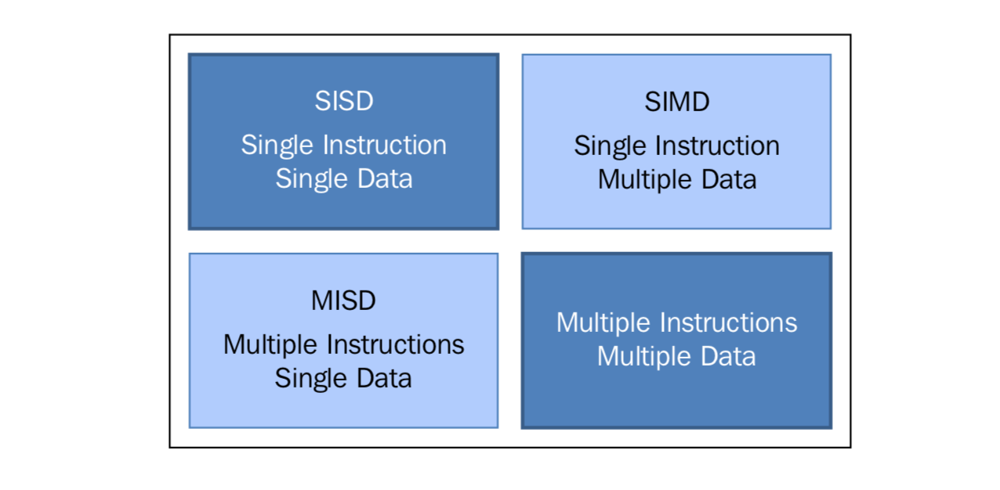

这种分类方法叫做 **菲林分类**

### 1.SISD

单处理器单数据就是"单 CPU 的机器"，其在单一数据流上执行指令。在 SISD 中，指令被顺序执行。

对于每一个"CPU 时钟"，CPU 按照下面的顺序执行：
+ Fetch：CPU 从一片内存区域中（寄存器）获取数据和指令
+ Decode：CPU 对该指令进行解码
+ Execute：该指令在数据上执行，将结果保存在另一个寄存器中

当 Execute 阶段完成之后，CPU 回到步骤1准备执行下一个时钟循环。

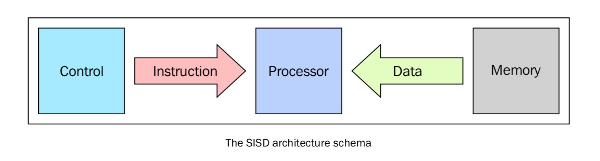

运行在这些计算机上的算法是顺序执行的（连续的），不存在任何并行。只有一个 CPU 的硬件系统就是 SISD 的例子。

这种架构的主要元素有以下：
+ 中心内存单元：存储指令和数据
+ CPU：用于从内存单元获得指令/数据，对指令解码并顺序执行它们
+ I/O 系统：程序的输入和输出
  
### 2.MISD
这种模型下，有 n 个处理器，每一个都有自己的控制单元，共享一个内存单元。在每一个 CPU 时钟中，从内存获取的数据会被所有的处理器同时处理，每一个处理器按照自己的控制单元发送的指令处理。在这种情况下，并行实际上是指令层面的并行，多个指令在相同的数据上操作。能够合理利用的情况比较少，例如数据加密等。

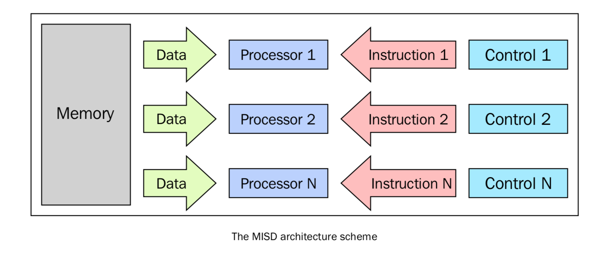

### 3.SIMD
SIMD 计算机包括多个独立的处理器，每个都有自己的局部内存，用来存放数据。所有处理器在单一指令流下工作。所有的处理器同时处理每一步，在不同的数据上执行相同的指令，这是一个数据并行的例子。SIMD 架构比 MISD 架构要实用的多，这种架构的算法十分容易设计，分析和实现。限制是只有可以被分解为多个小问题的问题才能被这种架构解决。

### 4.MIMD
在菲林分类中，这种计算机是最广泛应用的、也是最强大的种类。这种架构有 n 个处理器， n 个指令流，n 个数据流。每个处理器都有自己的控制单元和局部内存。每个处理器在独立的控制单元分配的指令流下工作。因此，处理器可以在不同的数据上运行不同的程序，这样可以解决完全不同的子问题甚至是单一的大问题。在 MIMD 中，架构是通过线程或者进程层面的并行实现的，这也意味着处理器一般是异步工作的。

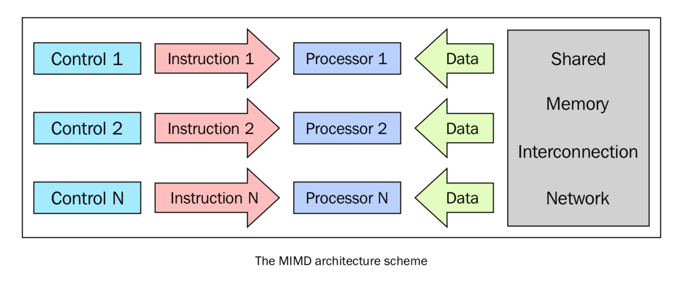


## 内存管理
内存管理是并行架构需要考虑的另一方面，确切来说是获取数据的方式。无论处理单元多块，如果内存提供指令和数据的速度跟不上，系统性能也不会得到提升。制约内存达到处理器速度级别的响应时间主要因素是内存存取周期。

存取周期：连续启动两次读或写操作中所需间隔的最小时间。

处理器的周期通常比内存周期短得多。当处理器传送数据到内存或从内存中获取数据时，内存依旧在一个周期中，在该周期内其他设备不能使用内存。


为了解决 MIMD 架构内存访问的问题，业界提出了两种内存管理系统，共享内存系统 和 分布式内存系统。

### 1.共享内存系统
总线结构允许任意数量的设备共享一个通道。每个处理器都拥有各自的 Cache（缓存），Cache 中保存着局部内存中有可能被处理器使用的指令或数据。

当一个处理器修改了内存中的数据，同时另一个处理器正在使用该数据，就会出现一致性的问题。

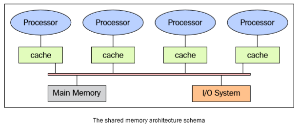


共享内存系统的主要特性如下：

+ 内存对于所有处理器来说都是一样的，例如，所有处理器所对应的相同数据结构都存在于相同的逻辑地址，也就是说可以从相同的内存单元中获得该数据的结构。
+ 通过控制处理器达到对共享内存的访问权限可以达到同步效果。实际上，每次只有一个处理器拥有对资源的访问权限。
+ 当一个任务正在访问共享内存时，其他任务都不能改变内存单元的内容。
+ 共享内存很快，两个任务通讯的时间和读取单个内存单元的时间相等（取决于内存的访问速度）

在共享内存中访问内存方式如下：

+ 均匀内存访问（Uniform memory access（UMA））：这类系统的基本特征是无论对处理器来说访问任意的内存区域速度是相同的，因此也称为对称式多处理器系统。系统实现起来简单，但是可拓展性较差。需要通过插入适当的控制、信号量、锁机制来管理同步，进而在进程中管理资源。
+ 非匀速内存访问（Non-uniform memory access（NUMA））：这类架构将内存分为高速访问区域和低速访问区域。高速访问区域是分配给各个处理器的区域，是用于数据交换的公共区域。这类系统被称为分布式共享系统，该类系统扩展性好，但开发难度大。在 NUMA 架构时，需要注意的是这类系统会把数据的副本保存在 Cache 中共处理器使用，并且在主存中也保存着相同的数据。
+ 无远程内存访问（No remote memory access（NORMA））：对于处理器来说内存在物理上是分布式存在的。每个处理器只能访问其局部私有内存。处理器之间通过信息传递协议进行通讯。
+ 仅 Cache 可访问（Cache only memory access（COMA））：这类系统中仅有 Cache 内存。COMA 架构可以移除重复的主存数据，而只保留 Cache 内存。对于处理器来说内存是物理上分布式存在的。每个处理器只能访问其局部私有内存，处理器之间通过信息传递协议进行通讯。

### 2.分布式内存
分布式内存系统中，各个处理器都有其各自的内存，而每个处理器只能处理属于自己的内存。

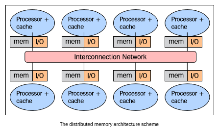

内存管理方式有几个好处：

+ 总线和开关级别的通讯不会发生冲突。每个处理器都可以无视其他处理器的干扰而充分利用局部内存的带宽；
+ 没有通用总线意味着没有处理器数量限制，系统规模只局限于连接处理器的网络带宽；
+ 没有 Cache 一致性的问题困扰，每个处理器只需要处理属于自己的数据而不需关心上传数据副本的问题。

最大缺点是，难以实现信息的通信。如果一个处理器需要处理其他处理器的数据，这两个处理器必须通过信息传递协议来交换信息，但这样会导致通信速度下降。原因有二：

+ 从一个处理器创建和发送信息到另一个处理器需要时间；
+ 任何处理器都需要停止工作，处理来自其他处理器的讯息。 
  

分布式内存系统的特性如下：
+ 内存通常分布在不同的处理器中，局部内存只能由对应的处理器访问；
+ 同步控制通过在处理器之间转移数据（也可以是消息本身）来实现，同理通讯的实现方式也一样；
+ 局部内存的数据分支会影响机器的性能--有必要精确的进行数据分割最小化 CPU 间的通讯。另外，协调数据的分解合成操作的处理器必须与处理部分数据的处理器高校的通讯；
+ 信息传递协议用于 CPU 间通过交换数据包通讯。消息是信息的分解单元，他们经过良好的定义，所以处理器之间能够准确地识别出信息的内容。

### 大规模并行处理（Massively parallel processing）
MPP 机器由上百个处理器通过通讯网络连接而成，世界上最快的计算机都是基于这种架构。

### 工作站集群
工作站集群是指将传统的计算机通过通讯网络连接在一起。在集群架构中，一个节点就是集群中的一个计算单元。对于用户来说，集群完全是透明的。

一般会定义三种集群：

+ 故障切换集群（The fail-over cluster）：该集群会持续检测节点的活动状态，当一个节点出现故障时，另一台机器会马上接管故障节点的工作。这类集群通过冗余架构来保障系统可用性。
+ 负载均衡集群（The load balancing cluster）：该系统中，作业会优先发给负载较小的节点上执行，这样可以减少整个处理过程耗费的时间。
+ 高性能计算集群（The high-performance cluster）：该系统中每个节点都可以提供极高性能，任务是并行化的，分配给不同机器处理。


### 异构架构

在同构的超计算机中采用 GPU 加速器改变了之前超级计算机的使用规则，即使 GPU 能够提供高性能计算，也不能将其视为独立的处理单元，因为 GPU 必须在 CPU 的配合下才能顺利完成工作。

异构计算的程序设计方法很简单，首先 CPU 通过多种方式计算和控制任务，将计算密集型和高并行性任务分配给图形加速卡执行。

CPU 和 GPU 不仅可以通过高速总线通讯，也可以通过一块虚拟内存或物理内存通讯。事实上这类设备上 CPU 和 GPU 都没有独立的内存区域，一般是通过各种编程框架提供的库来操作内存。这种架构被称为异构架构。

在这种架构中，应用程序可以在单一的地址空间中创建数据结构，然后将任务分配给合适的硬件执行。通过原子性操作，多个任务可以安全地操控同一个内存区域同时避免数据一致性问题。

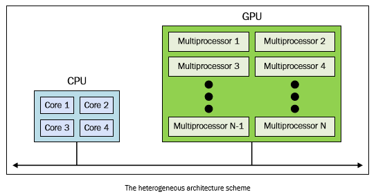


## 并行编程模型

并行编程模型是作为对硬件和内存架构的抽象而存在的，他们理论上能在任何类型的机器上实现。相对于前面的架构细分，这些编程模型会在更高的层面上建立。

要明白没有最好的编程模型，模型效果很大情况下取决于实际问题，目前使用范围最广的并行编程模型有：

+ 共享内存模型
+ 多线程模型
+ 分布式内存/消息传递模型
+ 数据并行模型

### 1.共享内存模型
在这个编程模式中所有任务都共享一个内存空间，对共享资源的读写是异步的。系统提供一些机制，如锁和信号量，来让程序员控制共享内存的访问权限。

优点是不需要知道程序间的通讯细节。

但了解和管理数据区域将会变得更加困难。

### 2.多线程模型
该模型中，单个处理器可以有多个执行流程，例如创建了一个顺序执行的任务后，会创建一系列可以并行执行的任务。

通常情况下这类模型会应用在共享内存架构中，由于多个线程都会对共享内存进行操作，所以线程间的同步控制很重要。

intel 的超线程（Hyper-threading）技术则是在硬件层面上实现多线程，超线程技术是通过当一个线程在停止或等待 I/O 状态时切换到另一个线程实现的。

### 3.消息传递模型
信息传递模型通常在分布式内存系统中应用。任务可以驻留在一台或者多台的物理机器上。程序员需要确定并行和通过信息产生的数据交换。

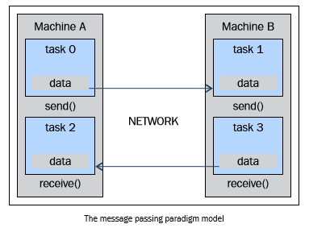

### 4.数据并行模型
该模型中，多个任务操作同一数据结构。每个任务执行数据的不同部分。在共享内存架构中，所有任务都访问同一内存。在分布式内存架构中，贼会将数据分割并且保存到每个任务的局部内存中。为了实现该模型，程序需要指定数据的分隔和对齐方式。GPU 在数据对齐的情况下效率很高。

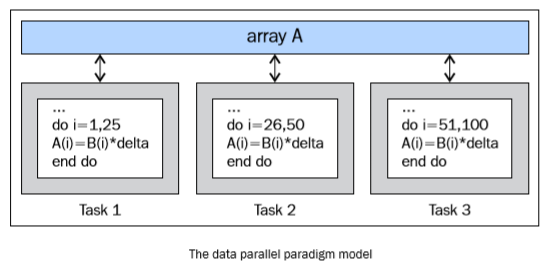


## 如何设计一个并行程序

并行算法是基于一系列操作的，在编程过程中必须执行以下操作来保证结果正确：

+ 任务分解（Task decomposition）
+ 任务分配（Task assignment）
+ 聚合（Agglomeration）
+ 映射（Mapping）

### 1.任务分解
第一阶段，将会程序软件分解为不同处理器执行的多个任务或者一系列指令，常用分类：

+ 按范围分解（Domain decomposition）：使用该处理方法，按同一个程序处理不同数据，一般适用于海量数据情况。
+ 按功能分解（Functional decomposition）：将问题分解为几个任务，每个任务对数据执行不同操作。
  
### 2.任务分配
该阶段会向各个处理器分配任务，最关键的是负载均衡，以保证没有处理器长时间闲置，浪费资源。为了实现该效果，程序员需要考虑异构的可能性，其可以将任务分配给相对更适合的处理器。在分配任务是要注意减少处理器间的通讯，处理器的通讯是资源消耗和程序变慢的源头。

### 3.聚合
聚合，就是为了提升性能将小任务合并为大任务的。如果前两个过程中，将任务数量分解的大大超出处理器接受程度，或者计算机架构并非能处理大量小任务（GPU 架构就很适合处理大量任务），这样的过分解就会导致效率下降。原因是任务需要和处理它的处理器和线程进行通讯，在通讯中，不止有数据量交换，还有通讯固定部分（比如 TCP 连接建立的延迟），如果固定部分消耗大于数据量交换，是一种很低效的行为。


### 4.映射
在映射阶段，需要确定哪个任务由哪个处理器执行，主要目的是减少程序执行的总时间。在这里经常有取舍，因为有两个矛盾策略：

+ 通讯频繁间的任务应该交由同一个处理器处理，以降低通讯成本
+ 可并行任务应当交由多个处理器处理，来提高并行效率

所谓的映射问题，也是一个 NP 完全问题。通常来讲，如果通讯模式易定义或者任务数量固定，设计合理的映射相对简单。但是如果通讯模式复杂而且任务的工作量不同时，需要通过负载均衡算法来识别聚合和映射策略。最难点在于任务数量或者通讯量会动态变化的问题，可以在执行过程中周期性运行动态负载均衡算法解决。


### 5.动态映射
不同问题有着不同的负载均衡算法，全局需要对指向的计算有全局认识，而局部则只需要关注正在解决问题的部分信息，对比全局可以减少很大开销，但局部的聚合和映射能力差，但即便如此，总体上还是能减少执行时间。如果任务除了执行开始和接收几乎不和其他任务进行通信，可以使用任务调度算法简单的把任务分配给空转的处理器。在调度算法中，会维护一个任务池，任务池中包含了待执行的任务，工作单元从中取出任务执行。

动态映射模型的三个通用方法

#### 1.管理单元/工作单元（Manager/worker）
基础的动态映射架构，工作单元都连接至一个中央管理单元，管理单元不断地发送任务给工作单元并收集运算结果。这种架构在处理器较少时表现最好


#### 2.分层的管理单元/工作单元（Hierarchical manager/worker）
半分布式的管理单元/工作单元变种，将工作单元按组划分，每组都有一个器管理单元。当组管理单元将任务分配给工作单位时，组管理单元会和主管理单元（或者另一个组管理单元）通讯。这样就可以提前获得任务，做到计算和通讯的重叠进行。

#### 3.去中心化
该架构中，所有东西都是去中心化的，每个处理器维护着自己的任务池并直接和其他处理器通讯请求任务。处理器有多种方式选择处理器任务。


# 如何评估并行程序的性能

## 1.加速比
加速比用来衡量使用并行方法解决问题的收益。如果使用单个处理器处理问题的时间是 TS。使用 P 个处理器处理相同问题的时间是 TP。那么加速比 S = TS/TP 。如果 S = P，加速比为线性，说明执行速度随着处理器增加而线性减少。当 TS 为 最佳串行算法是，加速比是绝对的，当 TS 为并行算法在单个处理器上的执行时间时，加速比则是相对的。

一般有三种情况：
S < P：真实情况
S = P：线性加速
S > P：超线性加速


## 2.效率
理想状态下，一个并向系统有 P 个处理器，则加速比为 P。然而这是不可能达到的，因为有空转处理器和通讯成本。

效率通常是用来评价在执行任务时是否充分利用处理器的性能指标，他根通讯和同步所耗费的时间做比较。

假设效率为 E，E = S/P 。理想状态下，E 为 1。

有三种情况：
E = 1：理想状态
E < 1：真实状态
E << 1：效率低下的并行算法


## 3.伸缩性
伸缩性用来衡量并行机器高效运算的能力，代表和处理器数量成正比的计算能力。如果问题的规模和处理器的数量同时增加，性能不会下降。在依靠各种因素的可伸缩系统中，可以保证相同或者更高的效率。

## 4.阿姆德尔定律（Ahmdal's law）
它指出程序能最大到达的加速比取决于串行。S = 1/(1-P)，其中 1- P 部分指程序的串行部分。假如一个程序中 90% 为并行代码，10% 为串行代码。那么该程序在无限处理器下最大加速比为 9。

## 5.古斯塔夫森定律（Gustafson's law）
古斯塔夫森定律是基于以下情况给出的：

+ 在问题的规模增加时，程序串行规模保存不变
+ 在处理器数量增加时，每个处理器的任务不变

古斯塔夫森定律的加速公式为 S（P）= P - a(P-1)，P表示处理器数量。a表示串行代码比例。阿姆德尔公式是在单个处理器执行时间作为定量和并行执行时间进行比较，其假设程序的整体工作量不会随着机器规模改变。而古斯塔夫森补充了该问题。


# Python 中基于线程的并行

## 介绍
在编程应用中最常见的并发编程范例是多线程，通常一个应用有一个进程，多个线程，并行执行，运行不同的任务。

几乎所有操作系统和所有编程语言都支持多线程。

线程是独立的处理流程，可以和系统的其他线程并行或并发。一般来讲，同一进程下的线程可以共享数据和资源。

线程基本上包括三个要素：程序计数器、寄存器、栈。每个线程拥有自己的运行状态，一般分为 ready、running、blocked。相比于进程，线程拥有的优势在于性能。因为线程间切换成本远小于进程间切换。

多线程一般使用共享内容空间进行线程通讯，因此管理内存空间成为多线程的难点。

## 使用 Python 的线程模块

Python 通过标准库 threading 模块来管理线程。

线程模块的主要组件如下：
+ 线程对象
+ Lock对象
+ Rlock对象
+ 信号对象
+ 条件对象
+ 事件对象


## 如何定义一个线程

使用线程最简单的方式是用一个目标函数实例化一个 Thread 然后调用 start()启动它。

```python
class threading.Thread(group = None,
                    target = None,
                    name = None,
                    args = (),
                    kwargs = {})
```

上面代码中：

+ group：一般为 None，为后续特性做准备；
+ target：设置线程启动时调用的函数；
+ name：线程的名字，如果不给出，系统会默认提供一个；
+ args：传递给 target 的参数，元组形式；
+ kwargs：传递给 target 的参数，字典形式。

# 如何确定当前线程

```python
threading.currentThread().getName()
```
如果在创建线程时给出了自定义名称，则返回自定义名称，若无则返回系统默认名称，例如 Thread-1。


# 如何实现一个线程

使用 threading 模块实现一个新的线程需要以下三步：

+ 定义一个 Thread 的子类；
+ 覆盖 __init\__（self,[,args]）方法，来添加额外参数；
+ 覆盖 run（self,[,args])方法，实现线程要做的事情；

当你创建新的 Thread 子类时，你可以实例化它，通过调用 start（）方法来执行 run（）方法


# 使用Lock进行线程同步

当两个以上对共享内存的操作发生在并发线程中，如果有某一个修改了数据，但又没有同步机制，就会造成竞争条件，导致代码无效化。

常见解决竞争条件的办法就是锁。锁的实现很简单，当一个线程想要访问部分资源时，他必须先获得该资源的锁才能访问，在访问结束后释放锁，然后其他线程才能拿到这个锁访问该资源。

这样可以保证同一时刻只有一个线程访问共享内存。

但实际过程中，这个方法经常导致一种糟糕的死锁。当不同线程要求得到同一个锁时，死锁就会发生。程序无法进行，因为他们拿着各自的锁。


# 使用 RLock 进行线程同步

RLock（Reentrant Lock）就是可以获取多次的锁，也叫做递归锁。主要有三个特点：

+ 谁拿到谁才能释放
+ 可以获取多次
+ 获取多次需要释放多次，只有最后一次释放时，锁才变为unlock状态

# 使用信号量进行线程同步

信号量是由操作系统管理的一种内部数据结构，用于在多线程中对于共享资源的管理。本质上，信号量是一个内部数据，表示共享资源可以有多少并发读取。

信号量特点：

+ 每当有线程想要使用该共享资源时，调用 acquire()，此操作减少信号量的内部变量，如果该值大于零，则分配该资源权限。如果小于零，则线程被挂起，直到有其他线程释放该资源。
+ 当线程不需要该共享资源，必须通过release（）释放。这是信号量的内部变量增加，在信号量等待队列中排在最前面的线程会拿到共享资源的权限。


# 使用条件进行线程同步


Python对条件同步的管理很有趣，如果没有已经存在的锁传递给构造器的话，内部的 _Condition 会创建一个 RLock（）对象


# 使用事件进行线程同步

事件是线程之间用于通信的对象。有的线程等待信号，有点线程发出信号。基本上事件对象会维护一个变量。使用 set（）时将变量设置为 ture，使用clear（）时将变量设置为 false。wait（）方法会阻塞线程，直至他变为 true。


# 使用with语法
使用 with 语法可以在特定的位置分配和释放资源，with 也叫做上下文管理器。在 threading 模块中，所有带有 acquire()方法和 release（）方法的都可以使用 with：

+ Lock
+ Rock
+ Condition
+ Semaphore


# 使用 queue 进行线程通信

当线程之间需要共享资源时，可能变得十分复杂。threading 提供了很多同步原语，如果能使用原语的情况下，优先使用原语。而不是使用 queue 队列。但是队列的操作人员，也是多线程编程安全性增加，因为队列可以将资源的使用通过单线程进行完全控制，并允许更简洁的设计模式

Queue 常用的四种方法：
+ put（）：往队列里放入一个 item
+ get（）：从队列删除一个 item，并返回该 item
+ task_done（）：每次 item 被处理时候需要调用
+ join（）：所有 item 被处理之前一直阻塞


# 评估多线程应用的性能

GIL 是 CPython解释器引入的锁，GIL 在解释器层面上阻止了真正的并行运行。解释器在执行任何线程之前，必须等待当前线程释放 GIL。事实上解释器会强迫想要运行的线程拿到 GIL 才能访问解释器的任何资源。GIL 的目的--阻止不同线程并发访问 Python 对象，保护解释器的内存，让垃圾回收工作能正常运行。 GIL 并没有影响多处理器并行的线程，只是限制了一个解释器只能由一个线程运行。


# 基于线程的并行

multiporecessing 是 Python 标准库中的模块，实现了共享内存机制，也就是说可以让运行在不同处理器核心的进程读取共享内存。

mpi4py 库实现了消息传递的编程范例（设计模式），简单来说进程之间不靠任何共享信息来进行通讯，所有交流都通过传递信息代替。


## 如何产生一个进程

产生的意思是，由父进程创建子进程，父进程既可以在产生在子进程后异步执行，也可以等待子进程创建完成之后再继续执行。

mulitprocess 通过以下几步创建进程：

+ 创建进程对象
+ 调用 start（）方法，开启进程的活动
+ 调用 join（）方法，在进程结束之前一直等待
  

## 如何在后台运行一个进程

为了让后台运行进程，我们需要将 daemon 参数设置为 True

```python
back_process.daemon = True
```

后台进程不允许创建子进程，否则当后台进程跟随父进程退出后，子进程会变为孤儿进程。另外，他们不是 Unix 的守护进程或服务，当非后台进程退出，他们会被终结。


## 如何杀掉一个进程

我们可以使用 terminate（）方法立即杀死一个进程，使用 is_alive（）判断进程是否存活。

我们可以读取进程的状态码来验证进程已经结束，常见的 ExitCode
+ ==0：没有错误政策退出
+ \> 0：进程有错误，并以此状态码退出
+ <0：进程被 '-1*' 的信号杀死并且以 ExitCode 退出
  
比如例子用， ExitCode 为 15，表示负数被子进程 15 的信号杀死。

## 如何在子类中使用进程

自定义进程子类，分三步：
+ 定义 Process 类
+ 覆盖 __init__方法，添加额外参数
+ 覆盖 run 方法，实现 Process 启动时的执行任务

## 如何在进程之间交换对象

并行应用常常要在进程之间交换数据，Multiporcess 有两个 Communication Channel 可以交换对象： 队列（queue） 和 管道(pipe)

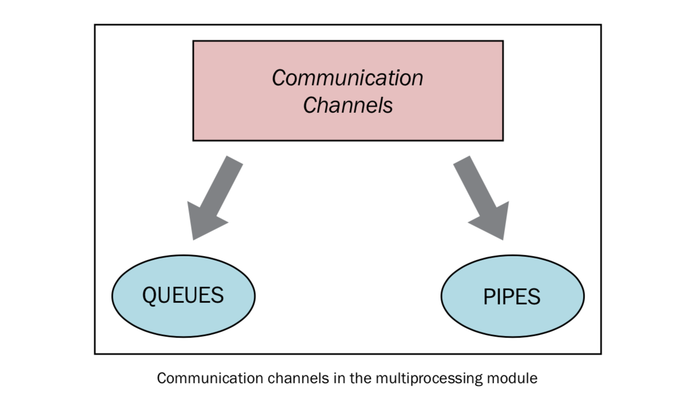

Queue 返回一个共享的队列，是线程安全也是进程安全的。可以序列的对象都能通过其进行交换。


队列还有个 JoinaleQueue 子类，他多了两个方法：

+ task_done()：此方法意味着之前入队的一个任务被完成
+ join（）：此方法将进程阻塞，知道所有 item 被取出执行
  

  注释：因为使用队列进程是一个单向的，不确定过程，使用 task_done()可以表示一个任务已经被完成了。

  该方法一般和 join 使用，在所有 get（）操作调用 task_done（）时，可以调用join（），完成任务

  join有点像 try catch 里的 finally

## 使用管道交换对象

  一个管道可以做以下事情：

  + 返回一堆被管道连接的连接对象
  + 使用 send/receive 进行线程通信

## 进程如何同步

多个进程可以协调完成一项工作，通常需要共享数据，所以在多进程之间保持数据的一致性十分重要。相关的同步原语和线程类似：

+ Lock：一个 lock 对象有两种方法，acquire（）和 release（）。
+ RLock：递归锁，和 Threading 用途一样。
+ Event：实现线程简单通信，一个发送信号，一个等待信号，set（）和 clear（）方法来管理内部变量。
+ Condition：同步部分工作流程，有两个基本方法，wait（）用来等待进程，notify_all（）用来通知其他等待此条件的进程。
+ Semaphore：用来共享资源，例如固定数目的共享连接。
+ Barrier：将程序分层，适用于某些进程需要在某些进程之后运行，使用障碍分隔，处于障碍前的代码不能与障碍后的代码并行。

下图展示了 barrier 如何进行同步：

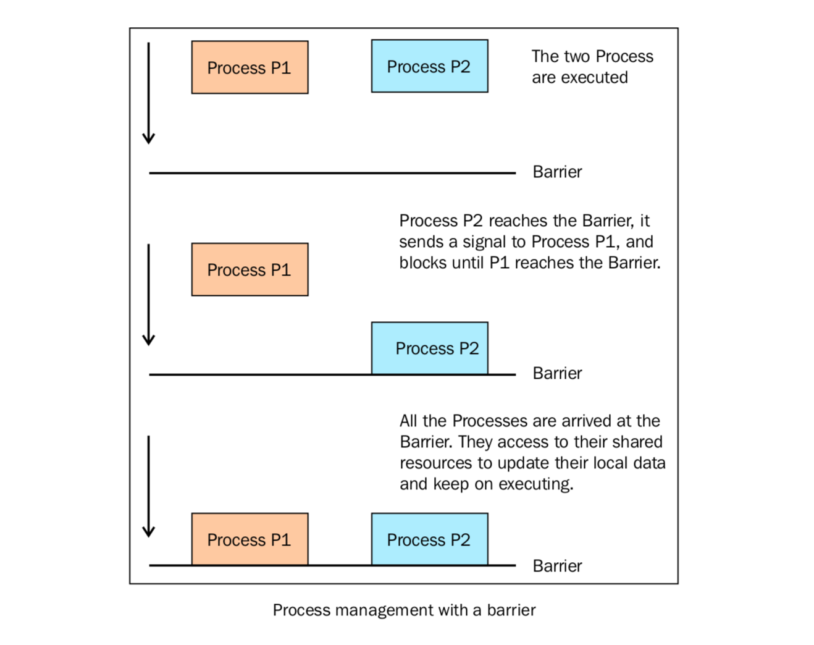


## 如何在进程之间管理状态

Python 多进程模块提供了一个在所有用户之间管理共享对信息的管理者（manager），一个管理者控制着拥有 Python 对象的服务进程，并允许其他进程作共享对象。

管理者特性：

+ 它控制着共享对象的服务进程
+ 当一个进程更新了共享对象后，所有进程拿到的共享对象都得到更新

## 使用进程池

多进程库提供了 Pool 类实现简单的多进程任务，Pool 类有以下方法：

+ apply()：得到结果之前一直阻塞。
+ apply_async()：是 apply（）方法的一个变体，返回一个 result 对象。其实一个异步操作，在子进程执行之前不会锁住主进程。
+ map（）：内置的 map（）函数的并行版，将每一个可执行的数据作为进程池中的一个任务。
+ map_async（）：是 map（）方法的变体，也是异步的，返回一个result 对象，如果指定了回调函数，回调函数应该是 callable 的，并且只接受一个参数。当 result 准备好之后会自动调用回调函数。