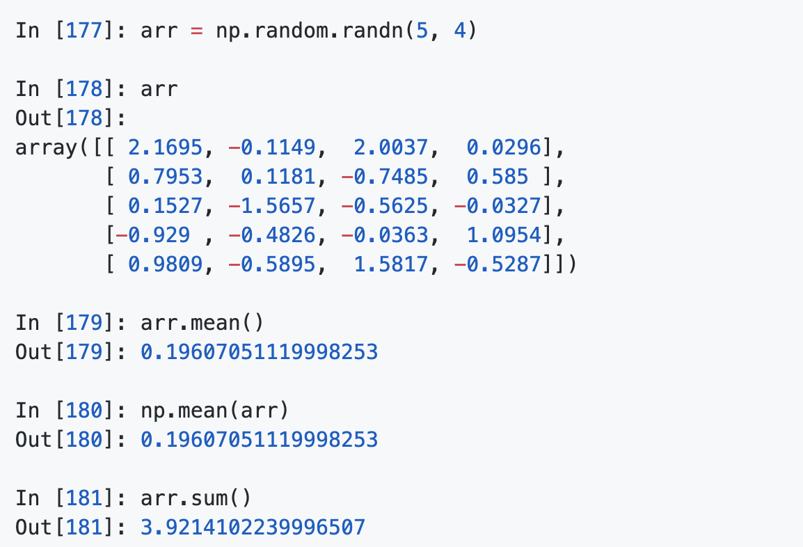

# 目录
+ [Charpter1准备工作](#Charpter1准备工作)
    + [本书的内容](#本书的内容)
        + [什么样的数据？](#什么样的数据？)
    + [为什么要使用Python进行数据分析](#为什么要使用Python进行数据分析)
        + [Python作为胶水语言](#Python作为胶水语言)
        + [为什么不选Python](#为什么不选Python)
    + [重要的Python库](#重要的Python库)
        + [NumPy](#NumPy)
        + [pandas](#pandas)
        + [matplotlib](#matplotlib)
+ [Charpter2Python语法基础，IPython和JupyterNotebooks](#Charpter2Python语法基础，IPython和JupyterNotebooks)
        + [IPython基础](#IPython基础)
            + [运行IPythonShell](#运行IPythonShell)
                + [Tab补全](#Tab补全)
                + [自省](#自省)
                + [%run命令](#%run命令)
                + [魔术命令](#魔术命令)
+ [Charpter4NumPy(NumercalPython)](#Charpter4NumPy(NumercalPython))
    + [NumPy的ndarray：一种多为数组对象](#NumPy的ndarray：一种多为数组对象)
    + [创建ndarray](#创建ndarray)
    + [ndarray的数据类型](#ndarray的数据类型)
    + [numpy数组运算](#numpy数组运算)
    + [基本的切片和索引](#基本的切片和索引)
    + [切片索引](#切片索引)
    + [布尔型索引](#布尔型索引)
    + [花式索引](#花式索引)
    + [数组转置和轴兑换](#数组转置和轴兑换)
    + [通用函数](#通用函数)
    + [利用数组进行数据处理](#利用数组进行数据处理)
    + [将条件逻辑表述为数组运算](#将条件逻辑表述为数组运算)
    + [数学和统计方法](#数学和统计方法)
    + [用于布尔型数组的方法](#用于布尔型数组的方法)
    + [排序](#排序)
    + [唯一化以及其他的集合逻辑](#唯一化以及其他的集合逻辑)

# Charpter 1 准备工作
## 本书的内容
本书主要介绍使用 Python 进行数据控制、处理、整理、分析等具体细节和基本要点，重点介绍 python 编程、库以及用于数据分析的工具。

### 什么样的数据？

书中出现的数据一般指结构化数据，例如：
+ 表格型数据，各列可能是不同的类型
+ 多重矩阵
+ 通过关键列（主键和外键）相互连接的多个表
+ 间隔平均或不平均的时间序列

## 为什么要使用 Python 进行数据分析

Python中的库不断改进，使得其成为数据分析中一个优选方案。

### Python 作为胶水语言

Python 能够轻松的集成 C++，C 以及 Fortran 代码，大部分现代计算环境都是用了 Fortran 和 C 库实现线性代数、优选、积分、快速傅里叶变化等算法。

### 为什么不选Python
由于其为解释型语言，因此运行速度比较慢，如果系统需要极小的延迟性，是不适合使用 Python的。
高并发，多线程的系统，由于 GIL 全局解释器锁的存在，限制了效率。
但是 Python 可以利用 C 插件使用原生的 C 或者 C++ 多线程，从而实现真正并行。

## 重要的 Python 库

### NumPy
NumPy（Numerical python 的简称），是 Python 科学计算的基础包。它提供但不限于以下内容：

+ 高效快速的多维数组 ndarray
+ 用于对数组进行元素集计算以及直接对数组进行计算的函数
+ 用于读写硬盘上基于数组的数据集的工具
+ 线性代数运算，傅里叶变换，以及随机生成数
+ 成熟的 C API，用于 Python 的插件和原生 C、C++、Fortran 代码访问 NumPy 的数据结构和计算工具。

NumPy 在数据分析中还有一个很重要的作用，就是作为库和算法之间传递数据的容器。NumPy 的数组比 Python 内置的数据结构在存储时效率高上许多，并且可以被低级语言（C、Fortran）直接处理。

### pandas
pandas 提供了大量函数和结构来处理结构化数据。

pandas 兼具 NumPy 高效率数组以及电子表格和关系型数据库的数据处理功能。它复杂精确的索引功能，能更加便捷地完成重塑、切片和切块、聚合以及选取数据子集等操作。因为数据清洗、准备、分析是数据分析的重要技能，所以 pandas 是本书的重点。

pandas 的名字源于 panel data 以及 Python data analysis。

### matplotlib
matplotlib 是最流行的用于绘制图表和其他二维数据可视化的 Python 库。

# Charpter 2 Python 语法基础，IPython 和 Jupyter Notebooks

本书主要关注于基于表格的分析和处理大规模数据集的准备工作。

### IPython 基础

#### 运行 IPython Shell

你可以使用 ipython 来打开 IPython shell 和 jupyter notebook

你可以通过输入代码或者回车运行任何 Python 语句，当你只输入一个变量时，他会被打印出来。

许多 Python 格式对象被转化为更易读的形式，或称为 pretty-printed。

##### Tab 补全
Tab 可以进行补全，不仅是函数和方法，同样适用于模块，文件路径各种。

##### 自省

在变量后面使用 ？，可以显示对象信息。

如果对象是一个函数或者实例方法，定义过文档字符串，则显示文档字符串。

使用 ？？会显示函数的源码

? 还有一个用途可以用来搜索命名空间。

##### %run 命令

你可以 使用 %run 命令运行一个 Python 脚本，运行结束后文件中定义的所有变量，都可以在 IPython 中访问。

在 Jupyter notebook 中，你可以使用 %load 导入代码到代码格中

下图是 IPython 常用的快捷键

##### 魔术命令

IPython 中有特殊命令使得普通任务更快捷。魔术命令的指令是在指令前面添加 % 号前缀。

可以使用 %automagic 命令来打开是否自动魔术命令，打开后所有魔术指令不需要 %。

一些魔术函数和 Python 函数很像，可以直接赋值给变量。

IPytohn 的文档可以在 shell 中打开，可以使用 % quickref 或 %magic 学习所有特殊命令。下图列出了一些主要命令

# Charpter4 NumPy(Numercal Python)

NumPy之于数值计算特别重要的原因之一，是因为他可以高效的处理大数组的数据，这是因为：

+ NumPy 是在一个连续的内存块中存储数据，独立于其他 Python 内置对象。NumPy 的 C 语言编写的算法库可以操作内存，而不需要要进行类型检查或者其他前期工作，所以比起 Python 内置序列，NumPy 数组使用的内存更少。
+ 可以在整个数组上执行复杂的计算，而不需要 Python 的 for 循环。

基于 NumPy 的算法要比纯 Python 快 10-100 倍，并且使用内存更少。

## NumPy 的 ndarray：一种多为数组对象

NumPy 的一个重要特点是其 N 维数组对象，该对象是一个快速而灵活的大数据集容器。

ndarray 是一个通用的同构数据多维容器，也就是说，所有元素必须是相同类型的。每个数组都有一个 shape（一个表示各维度大小的元组）和一个 dtype（一个用于说明数组数据类型的对象）

## 创建 ndarray

创建 ndarray 最简单的方法是使用 array，它接受一切有序列的对象，产生一个新的含有传入数据的 NumPy 数组。以一个列表转换为例：

除非特别说明，numpy 会给这个新数组一个更合适的数据类型。

除了 np.array 之外，还有一些函数可以新建数组。比如 zeros 和 ones 可以创建指定长度或形状的全 0 或全 1 数组。empty 可以创建一个没有任何具体值的数组。需要用这些方法是，只要传入一个表示形状的元组即可：

**注意：认为 np.empty 会返回全 0 数组的想法是不安全的。很多情况下，它返回的都是一些未初始化的垃圾值。**

arange 是 Python 内置函数 range 的数组版：

由于 numpy 关注的是数值计算，如果没有特别指定，数据类型基本为 float64（浮点数）

## ndarray 的数据类型

dtype 是一个特殊对象，他含有 ndarray 将一块内存解释为特定数据类型所需的信息。

dtype 是 numpy 灵活交互其他系统的源泉之一，多数情况下，他们直接映射到机器表示，这使得 “读写磁盘的二进制数据” 和 “集成低级代码（C 和 Fortran）”变的更加简单。

数值型 dtype 命名方式相同：一个类型名（如 float 和 int），后面跟一个用于表示各元素长的数字。标准的双精度浮点数值（即 Python 中的 float 对象）需要占用 8 字节（即 64 位），则类型就在 numpy 中记做 float64。

你可以 通过 ndarray 的 astype 方法将数组从一个 dtype 转到另一个 dtype：

如果字符串数组表示全是数字，也可以使用 astype 转化为 数值形式

**注意：使用 numpy.string 类型时，一定要小心，因为 numpy 的字符串数据是大小固定的，发生截取时，不会发出警告**

调用 astype 会创建一个新数组，即使新的 dtype 和旧的 相同。

## numpy 数组运算

在 numpy 中，你不写循环也可以对数据进行批量处理，大小相等的数组之间的所有运算都将运用到元素级，被称为矢量化。

大小相同的数组之间比较会生成布尔数组

不同大小的数组的运算称为广播，不在本书探讨范围内。

## 基本的切片和索引

选取数据子集或单个元素的方式有很多。

如果你将一个标量值赋给一个切片时（例如 arr[5:8]=12），该值会自动传播（也就是后面讲到的广播）。

数组和列表的最重要区别在于，数组切片是原始数组的视图，一意味着数据不会被复制，视图上的任何修改都会直接反应到原数组。

**注意：你想得到数组切片的副本而非视图时，需要明确操作：arr[5:8].copy（）**

多维数组情况下，可以进行递归访问，你可以以一个逗号为间隔来选取单个元素，下面两种方式是等价的

下图表示了二位数组的索引方式：

## 切片索引
对于多维数组，切片的方式稍显不同

可以看出，它是沿着第 0 轴即第一个轴切片的。也就是说，切片是沿着一个轴选取元素的。

可以一次传入多个切片，就像索引那样

类似这切片，只能得到同样规模的数据，要想得到低维度数据，可以使用整数索引和切片相结合。

切片索引常用操作：

自然对切片的赋值也会扩散到整个选区：

## 布尔型索引

假如我们有一个用于存储数据的数组以及一个存储姓名的数组

我们可以通过这样来选出 Bob 的所有行

要选取 除 Bob 以外的值，既可以使用 ！= 符号，也可以用 ~ 对条件进行否定。~相当于反转条件。

## 花式索引

利用整数数组进行索引。通过传入用于指定顺序的整数列表，来获得特定顺序的行子集。（1:n）

使用负数会从末尾开始选行

一次传入多个整数索引会有些特别，他返回一个一维数组，其中元素对于各个索引元组。

第一个数组范围（1:n），第二个数组范围（0:n），因为第一个数组范围表示行，第二个数组范围表示索引，边界值不同。

花式索引和切片不同，它总是将数据赋值到新数组。

## 数组转置和轴兑换

转置是重塑的一种特殊形式，他返回的是源数据的视图（不进行任何复制操作）。数组不仅有 transpose 方法，还有一个特殊的 T 属性。（就是线性代数学到的转置）

对于高纬度的数组转置，需要输入由轴编号组成的元组才能进行。（确认哪几个轴对换位置）：

简单的转置可以使用.T 方法。数组还有一个 swapaxes 方法，其接受一对轴编号。

## 通用函数

通用函数（ufunc）是对数组中的数据进行元素化操作的函数，你可以将其看做是普通函数的矢量化包装器。

一元 ufunc

二元 ufunc

## 利用数组进行数据处理

Numpy 可以将许多数据处理任务转回为简单的数据表达式，无需编写循环，被称为矢量化。矢量化数组运算会比纯 Python 方式块一到两个数量级，尤其是各种数组计算。

## 将条件逻辑表述为数组运算

numpy.where 函数 是三元表达式 x if condition else y 的矢量化版本。假设我们有一个布尔数组和两个值数组。

加入我们需要根据 cond 中的值俩选择 xarr 和 yarr 的值，如果cond 为 True，选择 xarr 的值，不然选择 yarr 的值。可以这样来写：

numpy.where 第二和第三个参数不必是数组，他们都可以是标量值。

也可以一个是标量，一个是数组，下图可以将 arr 内所有正数替换为 2。

## 数学和统计方法

可以通过数组上一的一组数学函数对整个数组或某个轴向的数据进行统计计算。

mean 和 sum 这类函数可以接受一个 axis 选项参数，用于计算该轴上的统计量，结果是少一维的数组。

多维数组中，累加函数（cumsum）返回的是同样大小的数组，但是会根据每个低维的切片沿着标记轴计算部分聚类：

基本数据统计方法

## 用于布尔型数组的方法

上述方法中，布尔值会被强制转换为 1 和 0，因此 sum 常被用来对布尔类型中的 True 值进行统计：

另外还有两个方法 all 和 any 十分有效，any 用来判断是否有 1 或多个 True，all 判断是否所有值都为 True。

该方法可用于非布尔数组，所有非 0 数会被视为 True

## 排序

跟 python 内置列表一样，numpy 数组可用进行就地排序：

多维数组可用选择在任意一个轴方向排序：

## 唯一化以及其他的集合逻辑

numpy 针对一维数组提供了基本的集合计算，最常用的要数 np.unique 了，它找出数组中唯一值并返回已排序结果。

集合函数参考

