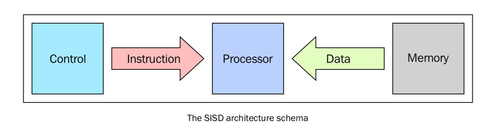
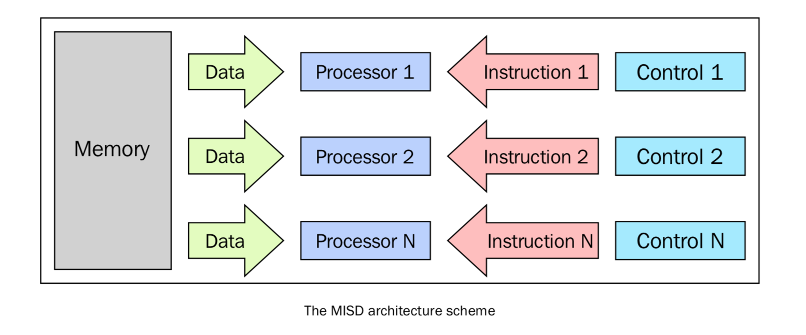

+ [认识并行](认识并行)
  + [介绍](介绍)

# 认识并行

## 介绍

并行程序用多个处理器同时工作，来完成同一个任务。每个处理区都做自己的那部分工作。而且计算过程中处理器之间可能需要交换数据。

提高计算能力有两种思路：提高处理器的时钟速度或者增加芯片上的核心数。提高时钟速度必定会增加散热，然后每瓦特的性能就会降低，甚至可能要求特殊的冷却设备。提高芯片性能的核心数是更可行的一种方法。

因此计算机硬件供应商选择的是多核心的架构，就是在同一个芯片上放两个或者多个处理器。GPU 制造商也引进了这种多处理器核心的硬件架构，所有目前大部分计算机都是多核的。

对我们说充分利用计算资源显得至关重要。

## 并行计算的内存架构

根据指令的同时执行和数据的同时执行，计算机系统分为以下四类：

+ 单处理器，单数据（SISD）
+ 单处理器，多数据（SIMD）
+ 多处理器，单数据（MISD）
+ 多处理器，多数据（MIMD）

这种分类方法叫做 **菲林分类**

### 1.SISD

单处理器单数据就是"单 CPU 的机器"，其在单一数据流上执行指令。在 SISD 中，指令被顺序执行。

对于每一个"CPU 时钟"，CPU 按照下面的顺序执行：
+ Fetch：CPU 从一片内存区域中（寄存器）获取数据和指令
+ Decode：CPU 对该指令进行解码
+ Execute：该指令在数据上执行，将结果保存在另一个寄存器中

当 Execute 阶段完成之后，CPU 回到步骤1准备执行下一个时钟循环。

运行在这些计算机上的算法是顺序执行的（连续的），不存在任何并行。只有一个 CPU 的硬件系统就是 SISD 的例子。

这种架构的主要元素有以下：
+ 中心内存单元：存储指令和数据
+ CPU：用于从内存单元获得指令/数据，对指令解码并顺序执行它们
+ I/O 系统：程序的输入和输出
  
### 2.MISD
这种模型下，有 n 个处理器，每一个都有自己的控制单元，共享一个内存单元。在每一个 CPU 时钟中，从内存获取的数据会被所有的处理器同时处理，每一个处理器按照自己的控制单元发送的指令处理。在这种情况下，并行实际上是指令层面的并行，多个指令在相同的数据上操作。能够合理利用的情况比较少，例如数据加密等。

### 3.SIMD
SIMD 计算机包括多个独立的处理器，每个都有自己的局部内存，用来存放数据。所有处理器在单一指令流下工作。所有的处理器同时处理每一步，在不同的数据上执行相同的指令，这是一个数据并行的例子。SIMD 架构比 MISD 架构要实用的多，这种架构的算法十分容易设计，分析和实现。限制是只有可以被分解为多个小问题的问题才能被这种架构解决。

### 4.MIMD
在菲林分类中，这种计算机是最广泛应用的、也是最强大的种类。这种架构有 n 个处理器， n 个指令流，n 个数据流。每个处理器都有自己的控制单元和局部内存。每个处理器在独立的控制单元分配的指令流下工作。因此，处理器可以在不同的数据上运行不同的程序，这样可以解决完全不同的子问题甚至是单一的大问题。在 MIMD 中，架构是通过线程或者进程层面的并行实现的，这也意味着处理器一般是异步工作的。

## 内存管理
内存管理是并行架构需要考虑的另一方面，确切来说是获取数据的方式。无论处理单元多块，如果内存提供指令和数据的速度跟不上，系统性能也不会得到提升。制约内存达到处理器速度级别的响应时间主要因素是内存存取周期。

存取周期：连续启动两次读或写操作中所需间隔的最小时间。

处理器的周期通常比内存周期短得多。当处理器传送数据到内存或从内存中获取数据时，内存依旧在一个周期中，在该周期内其他设备不能使用内存。

为了解决 MIMD 架构内存访问的问题，业界提出了两种内存管理系统，共享内存系统 和 分布式内存系统。

### 1.共享内存系统
总线结构允许任意数量的设备共享一个通道。每个处理器都拥有各自的 Cache（缓存），Cache 中保存着局部内存中有可能被处理器使用的指令或数据。

当一个处理器修改了内存中的数据，同时另一个处理器正在使用该数据，就会出现一致性的问题。

共享内存系统的主要特性如下：

+ 内存对于所有处理器来说都是一样的，例如，所有处理器所对应的相同数据结构都存在于相同的逻辑地址，也就是说可以从相同的内存单元中获得该数据的结构。
+ 通过控制处理器达到对共享内存的访问权限可以达到同步效果。实际上，每次只有一个处理器拥有对资源的访问权限。
+ 当一个任务正在访问共享内存时，其他任务都不能改变内存单元的内容。
+ 共享内存很快，两个任务通讯的时间和读取单个内存单元的时间相等（取决于内存的访问速度）

在共享内存中访问内存方式如下：

+ 均匀内存访问（Uniform memory access（UMA））：这类系统的基本特征是无论对处理器来说访问任意的内存区域速度是相同的，因此也称为对称式多处理器系统。系统实现起来简单，但是可拓展性较差。需要通过插入适当的控制、信号量、锁机制来管理同步，进而在进程中管理资源。
+ 非匀速内存访问（Non-uniform memory access（NUMA））：这类架构将内存分为高速访问区域和低速访问区域。高速访问区域是分配给各个处理器的区域，是用于数据交换的公共区域。这类系统被称为分布式共享系统，该类系统扩展性好，但开发难度大。在 NUMA 架构时，需要注意的是这类系统会把数据的副本保存在 Cache 中共处理器使用，并且在主存中也保存着相同的数据。
+ 无远程内存访问（No remote memory access（NORMA））：对于处理器来说内存在物理上是分布式存在的。每个处理器只能访问其局部私有内存。处理器之间通过信息传递协议进行通讯。
+ 仅 Cache 可访问（Cache only memory access（COMA））：这类系统中仅有 Cache 内存。COMA 架构可以移除重复的主存数据，而只保留 Cache 内存。对于处理器来说内存是物理上分布式存在的。每个处理器只能访问其局部私有内存，处理器之间通过信息传递协议进行通讯。

### 2.分布式内存
分布式内存系统中，各个处理器都有其各自的内存，而每个处理器只能处理属于自己的内存。

内存管理方式有几个好处：

+ 总线和开关级别的通讯不会发生冲突。每个处理器都可以无视其他处理器的干扰而充分利用局部内存的带宽；
+ 没有通用总线意味着没有处理器数量限制，系统规模只局限于连接处理器的网络带宽；
+ 没有 Cache 一致性的问题困扰，每个处理器只需要处理属于自己的数据而不需关心上传数据副本的问题。

最大缺点是，难以实现信息的通信。如果一个处理器需要处理其他处理器的数据，这两个处理器必须通过信息传递协议来交换信息，但这样会导致通信速度下降。原因有二：

+ 从一个处理器创建和发送信息到另一个处理器需要时间；
+ 任何处理器都需要停止工作，处理来自其他处理器的讯息。 
  

分布式内存系统的特性如下：
+ 内存通常分布在不同的处理器中，局部内存只能由对应的处理器访问；
+ 同步控制通过在处理器之间转移数据（也可以是消息本身）来实现，同理通讯的实现方式也一样；
+ 局部内存的数据分支会影响机器的性能--有必要精确的进行数据分割最小化 CPU 间的通讯。另外，协调数据的分解合成操作的处理器必须与处理部分数据的处理器高校的通讯；
+ 信息传递协议用于 CPU 间通过交换数据包通讯。消息是信息的分解单元，他们经过良好的定义，所以处理器之间能够准确地识别出信息的内容。

## 大规模并行处理（Massively parallel processing）
MPP 机器由上百个处理器通过通讯网络连接而成，世界上最快的计算机都是基于这种架构。

### 工作站集群
工作站集群是指将传统的计算机通过通讯网络连接在一起。在集群架构中，一个节点就是集群中的一个计算单元。对于用户来说，集群完全是透明的