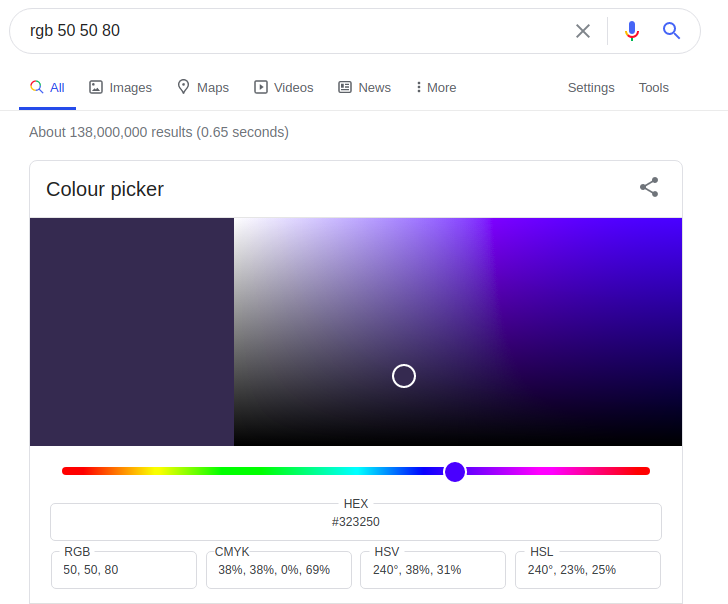
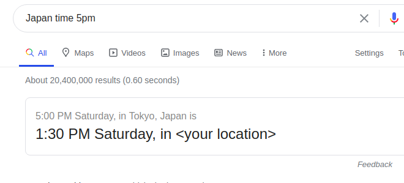

# 谷歌搜索中的十个隐藏功能

原文地址
> https://medium.com/swlh/10-hidden-features-in-google-search-83b347b48157

使用一些提示和小技巧像专家一样使用谷歌。

我们通常在需要找到某些我们想到的的东西会用到谷歌（比如网站，电影，应用等）。另外，它还提供了一些很棒的功能，这些功能是隐藏的。

## 计时器和秒表

假如，你需要为了准备演讲时计算时间或者在专心工作时休息五分钟。直接谷歌搜索 `stopwatch` 或者 `timer`

俩个工具都提供了全屏模式，在你作为观众使用投影仪模式时很有效。

## 颜色挑选器

谷歌搜索 `color picker` 或者复制黏贴十六进制颜色码（比如：#0f9bff）来打开颜色挑选器。其实你可以通过输入查询语句比如 `rgb 50 50 80` 来到达相同的页面

## 仅完全匹配

在你输入一系列单词作为关键字时，谷歌搜索算法使用非常聪明的搜索算法来为你优先推送最相关的内容。但在某些时候我们只需要找到完全匹配的文字内容而不是让谷歌提供的搜索逻辑。可以通过将搜索内容使用`""`包裹来精确匹配。

## 从搜索中排斥单词

很明显谷歌会给你所有和你输入的关键字有关的匹配的内容。但如果你不需要某些你已知某些单词结果，你从搜索内容中排除这些有这些单词的搜索内容。下面的例子会展示搜素结果包含 `Mercedes` 但是不包含 `Benz`。

## 仅搜索域名

一个普通的搜索语句在谷歌中会匹配很多域名。如果需要，你可以搜索一个特殊查询，该查询将仅带来属于特定域名的结果。简单添加 `site:<domain>` 在你的搜索语句之前，比如 `site:gov covid-19`。

## 单位转换工具

你不需要额外的app来进行标准单位转换。谷歌会帮助你。只需要输入你想要转换的东西即可，比如 `6 inches to cm` 或者 `Unit conversion`，然后输入数值。

## 货币转换

该工具和单位转换工具类似。搜索语句也有相同的格式，比如 `5 usd to lkr`，甚至在大多数情况下，`5 usd` 就足够了，因为谷歌知道你的位置。

## 我的IP是什么

有人询问你的IP地址来加入白名单？只需要谷歌搜索 `what is my ip` 或者 `my ip`。

## 世界时钟

和生活在不同时区的人工作？那么，他们很快问道我们能否在下午五点开会。谷歌会在这种时候帮助如果你使用如下展示的搜索语句 `Japan time 5pm`。

## 在社交媒体上找到某人

如果你需要在社交媒体中找到你的某个朋友，你需要前往社交平台然后才能够进行搜索。事实上谷歌提供了更快速的方法。简单使用 `@` 字符在朋友的用户名之前然后搜索。

## 菜单: 我很好奇

如果你搜索 `I’m feeling curious`，会有令人惊讶的问题和答案。此外，如果你按下展开工具将看到来自谷歌的许多有趣的小游戏和其他有用的工具。

