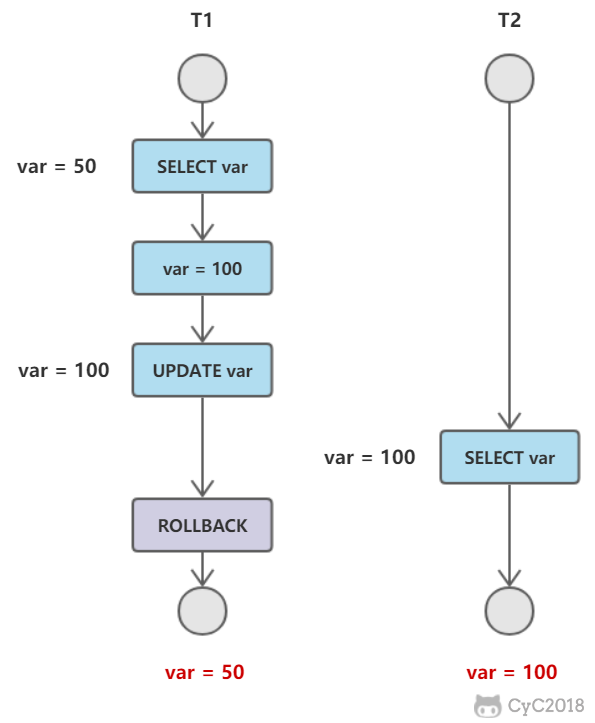

+ [事务](#事务)
  + [概念](#概念) 
  + [ACID](#ACID) 
  + [AUTOCOMMIT](#AUTOCOMMIT)
+ [并发一致性问题](#并发一致性问题)  
  + [丢失修改](#丢失修改)  
  + [读脏数据](#读脏数据)  
  + [不可重复读](#不可重复读)  
  + [幻影读](#幻影读)  
+ [封锁](#封锁)  
  + [封锁力度](#封锁力度)  
  + [封锁类型](#封锁类型)  
  + [封锁协议](#封锁协议)  
  + [MySQL隐式与显式锁定](#MySQL隐式与显式锁定)  
+ [隔离级别](#隔离级别)  
  + [未提交读（READ UNCOMMITTED）](#未提交读)  
  + [提交读（READ COMMITTED）](#提交读)  
  + [可重复读（REPEATABLE READ）](#可重复读)  
  + [可串行化（SERIALIZABLE）](#可串行化)  
+ [多版本并发控制](#多版本并发控制)  
  + [版本号](#版本号)  
  + [隐藏的列](#隐藏的列)  
  + [Undo日志](#Undo日志)  
  + [实现过程](#实现过程)  
  + [快照读与当前读](#快照读与当前读)  
+ [Next-Key Locks](#Next-KeyLocks)  
  + [Record Locks](#Record-Locks)  
  + [Gap Locks](#Gap-Locks)  
  + [Gap Locks](#Gap-Locks)  
  + [Next-Key Locks](#Next-Key-Locks)  
+ [关系数据库设计理论](#关系数据库设计理论)  
  + [函数依赖](#函数依赖)  
  + [异常](#异常)  
  + [范式](#范式)  
+ [ER图](#ER图)  
  + [实体的三种联系](#实体的三种联系)  
  + [表示出现多次的关系](#表示出现多次的关系)  
  + [联系的多向性](#联系的多向性)  
  + [表示子类](#表示子类)  

# 事务

## 概念
事务指的是满足 ACID 特性的一组操作，可以通过 Commit 提交一个事务，也可以使用 Rollback 进行回滚。

.png)

## ACID

### 1.原子性（Atomicity）
事务被视为不可分割的最小单元，事务的所有操作要么全部提交成功，要么全部失败回滚。

回滚可以用回滚来实现，回滚日志记录着事务所执行的修改操作，在回滚时反向执行这些修改操作即可。

### 2.一致性（Consitency）
数据库在事务执行后都保存一致性，在一致性状态下，所有事务对一个数据的读取结果都是相同的。

### 3.隔离性（Isolation）
一个事务所做的修改在最终提交之前，对其他事务是不可见的。

### 4.持久性（Durability）
一旦事务提交，则其所做的修改会永远保存到数据库中。即使系统发生崩溃，事务执行的结果也不会丢失。


事务的 ACID 特性概念简单，但不是很好理解，主要原因是因为这几个特性并非一种平级关系：
+ 只有满足一致性，事务的执行结果才是正确的。
+ 再无并发的情况下，事务串行执行，隔离性一定能够满足。此时只是要能满足原子性，就一定能一致性。
+ 在并发的情况下，多个事务并行执行，事务不仅要满足原子性，还要满足隔离性，才能满足一致性。
+ 事务满足持久化是为了能够应对数据库奔溃的情况。


## AUTOCOMMIT

MySQL 默认采用自动提交模式。也就是说，如不显示使用 START TRANSCATION 语句来开始一个事务，那么每个查询都会被当做一个事务自动提交。

# 并发一致性问题
在并发环境下，事务的隔离性很难保证，因此会出现很多并发一致性问题。

## 丢失修改
T1 和 T2 两个事务都对一个数据进行修改，T1 先修改，T2 再修改，T2的修改覆盖了 T1 的修改。


## 读脏数据
T1 修改一个数据，T2 随后读取这个数据。如果 T1 撤销了这次修改，那么 T2 读取的数据是脏数据。



## 不可重复读
T2 读取一个数据，T2 对该数据做了修改。如果 T2 再次读取这个数据，此时读取的结果和第一次读取的结果不同。


## 幻影读
T1 读取某个范围的数据，T2 在这个范围内插入新的数据，T1 再次读取这个范围的数据，此时读取的结果和第一次读取的结果有所不同。


产生并发不一致性问题主要原因是破坏了事务的隔离性，解决方法是通过并发控制来保证隔离性。并发控制可以通过封锁来实现，但是封锁操作需要用户自己控制，相当复杂。数据库管理系统提供了事务的隔离级别，让用户以一种更轻松的方式处理并发一致性。


# 封锁

## 封锁粒度
MySQL 中提供了两种封锁粒度：行级锁以及表级锁。

应该经历只修改需要修改的那部分数据，而不是所有的资源。锁定的资源数量越少，发生锁争用的可能性就越小，系统的并发度就越高。

但是加锁需要消耗资源，锁的各种操作（包括获得锁、释放锁、以及检查锁状态）都会增加系统开销。因此封锁粒度越小，系统开销越大。

在选择封锁粒度时，需要在锁开销和并发程度之间做一个权衡。

## 封锁类型

### 1.读写锁
+ 排它锁（Exclusive），简称为 X 锁，又称写锁。
+ 共享锁（Shared），简称 S 锁，又称读锁。

有以下两个规定：
+ 一个事务对数据对象 A 加了 X 锁，就可以对 A 进行读取和更新，加锁期间其他事务不能对 A 加任何锁。
+ 一个事务对数据对象 A 加了 S 锁，可以对 A 进行读取操作，但是不能进行更新操作。加锁期间其他事务能对 A 加 S 锁，但是不能加 X 锁。

锁的兼容关系如下：
|-|X|S|
|--|--|--|
|X|×|×|
|S|×|✔️|


### 2.意向锁

使用意向锁（Intention Locks）可以更容易地支持多粒度封锁。

在存在行级锁和表级锁的情况下，事务 T 想要对表 A 加 X 锁，就需要先检测是否有其他事物对表 A 或者表 A 的任意一行加了锁，那么就需要对 表 A 的每一行数据进行一次检索，这是非常耗时的。

意向锁在原来的 X/S 锁之上引入了 IX/IS，IX/IS 都是表锁，用来表示一个事务想要在表中的某个数据行上加上 X 锁或 S 锁。有以下两个规定：
+ 一个事务在获得某个数据行对象的 S 锁之前，必须先获得表的 IS 锁 或者更强的锁。
+ 一个事务在获得某个数据行对象的 X 锁之前，必须先获得表的 IX 锁。

通过引入意向锁，事务 T 想要对表 A 加 X 锁，只需要先检测是否有其他事务对表 A 加了 X/IX/S/IS 锁，如果加了就表示有其他事务正在使用这个表或者表中某一行的锁，因此事务 T 加锁失败。

各种锁的兼容关系如下：

|-|X|IX|S|IS|
|--|--|--|--|--|
|X|×|×|×|×|
|IX|×|✔️|×|✔️|
|S|×|×|✔️|✔️|
|IS|×|✔️|✔️|✔️|

解释如下：
+ 任意 IS/IX 锁之间的兼容的，因为他们只是表示想要对表加锁，而不是真正加锁；
+ S 锁只与 S 锁和 IS 锁兼容，也就是说事务 T 想要对数据行加 S 锁，其他事务可以已经获得对表或者表中的行的 S  锁。

## 封锁协议

### 1.三级封锁协议

#### 一级封锁协议
事务 T 要修改数据 A 时必须加 X 锁，直到 T 结束才能释放锁。

可以解决丢失修改问题，因为不能同时有两个事务对同一个数据进行修改，那么事务的修改就不会被覆盖。


#### 二级封锁协议
在一级的基础上，要求读取数据 A 必须加 S 锁，读取完马上释放 S 锁。

可以解决读脏数据的问题，因为如果一个事务在对数据 A 进行修改，根据一级封锁协议，会加 X 锁，那么就不能再加 S 锁了，也就是不会读入数据。


#### 三级封锁协议

在二级的基础上，要求读取数据 A 锁时必须加 S 锁，知道事物结束了才能释放 S 锁。

可以解决不可重复读的问题，因为 读 A 时，其他事务不能对 A 加 X 锁，从而避免了在读期间数据发生变化。


### 2.两段锁协议
加锁和解锁分为两个阶段进行。

可串化调度是指，通过并发控制，使得并发执行的事务结果与某个串行执行的事务结果相同。

事务遵循两端锁协议是保证可串化调度的充分条件。例如以下操作满足两端锁协议，他是可串化调度。

```html
lock-x(A)...lock-x(B)...lock-x(C)...lock-x(A)...lock-x(B)...lock-x(C)...
```

但不是必要条件，例如一下操作不满足两端协议，但是它还是可以可串行调度。

```html
lock-x(A)...unlock(A)...lock-s(B)...unlock(B)...lock-s(C)...unlock(C)
```

# MySQL隐式与显式锁定
MySQL 的 InnoDB存储引擎采用两段锁协议，会根据隔离级别在需要的时候自动加锁，并且所有的锁都是在同一时刻被释放，这被称为隐式锁定。

InnoDB 也可以使用特定的语句进行显示锁定：

```html
SELECT ... LOCK In SHARE MODE;
SELECT ... FOR UPDATE;
```

# 隔离级别

## 未提交读
事务中的修改，即使没有提交，对其他事务也是可见的。

## 提交读
一个事务只能读取已经提交的事务所做的修改。换句话说，一个事务所做的修改在提交之前对其他事务是不可见得。

## 可重复读
保证在同一个事务中多次读取同样数据的结果是一样的。

## 可串行化
强制事务串行执行。
需要加锁实现，而其他隔离级别通常不需要。

|隔离级别|脏读|不可重复读|幻影读|
|:--:|:--:|:--:|:--:|
|未提交读|✔️|✔️|✔️|
|提交读|×|✔️|✔️|
|可重复读|×|×|✔️|
|可串行化|×|×|×|

# 多版本并发控制
多版本并发控制（Muti-Version Concurrency Control，MVCC）是 MySQL 的 InnoDB 存储引擎实现隔离级别的一种具体方式，用于实现提交读和可重复读这两种隔离级别。而未提交读隔离总是读取最新的数据行，无需使用 MVCC。可串行化隔离级别需要对所有读取的行都加锁，单纯使用 MVCC 无法实现。

## 版本号
+ 系统版本号：是一个递增的数字，每开始一个新的事务，系统版本号就会自动递增。
+ 事务版本号：事务开始时的系统版本号。

## 隐藏的列
MVCC 在每行记录后面都保存着连个隐藏的列，用来存储两个版本号：
+ 创建版本号：指示创建一个数据行的快照时的系统版本号；
+ 删除版本号：如果该快照的删除版本未定义或删除版本号大于当前事务版本号表示该快照有效。

## Undo 日志
MVCC 使用到的快照存储在 Undo 日志中，该日志通过回滚指针把一个数据行（Record）的所有快照连接起来。