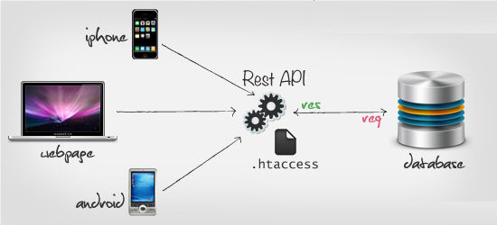

# 理解Restful-API.md

Restful 是由 Roy Fielding (HTTP协议主要设计者、Apache基金会第一人主席，Apache开发者之一）在2000年一篇论文中提出的。

REST 全称为 Representational State Transfer ，即表现层状态转移，听上去晦涩难懂。

我们可以高度概括这种风格的API：

**URL定位资源，用HTTP动词（GET,POST,DELETE,DETC）描述操作**

使用 Restful-API 可以做到使用一套统一的接口为不同平台提供服务

GET 用来获取资源，
POST 用来新建资源（也可以用于更新资源），
PUT 用来更新资源，
DELETE 用来删除资源

例子：
DELETE http://api.qc.com/v1/friends: 删除某人的好友 （在http parameter指定好友id）
POST http://api.qc.com/v1/friends: 添加好友
UPDATE http://api.qc.com/v1/profile: 更新个人资料

禁止使用  GET http://api.qc.com/v1/deleteFri 类似的动词

比较优秀的习惯：
1.保证 HEAD 和 GIT 是幂等的（不会对资源状态有所改变）
2.使用名词推荐复数形式
3.资源地址推荐使用嵌套模式比如：GET /friends/10375923/profile
4.使用统一的 HTTP Status Code表示访问状态
